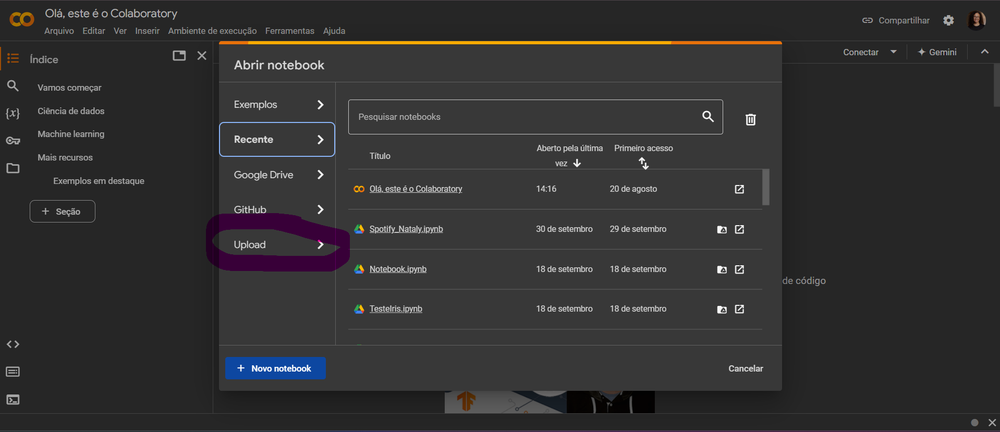
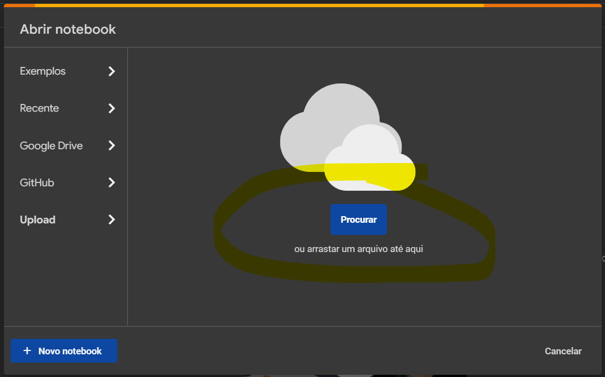
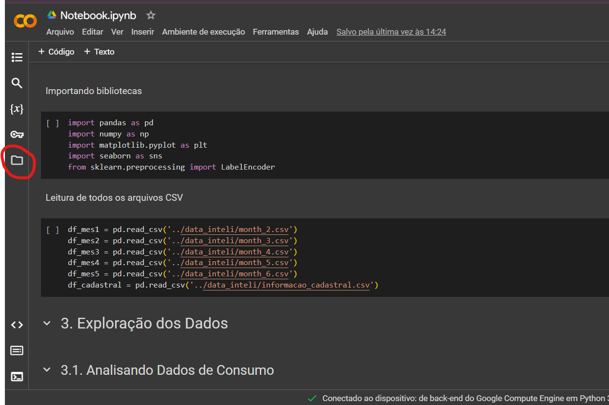
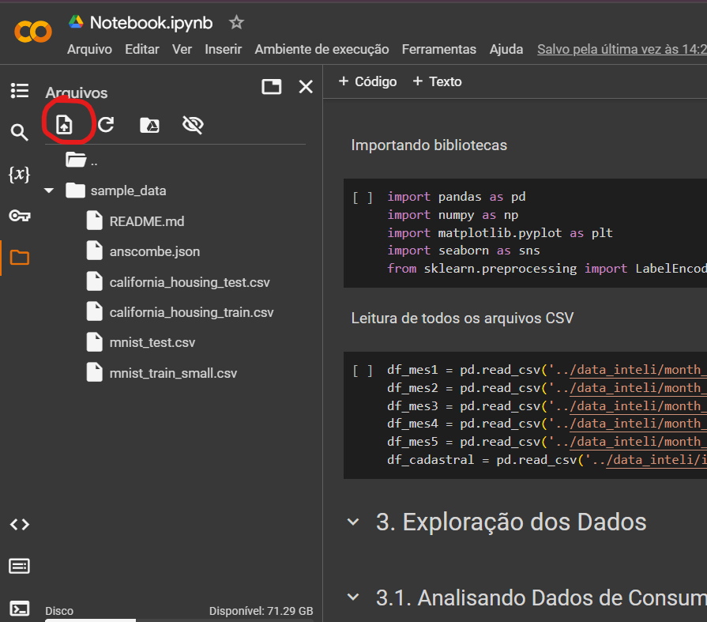
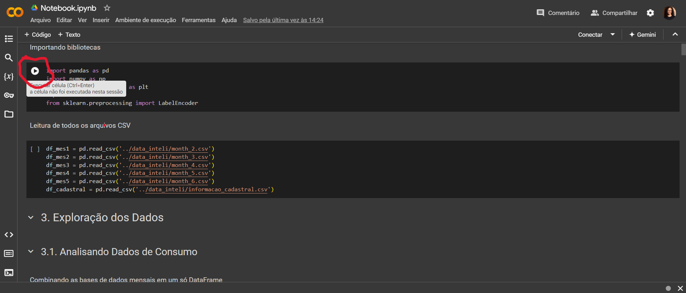
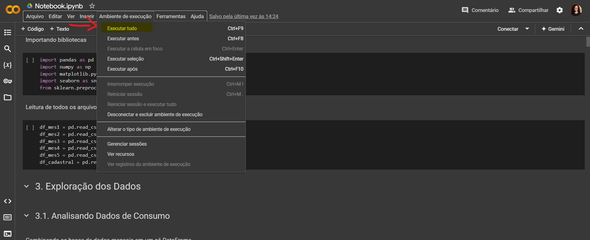
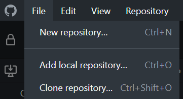
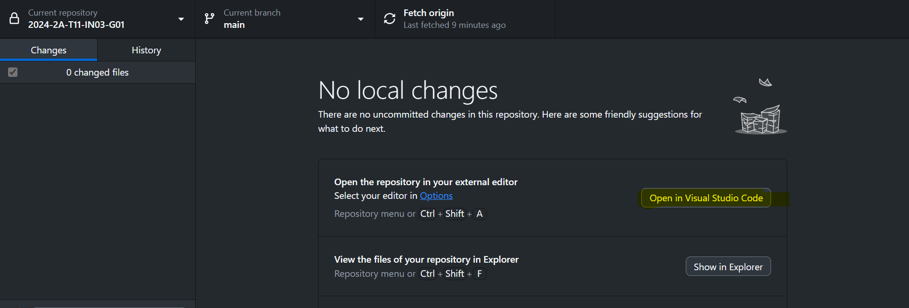
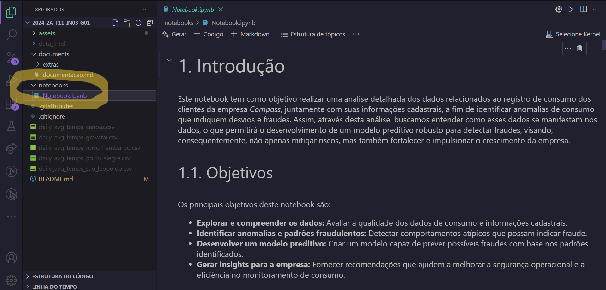

# Inteli - Instituto de Tecnologia e Liderança 

# Modelo preditivo para identificação de anomalias no consumo de gás natural

## ⚖️ Galvão & Associados: Gases e Dados 

## 👨‍🎓 Integrantes: 
- <a href="https://www.linkedin.com/in/caio-alcantara-santos/">Caio de Alcantara Santos</a>
- <a href="https://www.linkedin.com/in/cec%C3%ADlia-galv%C3%A3o/">Cecília Beatriz Melo Galvão</a>
- <a href="https://www.linkedin.com/in/eduardo-f-libutti-salles-599299263/">Eduardo Faris Libutti Salles</a> 
- <a href="https://www.linkedin.com/in/kethlen-martins-040332221/">Kethlen Martins da Silva</a> 
- <a href="https://www.linkedin.com/in/lucas-cozzolino-tort-783273270/">Lucas Cozzolino Tort</a> 
- <a href="https://www.linkedin.com/in/mariella-kamezawa/">Mariella Sayumi Mercado Kamezawa</a> 
- <a href="https://www.linkedin.com/in/natalycunha/">Nataly de Souza Cunha</a>
- <a href="https://www.linkedin.com/in/pabloazevedo/">Pablo de Azevedo</a>

## 👩‍🏫 Professores:
### Orientador(a) 
- <a href="https://www.linkedin.com/in/profclaudioandre/">Claudio Fernando André</a>
### Instrutores
- <a href="https://www.linkedin.com/in/diogo-martins-gon%C3%A7alves-de-morais-96404732/">Diogo Martins Gonçalves de Morais</a>
- <a href="https://www.linkedin.com/in/francisco-escobar/">Francisco de Souza Escobar</a> 
- <a href="https://www.linkedin.com/in/henrique-mohallem-paiva-6854b460/">Henrique Mohallem Paiva</a>
- <a href="https://www.linkedin.com/in/michele-bazana-de-souza-69b77763/">Michele Bazana de Souza</a> 
- <a href="https://www.linkedin.com/in/rafael-will-m-de-araujo-20809b18b/">Rafael Will Macedo de Araujo</a> 

## 📝 Descrição

&nbsp;&nbsp;&nbsp;&nbsp;A solução final desenvolvida pelo grupo Galvão & Associados é o Método Galvão, uma ferramenta de análise e visualização de dados com inteligência artificial que conta com 2 features: um modelo preditivo para detecção de anomalias nos dados de consumo de gás natural; e um modelo preditivo para prever o consumo futuro de gás natural. Ambos os modelos já podem ser utilizados para verificar quais clientes possuem dados anômalos ou para verificar quanto um cliente vai consumir nos próximos meses, funcionalidades acessadas de forma facilitada e visualmente simplificada por meio de uma dashboard interativa e ajustada automaticamente ao conjunto de dados. 

<b>Link para vídeo demonstrativo:

- </b> <a href="https://drive.google.com/file/d/1HAnL7gVYIV4WFIMB6muXHQ-mofmlH6KT/view?usp=sharing">Demonstração no Visual Studio Code</a>

- </b> <a href="https://drive.google.com/file/d/1hJ4_Ba5xLCdqO-Z7YIf8Qb97d1bGyrsr/view?usp=sharing">Demonstração no Google Colab</a>

- </b> <a href="https://drive.google.com/file/d/1RsqfiLN1I0JNwW6aXczqiIfk9ZFXiFCJ/view?usp=sharing">Demonstração do Dashboard</a>

- [Link do projeto no Google Colab](https://colab.research.google.com/drive/10eVX4ED3vlyXH8y7i08jxOUGG-0DhV2B?usp=sharing)

- [Link da Dashboard](https://metodo-galvao.streamlit.app/)

## 📁 Estrutura de pastas

Dentre os arquivos presentes na raiz do projeto, definem-se:

- <b>readme.md</b>: arquivo que serve como guia e explicação geral sobre o projeto (o mesmo que você está lendo agora).

- ***.gitignore*** e *.**gitattributes***: arquivos padrão para configuração do projeto. Não precisam ser utilizados.

- <b>assets</b>: todas as imagens e mídias utilizadas nos notebooks e documentação são posicionadas aqui.

- <b>documents</b>: aqui estarão todos os documentos do projeto. Há também uma pasta denominada <b>extras</b> onde estão presentes documentos complementares.

- <b>notebooks</b>: todos os Jupyter Notebooks criados para desenvolvimento do projeto.

## 💻 Execução dos projetos

Este projeto contém um notebook que realiza a identificação de anomalias no consumo de gás natural utilizando técnicas de aprendizado de máquina, além de uma documentação detalhando todo o processo de desenvolvimento. Abaixo, você encontrará instruções detalhadas para rodá-lo tanto no Google Colab quanto no seu ambiente local usando o Visual Studio Code.

### Recursos

1. ***Google Colab***

&nbsp;&nbsp;&nbsp;&nbsp;O Google Colab é uma plataforma online gratuita que permite criar e executar notebooks Jupyter (documentos de código executável) diretamente no navegador, oferecendo um ambiente para programar em Python. Ele já é integrado ao Google Drive, oferecendo uma maneira fácil de utilização de arquivos pessoais, e possibilita o uso de GPUs que melhoram o processamento.

2. ***Visual Studio Code***

&nbsp;&nbsp;&nbsp;&nbsp;O *Visual Studio Code*, construído pela Microsoft, é um ambiente de desenvolvimento integrado (IDE) com uma ampla gama de recursos para a produção de software, incluindo realce de sintaxe para melhor visualização dos componentes do código, feedback de erros e alterações, controle de versões, entre vários outros benefícios, além de integrar uma biblioteca de extensões que ampliam sua funcionalidade, trazem otimização e perosnalização para o desenvolvimento.

### Executando no Google Colab

 > **Atenção**: o utilizador deve manter salvo uma cópia do arquivo `Notebook.ipynb` no seu Google Drive próprio, caso contrário, não será possível salvar as alterações realizadas no arquivo. A seguir, explica-se como fazer isso.

1. **Abra o Google Colab**:
   - Acesse [Google Colab](https://colab.research.google.com).

2. **Faça upload do notebook**:
   - No canto superior direito, clique em "Arquivo" > "Carregar notebook". Será aberto o menu da Figura 1. Clique em Upload (Figura 1) e em "Procurar" (Figura 2).
   - Selecione o arquivo `Notebook.ipynb` do projeto, localizado na pasta *notebooks*.

    Figura 1 - Google Colab  
    
   
   Fonte: Material produzido pelos autores (2024)
   

    Figura 2 - Upload de arquivo no Google Colab  
    
   
   Fonte: Material produzido pelos autores (2024)
   

3. **Importe os dados**:

   - Com o Notebook aberto, no menu lateral, clique no símbolo de pasta (Figura 3). Será aberto uma gerenciador de arquivos do notebook. Clique no primeiro botão do menu superior interno para escolher um arquivo do seu computador (Figura 4).

    Figura 3 - Upload de dados no Google Colab  
    
   
   Fonte: Material produzido pelos autores (2024)
   

    Figura 4 - Upload de dados no Google Colab  
    
   
   Fonte: Material produzido pelos autores (2024)
   

4. **Execute as células**:
   - Você pode clicar no símbolo de "Play" ao passar o mouse sobre cada célula do notebook (Figura 5), ou pode acessar a opção "Ambiente de execução > Executar tudo" no menu superior (Figura 6). O Colab irá proceder com os passos para reproduzir o código.  

    Figura 5 - Execução de cada célula Colab  
    
   
   Fonte: Material produzido pelos autores (2024)
   

    Figura 6 - Execução de todas as células Colab  
    
   
   Fonte: Material produzido pelos autores (2024)
   

### Executando localmente no VS Code

Se você preferir rodar o notebook localmente no seu computador usando o Visual Studio Code, siga os passos abaixo:

1. **Clonando o repositório no *GitHub Desktop*:**

&nbsp;&nbsp;&nbsp;&nbsp;Através do <a href="https://desktop.github.com/">link</a>, deve-se baixar a versão mais adequada e atualizada do *GitHub Desktop*, disponível para os sistemas operacionais *Windows* e *macOS*.  Feito isso, deve-se executar o arquivo do programa e finalizar a instalação. 

&nbsp;&nbsp;&nbsp;&nbsp;Dentro do *GitHub Desktop*, após realizar o login ou o cadastro da conta GitHub, tem-se acesso à página inicial. Clicando em *File* (Arquivo) nas opções do canto superior esquerdo (Figura 1) e em "Clone new repository" (Clonar novo repositório), deve-se inserir o <a href="https://github.com/Inteli-College/2024-2A-T11-IN03-G01.git">link do repositório</a> do Galvão & Associados (Figura 2), dando prosseguimento com a clonagem dos arquivos. Dessa forma, é possível iniciar a utilização do notebook. 

    Figura 1 - Passos para a clonagem de repositório  
    
   
   Fonte: Material produzido pelos autores (2024)
   

    Figura 2 - Passos para a clonagem de repositório  
    
   
   Fonte: Material produzido pelos autores (2024)
   

3. **Instalando o Python**:
   - Se ainda não tiver o Python instalado, baixe a versão *3.11.9* em [python.org](https://www.python.org/downloads/) e siga as instruções de instalação.

4. **Instalando a extensão Jupyter**:
   - No VS Code, vá para a aba de extensões no menu à esquerda (um ícone de quadrados empilhados).
   - Pesquise por "Jupyter" e clique em "Instalar" na extensão correspondente para rodar notebooks dentro do VS Code. Se detectados no ambiente mais pacotes necessários, instale-os.

5. **Instale os pacotes necessários**:

No terminal de sua máquina, execute comandos para a instalação dos seguintes pacotes. Eles serão necessários para a execução do modelo preditivo.
   - numpy
   - pandas
   - seaborn
   - scikit-learn
   - matplotlib
   - scipy
   - tqdm
   - mpl_toolkits.mplot3d
   - statsmodels

6. **Acessando o notebook**

Dentro do GitHub Desktop, após a clonagem do repositório, é possível visualizar algumas funcionalidades (Figura 3). Clicando no botão *"Open With Visual Studio Code"* (Abrir com o Visual Studio Code) a pasta do projeto é aberta dentro do *Visual Studio Code*, podendo-se ter acesso a seus arquivos e códigos (Figura 4).

Abrindo a pasta `notebooks` e acessando o arquivo `Notebook.ipynb`, tem-se acesso ao arquivo que contém todo o desenvolvimento do modelo preditivo, com detalhamentos e códigos executáveis.

    Figura 3 - Funcionalidades do repositório  
    
   
   Fonte: Material produzido pelos autores (2024)
   

    Figura 4 - Pasta do projeto*  
    
   
   Fonte: Material produzido pelos autores (2024)
   

&nbsp;&nbsp;&nbsp;&nbsp;Seja no Google Colab ou no Visual Studio Code, concluindo os passos explicados acima será possível executar o modelo preditivo a partir de arquivos *.csv*, aproveitando-se as funcionalidades de visualização e manipulação de dados inclusas.

## 🗃 Histórico de lançamentos

* 1.0.0 - 11/10/2024
    * **[Sprint 5]** Lançamento da primeira versão do modelo preditivo com documentação: seleção e discussões de um modelo final, considerando melhor performance.  
* 0.6.0 - 27/09/2024
    * **[Sprint 4]** Comparação de modelos preditivos: construção de diversos modelos preditivos e comparação entre os candidatos, aplicando-se métricas padronizadas para análise do desempenho de cada.  
* 0.3.1 - 13/09/2024
    * **[Sprint 3]** Preparação de dados e modelo preditivo preliminar: construção de um modelo preditivo inicial e demais ajustes no pré-processamento. Exploração dos primeiros resultados.  
* 0.2.7 - 30/08/2024
    * **[Sprint 2]** Análise exploratória e levantamento de hipóteses: exploração e manipulação inicial dos dados para detecção de características e relações dos dados relevantes para a construção dos modelos preditivos; análise aprofundada da experiência do usuário; levantamento de suposições sobre os dados.  
* 0.1.3 - 16/08/2024
    * **[Sprint 1]** Documentação de entendimento do negócio: compreensão do problema, das personas, do posicionamento da Compass e das oportunidades para a aplicação de modelos preditivos na previsão do consumo de gás natural.

## 📋 Licença/License

<a property="dct:title" rel="cc:attributionURL" href="https://github.com/Inteli-College/2024-2A-T11-IN03-G01">Galvão & Associados</a> by Inteli is licensed under <a href="http://creativecommons.org/licenses/by/4.0/?ref=chooser-v1" target="_blank" rel="license noopener noreferrer" style="display:inline-block;">Attribution 4.0 International</a>.
