# Documentação Modelo Preditivo - Inteli

## Modelo preditivo para identificação de anomalias no consumo de gás natural
### Galvão & Associados: Gases e Dados 

## 👨‍🎓 Integrantes: 
- <a href="https://www.linkedin.com/in/caio-alcantara-santos/">Caio de Alcantara Santos</a>
- <a href="https://www.linkedin.com/in/cec%C3%ADlia-galv%C3%A3o/">Cecília Beatriz Melo Galvão</a>
- <a href="https://www.linkedin.com/in/eduardo-f-libutti-salles-599299263/">Eduardo Faris Libutti Salles</a> 
- <a href="https://www.linkedin.com/in/kethlen-martins-040332221/">Kethlen Martins da Silva</a> 
- <a href="https://www.linkedin.com/in/lucas-cozzolino-tort-783273270/">Lucas Cozzolino Tort</a> 
- <a href="https://www.linkedin.com/in/mariella-kamezawa/">Mariella Sayumi Mercado Kamezawa</a> 
- <a href="https://www.linkedin.com/in/natalycunha/">Nataly de Souza Cunha</a>
- <a href="https://www.linkedin.com/in/pabloazevedo/">Pablo de Azevedo</a>

## 👩‍🏫 Professores:
### Orientador(a) 
- <a href="https://www.linkedin.com/in/profclaudioandre/">Claudio Fernando André</a>
### Instrutores
- <a href="https://www.linkedin.com/in/diogo-martins-gon%C3%A7alves-de-morais-96404732/">Diogo Martins Gonçalves de Morais</a>
- <a href="https://www.linkedin.com/in/francisco-escobar/">Francisco de Souza Escobar</a> 
- <a href="https://www.linkedin.com/in/henrique-mohallem-paiva-6854b460/">Henrique Mohallem Paiva</a>
- <a href="https://www.linkedin.com/in/michele-bazana-de-souza-69b77763/">Michele Bazana de Souza</a> 
- <a href="https://www.linkedin.com/in/rafael-will-m-de-araujo-20809b18b/">Rafael Will Macedo de Araujo</a> 

## Sumário
[1. Introdução](#c1)

[2. Objetivos e Justificativa](#c2)

[3. Metodologia](#c3)

[4. Desenvolvimento e Resultados](#c4)

[5. Conclusões e Recomendações](#c5)

[6. Referências](#c6)

[Anexos](#attachments)


## <a name="c1"></a>1. Introdução
&nbsp;&nbsp;&nbsp;&nbsp;A *Compass* é uma empresa de gás e energia que surgiu em março de 2020, a partir da aquisição da *Comgás* pelo *Grupo Cosan* em 2012. Desse modo, a *Compass* surgiu como um modelo de negócio vencedor que possibilitou ampliar o número de clientes e expandir a rede de gasodutos de distribuição, oferecendo opções para um mercado de gás e energia cada vez mais livre no Brasil, colaborando para o crescente desenvolvimento da economia do país. Assim, atualmente a *Compass* atua em dois segmentos específicos: Distribuição e Marketing & Serviços, sendo o primeiro focado na distribuição pela *Comgás* e mais outras 11 empresas gerenciadas pela *Commit*, e o segundo concentrado no oferecimento de alternativas de suprimento de gás natural, através da gestão da *Edge*, empresa criada pela *Compass*. <br>

&nbsp;&nbsp;&nbsp;&nbsp;Por meio da *Comgás*, a maior distribuidora de gás do Brasil, a *Compass* é operacionalizada por uma rede de mais de 19 mil km, atendendo 2,1 milhões de clientes nos setores residencial, comercial, industrial, veicular, entre outros, segundo informações do próprio site da [*Compass*](https://www.compassbr.com/sobre-a-compass/quem-somos/)</a>. Além disso, em 2020, foi distribuído 4,5 bilhões de m³ de gás, o que representa 32% do volume de gás canalizado no país, consolidando-a com a maior participação de mercado entre as distribuidoras nacionais, conforme dados do *Ministério de Minas e Energia*. Dessa forma, presente em 94 municípios do Estado de São Paulo, incluindo a capital e sua região metropolitana, a *Comgás* foi reconhecida pela *American Gas Association (AGA)* como referência global em segurança no setor de distribuição de gás por 13 anos consecutivos, contribuindo, assim, para a concretização da *Compass* no mercado brasileiro. <br>

&nbsp;&nbsp;&nbsp;&nbsp;Dessa maneira, tendo em vista o contexto de constante crescimento da *Compass*, a empresa atualmente enfrenta um grande desafio de desenvolvimento: o surgimento de fraudes e anomalias no seu negócio. Nesse sentido, esses pontos de preocupação aparecem principalmente no formato de vazamento de medidores e distorção nas informações retornadas nos equipamentos de manutenção. À vista disso, é responsabilidade do grupo desenvolver uma solução, caracterizada por algoritmos de aprendizado de máquina, capaz de ser aplicado para monitorar os dados de consumo de gás em tempo real, identificando padrões anormais com alta precisão. <br>

&nbsp;&nbsp;&nbsp;&nbsp;Logo, o projeto será desenvolvido com o objetivo de escalar modelos preditivos de dados de consumo de gás, beneficiando as equipes de Produtos, Tecnologia e Operações da *Compass* e aprimorando a qualidade dos serviços prestados aos clientes, sendo eles distribuidoras de gás, condomínios e usuários finais. Portanto, através desses modelos preditivos, buscamos implementar uma gestão de riscos mais eficiente, entregando uma plataforma de inteligência de dados que, ao cruzar o consumo monitorado dos clientes da *Compass*, gerará informações valiosas para melhorar operações, segurança e vendas, além de detectar anomalias de consumo que possam indicar desvios ou fraudes.<br>


## <a name="c2"></a>2. Objetivos e Justificativa

&nbsp;&nbsp;&nbsp;&nbsp;Esta seção trata da breve contextualização da empresa parceira, falando sobre seus principais objetivos. Além disso, será realizada uma análise acerca da solução que será desenvolvida, tratando da proposta da solução, como ela será utilizada, critérios de sucesso e justificativa para seu uso.

### 2.1 Objetivos

&nbsp;&nbsp;&nbsp;&nbsp;Assim como abordado na introdução deste documento, a Compass é uma empresa criada em 2020 que surgiu a partir da aquisição da Comgas pelo Grupo Cosan. Desse modo, a Compass se coloca como uma *holding* com um modelo de negócios que fez capaz a ampliação da sua rede de clientes, expandido a rede de gasodutos de distribuição no Brasil. Atualmente, a Compass direciona o seu trabalho a dois segmentos: o de distribuição de gás e o de marketing & serviços, onde o primeiro é focado na distribuição pela Comgas e demais empresas gerenciadas pela Commit, e o segundo tem como objetivo oferecer alternativas de suprimento de gás natural (biometano, por exemplo). <br>
&nbsp;&nbsp;&nbsp;&nbsp;Dessa forma, ficam listados como principais objetivos da Compass a vontade de se colocar como a empresa responsável pelo maior fluxo de distribuição de gás encanado na América Latina, bem como o desejo de realizar uma transformação em tal mercado, fazendo com que cada vez mais parcelas significativas da população utilizem fontes de energia mais renováveis como o biometano.

### 2.2 Proposta de solução

&nbsp;&nbsp;&nbsp;&nbsp;Retornamos, então, a um dos principais desafios que a Compass tem enfrentado durante o seu desenvolvimento: o surgimento de anomalias e fraudes no consumo de gás. Dessa forma, foi colocada como proposta de solução a elaboração de um modelo preditivo que utilizará dados de consumo fornecidos pela empresa a fim de treinar tal modelo para identificar inconsistências no consumo dos clientes. Essas anomalias variam desde a vazamentos de gás até a diferenças bruscas no consumo desses clientes. Assim, identificar esses problemas pode ajudar a empresa a encontrar possíveis clientes fraudulentos, que podem estar utilizando, por exemplo, de mecanismos para burlar o medidor instalado nas residências a fim de pagar menos pelo gás consumido. <br>
&nbsp;&nbsp;&nbsp;&nbsp;Por fim, este modelo preditivo para fraudes e anomalias atende aos objetivos da Compass por meio da facilitação no processo de identificação de fraudes, possivelmente reduzindo o índice de clientes que praticam ações fraudulentas e a perda monetária que decorre de tais ações. Ademais, o modelo preditivo a ser desenvolvido pode ser uma forte ferramenta para fornecer à Compass uma inteligência sobre o consumo de seus clientes, possibilitando a oferta de serviços cada vez mais personalizados, algo que atende ao objetivo de ampliar a base de clientes e a rede de distribuição de gás encanado no Brasil. 

### 2.3 Justificativa

&nbsp;&nbsp;&nbsp;&nbsp;Modelos preditivos são dotados de grande potencial quando o assunto é análise de dados, e, dentre os principais identificados na solução proposta, podemos apontar a identificação de fraudes e anomalias com um **grande** volume de dados, sendo este um trabalho que é inviável de ser realizado de maneira manual. Dessa forma, o modelo preditivo descrito na proposta da solução pode resolver os problemas já citados por meio da realização da análise de uma grande quantidade de dados de consumo e entregando à empresa quais clientes estão com consumo anormal e podem estar cometendo fraude. <br>
&nbsp;&nbsp;&nbsp;&nbsp;Além disso, identificamos como benefícios desta solução a possibilidade de, ao final e com base nos resultados, ofertar serviços personalizados para os clientes da Compass. Ademais, como dito anteriormente, a identificação das anomalias e fraudes podem acarretar na diminuição das perdas monetárias que ocorrem por conta dessas situações. <br>
&nbsp;&nbsp;&nbsp;&nbsp;Finalizando, destacamos também o principal diferencial desta solução em relação às demais que podem estar presentes no mercado como sendo a possibilidade de realizar uma detecção em tempo real das anomalias, sem a necessidade de esperar semanas para que um profissional vá até o local realizar a leitura do medidor.  

## <a name="c3"></a>3. Metodologia

&nbsp;&nbsp;&nbsp;&nbsp;Para o atual projeto, a metodologia aplicada é a CRISP-DM (*Cross Industry Standard Process for Data Mining*). Tal metodologia tem como principal objetivo o desenvolvimento de modelos a partir da análise de informações e dados de um negócio a fim de prever futuras falhas e soluções (Roberto, 2023). Esta metodologia é dividida em 6 etapas, onde cada uma possui suas peculiaridades. Além disso, é importante ressaltar que o processo da metodologia CRISP-DM é iterativo, ou seja, quando terminada cada etapa, posteriormente é sempre possível voltar para um passo anterior, a fim de aprimorar o trabalho que foi realizado anteriormente. As seis etapas da metodologia são:
* **Entendimento do negócio**: Trata-se da primeira etapa da metodologia e uma das mais essenciais para o projeto, uma vez que é neste momento em que se definem os objetivos do projeto que está sendo realizado e as necessidades da empresa. Por conta disso, caso esse entendimento seja feito de maneira errada, o projeto inteiro pode ser comprometido. 
* **Entendimento dos dados**: Esta etapa precede a exploração dos dados em si, e é marcada por questionamentos acerca dos dados que serão recebidos para o projeto. A partir destes questionamentos é que é feita a coleta dos dados, por exemplo (algo que, por decisões de escopo, não ocorreu no presente projeto).
* **Preparação dos dados**: Já com os dados em mãos, é nesta etapa onde ocorre o tratamento e pré-processamento dos dados, ou seja, tratamento de valores *outliers* e nulos, enriquecimento dos dados e até a escolha das *features* mais relevantes para o modelo. Esta etapa normalmente é a mais demorada do processo e também a que mais é revisitada, uma vez que os dados precisam estar em processo de tratamento constante durante o decorrer do projeto.
* **Modelagem**: Esta é, normalmente, a etapa mais aguardada do processo, apesar de ser geralmente a mais rápida. Neste momento, é definido o tipo de modelagem/modelo que será utilizado e quais atributos serão variáveis na construção de tal modelo. Além disso, é nesta etapa onde, de fato, um modelo é performado e se obtém resultados referentes, sendo um exemplo a acurácia de um modelo preditivo. 
* **Avaliação**: Possuindo os resultados da modelagem, obtidos na etapa anterior, este é o momento onde se deve avaliar se o resultado do modelo, como a acurácia, corresponde com as expectativas existentes ao começar o projeto. Caso o resultado não seja satisfatório e exista espaço para melhorias, os esforços da equipe devem ser apontados para realizar tais melhorias. A partir desta etapa, é comum que equipes retornem para a etapa de preparação dos dados a fim de melhorar a qualidade dos dados utilizados na modelagem, buscando obter resultados melhores.
* **Implementação ou *deploy***: Sendo a última etapa do processo, o *deploy* é o momento onde o modelo deve ser colocado em produção e deve trazer impacto real para o negócio/empresa. Esta é uma etapa que pode variar grandemente de projeto para projeto, mas um exemplo de *deploy* consiste em disponibilizar o modelo em um serviço de *cloud* e disponibilizá-lo para membros da empresa. 

&nbsp;&nbsp;&nbsp;&nbsp;Por fim, destaca-se que o principal benefício que é trazido a partir da aplicação de uma metodologia CRISP-DM é a maneira como a criação do modelo preditivo se encaixa com o entendimento do negócio da empresa parceira. Com tal metodologia, pode-se analisar a fundo como funciona o modelo de negócio da Compass e como o problema trazido impacta a empresa. A partir disso, é possível criar um modelo preditivo que combata mais diretamente o problema, sendo mais eficaz para resolvê-lo. Além disso, a metodologia CRISP-DM se mostra muito eficaz em projetos de análise de dados por conta do seu caráter iterativo, em que podemos sempre voltar para etapas anteriores, algo que se demonstra muito útil em casos onde, após se avaliar determinado modelo e perceber que ele não é satisfatório, é possível retornar para a etapa de preparação dos dados a fim de refinar o *dataset* e obter resultados melhores.  

## <a name="c4"></a>4. Desenvolvimento e Resultados

&nbsp;&nbsp;&nbsp;&nbsp;Esta seção detalha o desenvolvimento e os resultados do projeto, desde a compreensão do problema a ser resolvido e a análise dos dados que serão utilizados no modelo preditivo, até a preparação dos dados e a etapa de modelagem.

### 4.1. Compreensão do Problema
&nbsp;&nbsp;&nbsp;&nbsp;Para compreender o problema que iremos solucionar, é necessário passar por uma série de etapas, como estudar o contexto da indústria, realizar uma análise da empresa parceira e da solução proposta que estamos desenvolvendo, identificar os possíveis riscos do projeto, definir as personas e mapear a jornada do usuário. O objetivo de todo esse processo é realizar um projeto mais consistente e fiel às necessidades dos clientes.


#### 4.1.1. Contexto da indústria 
&nbsp;&nbsp;&nbsp;&nbsp;A *Compass* é uma empresa de gás e energia fundada em 2020 que, desde sua fundação, tem se empenhado em promover o uso consciente e eficiente da energia em diversas regiões do Brasil. Com uma presença significativa no mercado, a Compass integra o setor de gás natural e disputa espaço com outras empresas que também atuam nesse mesmo ramo, como *Petrobras*, *Naturgy* e *Eneva*. Assim, além de fornecer serviços essenciais, a *Compass* está comprometida com a responsabilidade social e ambiental, buscando expandir suas operações e investir em tecnologias que aumentem a eficiência e a sustentabilidade de seus serviços. <br>

&nbsp;&nbsp;&nbsp;&nbsp;Desse modo, a *Compass* é uma empresa do setor privado com um modelo de negócios dividido em dois principais segmentos: Distribuição e Marketing & Serviços. No segmento de distribuição, a *Compass* opera por meio de duas empresas: a *Comgás*, maior distribuidora de gás natural do Brasil, e a *Commit*, uma parceria estratégica com o conglomerado japonês *Mitsui*. Os ativos da *Commit* estão distribuídos em dois *clusters* principais: o Nordeste, representado pela *Norgás*, e o Centro-Sul, onde a *Sulgás*, adquirida do Estado do Rio Grande do Sul em 2022, e a *Necta*, controlada diretamente pela *Commit*, desempenham papéis importantes. A *Commit* também possui participações minoritárias em outras distribuidoras e trabalha em conjunto com seus parceiros para implementar as melhores práticas de gestão. <br>

&nbsp;&nbsp;&nbsp;&nbsp;No segmento de Marketing & Serviços, a *Compass* tem como objetivo fornecer alternativas de suprimento de gás natural, garantindo segurança, flexibilidade e promovendo a descarbonização para seus clientes, tanto os conectados à rede de distribuição quanto os que operam fora dela (*off-grid*), através do modal rodoviário (*GNL B2B*). A partir de 2023, esse segmento passou a operar sob a marca *"Edge"*, que concentra ativos estratégicos como o *Terminal de Regasificação de São Paulo (TRSP)* localizado em Santos, além de ativos e contratos de *Biometano*, como a planta de purificação em parceria com a *Orizon*, e o *GNL B2B*. Todos esses ativos são geridos de forma integrada pela *Edge*, visando maximizar eficiência e sinergia. <br>

&nbsp;&nbsp;&nbsp;&nbsp;Dessa forma, atuando no segundo setor, a *Compass* trabalha em um mercado bastante competitivo, tendo que se encarregar constantemente do surgimento de inovações tecnológicas e estratégias de negócios eficientes. Portanto, é através do desenvolvimento de um modelo preditivo que a *Compass*, juntamente com o seu time de Tecnologia, Produtos e Operações, além do auxílio da *IOLIT*, empresa de controle de dados, conseguirá desenvolver o seu empreendimento, enfrentando futuros impasses, considerando a importância dessas predições para a análise de anomalias e fraudes, em prol do crescimento exponencial do negócio. <br>

#### 4.1.2. Análise SWOT 

&nbsp;&nbsp;&nbsp;&nbsp;Segundo Mian _et al._ (2020), a análise SWOT (Strengths, Weaknesses, Opportunities, Threats) ou análise FOFA (Forças, Oportunidades, Fraquezas, Ameaças) é uma ferramenta analítica, colaborativa e versátil, amplamente utilizada para uma compreensão aprofundada da situação atual de uma empresa, facilitando o processo de lidar com os desafios para alcançar um objetivo estratégico.

&nbsp;&nbsp;&nbsp;&nbsp;Desse modo, a realização dessa análise é fundamental para garantir uma gestão eficaz do projeto da Compass Gás e Energia S.A., permitindo um direcionamento estratégico mais preciso. A análise SWOT examina tanto o ambiente interno, identificando as forças e fraquezas da empresa, quanto o ambiente externo, avaliando as oportunidades e ameaças do mercado. 

<div align="center">
   
   <sub>Figura 1 - Análise Swot </sub>

   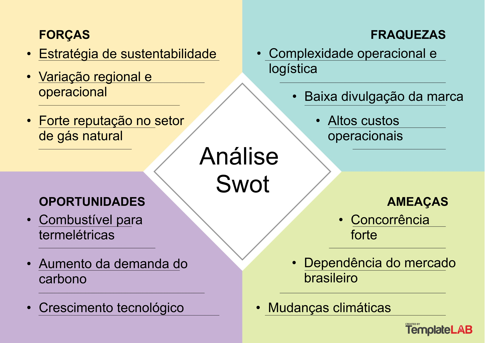 
   
   <sup>Fonte: Material produzido pelos autores (2024)</sup>
   
</div>

&nbsp;&nbsp;&nbsp;&nbsp;De acordo com a análise SWOT da empresa apresentado acima, temos:

### Forças 

- Estratégias de sustentabilidade: A Compass definiu uma estratégia de sustentabilidade focada na descarbonização e na construção de uma matriz energética mais segura, acessível e sustentável.  A empresa reconhece o gás natural como um componente estratégico para substituir combustíveis mais poluentes, com metas para 2030. Esses objetivos incluem alcançar a neutralidade de carbono, liderar a distribuição de gás renovável no Brasil e impulsionar o uso do gás na matriz de transportes, demonstrando um compromisso com a sustentabilidade.

-  Variação regional e operacional: A Compass está presente em várias regiões do Brasil através de distribuidoras como a Comgás, Sulgás e CeGás, além de atuar em diferentes áreas, incluindo Distribuição e Marketing & Serviços de gás. Essa diversificação regional e operacional permite à empresa atender uma ampla gama de clientes e se adaptar melhor às variações do mercado, o que ajuda a diminuir riscos à empresa.

- Forte reputação no Setor de Gás Natural: A Compass é uma empresa que controla a Comgás, a maior distribuidora de gás natural encanado do Brasil. Além disso, a Compass também possui a participação de mais de 11 distribuidoras de gás, que são gerenciadas pela Commit, uma subsidiária da Compass que conta com a parceria da Mitsui, um dos maiores conglomerados do Japão. Isso amplia a atuação da empresa em diferentes regiões do Brasil, fortalecendo sua posição no mercado de gás natural e aumentando sua capacidade de distribuição e fornecimento.


### Fraquezas 


- Complexidade operacional e logística: A Compass controla mais de 11 distribuidoras de gás, o que fortalece a reputação da empresa no mercado. No entanto, essa ampla rede também apresenta grandes desafios de gestão. Coordenar e controlar distribuidoras em diferentes regiões do Brasil, cada uma com suas próprias regulamentações e infraestruturas, é uma tarefa complexa. Se essas operações não forem coordenadas de forma eficaz, a complexidade pode comprometer a eficiência do serviço.

- Baixa divulgação da marca: Embora a Compass controle grandes distribuidoras de gás, como a Comgás, Sulgás e Necta, a própria marca Compass tem pouca visibilidade e reconhecimento entre o público em geral. Muitas pessoas estão familiarizadas com as distribuidoras regionais, mas não associam essas operações à Compass. Isso indica uma fraqueza em termos de marketing e divulgação da marca corporativa. A falta de uma presença forte em redes sociais e de materiais informativos detalhados sobre a empresa na mídia pode limitar a percepção pública da Compass como uma empresa importante no setor de energia, embora não seja.


- Altos custos operacionais: A manutenção, a logística e a conformidade regulatória nas operações de distribuição de gás geram custos elevados, que se tornam ainda mais desafiadores quando há várias distribuidoras para gerenciar. Com a responsabilidade de preservar e atualizar as infraestruturas em diferentes regiões, a Compass enfrenta despesas significativas. Esses custos elevados representam uma fraqueza para a empresa, pois podem impactar sua margem de lucro e limitar sua capacidade de investir em outras áreas estratégicas.

### Oportunidades 

- Combustível para termelétrica: O gás natural é atualmente o principal combustível utilizado na expansão da geração termelétrica no Brasil, devido à sua eficiência e menor impacto ambiental em comparação com outras fontes fósseis. Isso representa uma grande oportunidade para a Compass, que pode aproveitar essa tendência crescente ao fornecer gás natural para novas usinas termelétricas, aumentando assim sua participação no mercado e fortalecendo sua posição no setor energético.

- Aumento da demanda de baixo carbono: Diante da crescente pressão global para reduzir emissões de carbono e combater as mudanças climáticas, a Compass está bem posicionada para aproveitar essa tendência. Com um plano de sustentabilidade que inclui metas para 2030, como alcançar a neutralidade de carbono e liderar a distribuição de gás renovável no Brasil, a empresa estará preparada para atender a crescente demanda por soluções de baixo carbono. Dessa maneira, esse posicionamento estratégico não só fortalece os pontos fortes da Compass, como também a coloca em vantagem competitiva em um mercado cada vez mais voltado para a sustentabilidade.

- Crescimento da Tecnologia: O avanço da tecnologia, como automação, inteligência artificial entre outros, apresenta uma oportunidade para a Compass no setor de gás natural. Ao adotar tecnologias avançadas, como sistemas inteligentes de monitoramento de redes e análises de dados, a empresa pode otimizar a eficiência operacional, reduzir custos, e melhorar a segurança de suas operações. Além disso, o uso de novas tecnologias pode facilitar a detecção de anomalias e fraudes, aprimorar a manutenção preditiva e melhorar a gestão da rede de distribuição de gás, minimizando riscos e aumentando a capacidade da infraestrutura.


### Ameaças 

- Concorrência forte: Apesar de sua forte reputação, a Compass enfrenta concorrentes no mercado de gás, como Petrobras, Naturgy e Gás Natural Açu (GNA). Empresas como Petrobras e Naturgy dominam grande parte do mercado devido às suas vastas infraestruturas e capacidades de produção e distribuição de gás natural. Enquanto isso, a Gás Natural Açu (GNA) está expandindo suas operações e introduzindo inovações, aumentando a competitividade no setor.

- Dependência do mercado brasileiro: A Compass realiza suas operações exclusivamente no Brasil, o que a torna vulnerável às condições econômicas e políticas do país. Dessa forma, qualquer instabilidade no cenário nacional pode impactar negativamente as operações da empresa, dificultando a continuidade dos negócios e a execução de suas estratégias.

- Mudanças climáticas: O aumento da severidade de eventos climáticos, como deslizamentos causados por chuvas intensas, ciclones tropicais e inundações, representa uma ameaça às operações da Compass. Esses fenômenos podem causar danos à infraestrutura da empresa, como gasodutos e instalações de distribuição, interrompendo o fornecimento de gás e elevando consideravelmente os custos de manutenção, reparo e implementação de medidas de prevenção de riscos. 

&nbsp;&nbsp;&nbsp;&nbsp;Assim, após a realização da análise SWOT da Compass Gás e Energia SA, é perceptível uma visão mais ampla da situação da empresa. Foram identificados pontos que precisam ser melhorados, bem como os pontos fortes que colocam a marca em uma posição de vantagem. Além disso, há as oportunidades que podem ser exploradas e os riscos que a empresa pode enfrentar diante das circunstâncias atuais. Desse modo, todos esses aspectos são fundamentais para o desenvolvimento e o sucesso do projeto.


#### 4.1.3. Planejamento Geral da Solução

&nbsp;&nbsp;&nbsp;&nbsp;Para desenvolver o planejamento geral da solução, é essencial levantar alguns pontos importantes para o sucesso do projeto, como os dados disponíveis, a solução proposta, sua aplicação prática e os benefícios esperados. Desta forma, podemos nos aprofundar a respeito dos tópicos necessários ao decorrer do texto.

&nbsp;&nbsp;&nbsp;&nbsp;Primeiramente, em relação aos dados fornecidos à equipe, podemos destacar que o projeto trabalhará com dois tipos de planilhas específicas, disponibilizadas oficialmente pelo time de tecnologia da Compass: a planilha de informações cadastrais dos clientes e as planilhas mensais de consumo desse público.

&nbsp;&nbsp;&nbsp;&nbsp;Os dados trabalhados nas planilhas de informações cadastrais são os seguintes:

- **clientCode (Código do Cliente):** Identificador único do cliente, vinculado diretamente ao CPF ou CNPJ do cliente.
- **clientIndex (Índice do Cliente):** Identificador único para cada instalação (medidor) realizada vinculada ao cliente.
- **cep (CEP da Instalação):** CEP da instalação.
- **bairro (Bairro da Instalação):** Bairro da instalação.
- **cidade (Cidade da Instalação):** Cidade da instalação.
- **categoria (Categoria do Cliente):** Categoria do cliente na qual ele se enquadra.
- **contratacao (Data da Contratação):** Data da contratação do serviço.
- **situacao (Situação Atual do Cliente):** Situação do cliente, se está consumindo gás ou desativado.
- **perfil_consumo (Serviços Contratados):** Tipo/Perfil de consumo do cliente, quais situações utiliza o serviço de gás.
- **condCode (Código do Condomínio):** Identificador único do condomínio.
- **condIndex (Índice do Condomínio):** Identificador único para cada instalação realizada na área comum do condomínio.

&nbsp;&nbsp;&nbsp;&nbsp;Os dados que serão fornecidos na planilha de consumo do cliente são os seguintes:

- **clientCode (Código do Cliente):** Identificador único do cliente, vinculado diretamente ao CPF ou CNPJ do cliente.
- **clientIndex (Índice do Cliente):** Identificador único para cada instalação (medidor) realizada vinculada ao cliente.
- **datetime (Data de Recepção):** Data de recepção da informação pelo ecossistema LoRa.
- **meterIndex (Leitura Atual):** Valor da leitura atual do medidor.
- **initialIndex (Valor Inicial do Equipamento):** Valor inicial do equipamento quando foi realizada a instalação do sensor.
- **pulseCount (Valor de Pulso):** Valor de pulsos lidos referente ao consumo.
- **gain (Valor de Ganho):** Fator de multiplicação de pulsos para metros cúbicos.
- **rssi (Intensidade de Sinal):** Intensidade de sinal do sensor ao gateway da publicação.
- **gatewayGeoLocation.alt (Altitude ou Altura do Gateway):** Valor de altura/altitude da instalação do gateway.
- **gatewayGeoLocation.lat (Latitude do Gateway):** Valor de latitude da instalação do gateway.
- **gatewayGeoLocation.long (Longitude do Gateway):** Valor de longitude da instalação do gateway.
- **model (Modelo do Equipamento):** Modelo do equipamento.
- **meterSN (Número do Medidor):** Número do medidor de cada instalação.
- **inputType (Tipo de Leitura):** Tipo de leitura do medidor.

&nbsp;&nbsp;&nbsp;&nbsp;Com os dados que serão trabalhados ao longo do desenvolvimento do projeto exemplificados, podemos compreender, portanto, a solução proposta. Neste contexto, a Compass está enfrentando desafios relacionados a anomalias e fraudes no consumo de gás, das quais se destacam vazamentos de gás e possíveis manipulações de medidores físicos. Assim, visando extinguir essas problemáticas, a empresa parceira propôs que o grupo criasse um modelo preditivo que identifique essas inconsistências.

&nbsp;&nbsp;&nbsp;&nbsp;Dessa forma, o modelo elaborado pela equipe será encarregado de auxiliar a detectar fraudes e reduzir as perdas financeiras associadas a esses incidentes para a Compass. Em meio a esse processo, a empresa poderá compreender melhor o comportamento do consumo de gás por parte dos seus clientes. Por fim, espera-se que, com a elaboração do modelo preditivo, a empresa possa oferecer serviços mais personalizados e eficazes, contribuindo para a expansão de sua base de clientes e da rede de distribuição de gás encanado no Brasil.

&nbsp;&nbsp;&nbsp;&nbsp;Após desenvolvida, a solução proposta será implementada como uma forma de gestão de dados focada em detectar anomalias no consumo de gás natural e identificar as possíveis fraudes levantadas. Por meio do nosso modelo preditivo, poderemos monitorar dados que são recebidos de 12 em 12 horas, analisando padrões de consumo a partir de dados recebidos pelos sensores instalados nos medidores dos clientes.

&nbsp;&nbsp;&nbsp;&nbsp;Falando um pouco sobre o modelo de negócios da empresa e os usuários que serão analisados pela solução desenvolvida pela equipe, podemos mencionar, Grandes distribuidores de gás natural, configurando um modelo _Business to Business_ (B2B), condomínios residenciais com foco em individualização de consumo, também configurando um modelo _Business to Business_ (B2B), e, por fim, consumidores finais, caracterizando um modelo _Business to Consumer_ (B2C).

&nbsp;&nbsp;&nbsp;&nbsp;Podemos concluir que a solução proposta oferece diversos benefícios para a empresa Compass. Em termos de detecção de fraudes, nosso modelo preditivo permitirá a identificação de fraudes no consumo, evitando perdas financeiras e possíveis danos aos equipamentos físicos da empresa. 

&nbsp;&nbsp;&nbsp;&nbsp;Em um segundo plano, pode-se mencionar a melhoria na segurança, garantida pela detecção de anomalias em tempo real, possibilitando uma resposta rápida para corrigir problemas, como vazamentos de gás ou falhas nos equipamentos, assegurando a proteção dos usuários finais. 

&nbsp;&nbsp;&nbsp;&nbsp;Por fim, em relação à eficiência operacional, a análise de dados permitirá a otimização dos processos, reduzindo o tempo de resposta a problemas e, consequentemente, melhorando a qualidade do serviço prestado.

#### 4.1.4. Value Proposition Canvas

&nbsp;&nbsp;&nbsp;&nbsp;Segundo a autora Amanda Gushiken (2023), o Canvas Proposta de Valor é uma ferramenta estratégica que permite aos empreendedores desenhar, testar, visualizar e aprimorar produtos e serviços, baseando-se na compreensão das necessidades, desejos e desafios dos clientes. A Proposta de Valor é uma mensagem clara que explica o que uma empresa oferece, como ela se diferencia dos concorrentes e como ajuda a criar propostas de valor que ressoam com o público-alvo. <br>
&nbsp;&nbsp;&nbsp;&nbsp;A estrutura do Canvas Proposta de Valor é composta por duas partes: um círculo, que representa o perfil do cliente, e um quadrado, que simboliza o mapa de valor do produto. Essas partes são divididas em três áreas: <br>
- **Tarefas**: No perfil do cliente, são identificadas as tarefas realizadas ao consumir um serviço. O produto deve auxiliar na execução dessas tarefas para criar valor.
- **Dores**: São levantados os problemas que o cliente enfrenta. O produto deve reduzir ou eliminar esses problemas para criar valor.
- **Ganhos**: O cliente busca benefícios em suas experiências. O produto deve proporcionar esses benefícios para criar valor.

<div align="center">
   
   <sub>Figura 2 - Proposta de Valor Canvas Sprint 1 </sub>

    
   
   <sup>Fonte: Material produzido pelos autores (2024)</sup>
   
</div>

&nbsp;&nbsp;&nbsp;&nbsp;Como mostrado na imagem acima, estão definidos os tópicos relacionados ao perfil do cliente e à proposta de valor: <br>
- **Tarefas**: A Compass atua na distribuição de gás, marketing e serviços, controlando todos esses serviços para suas filiais.
- **Dores**: A Compass enfrenta dificuldades para identificar e controlar anomalias presentes nos processos.
- **Ganhos**: A Compass busca identificar de forma mais fácil e proativa as anomalias relacionadas ao gás.
- **Produtos e serviços**: Será fornecido um serviço para a análise de dados, visando a descoberta de possíveis anomalias, como desvio de gás, vazamentos, medições negativas (medição abaixo da quantidade real utilizada), picos (medição acima da quantidade real utilizada) e ausência de dados (falta de registro da quantidade de gás utilizada).
- **Criadores de ganhos**: Facilitamos o acompanhamento das medições de anomalias pela Compass, tornando os dados mais claros e acessíveis para um monitoramento mais eficaz.
- **Aliviadores de dores**: Serão fornecidos os recursos necessários para que a Compass identifique anomalias na distribuição de gás.

&nbsp;&nbsp;&nbsp;&nbsp;Desse modo, o Canvas Proposta de Valor permite às empresas como a Compass mapear e entender as necessidades e desafios de seus clientes. Com base nisso, a Compass pode desenvolver um serviço focado na análise de dados para identificar anomalias na distribuição de gás, facilitando o monitoramento e controle dos processos. Ao abordar as dores e criar ganhos para seus clientes, a empresa alinha sua oferta de produtos e serviços às expectativas e necessidades do mercado.


#### 4.1.5. Cinco Forças de Porter

&nbsp;&nbsp;&nbsp;&nbsp;Segundo Michael Porter (1986), no contexto de elaboração de ações estratégicas dentro de uma corporação, torna-se essencial compreender como o setor em que ela atua no mercado interfere seu desempenho. Nesse sentido, as chamadas Cinco Forças de Porter são um *framework* para a investigação de fatores-chave que exercem influência no sucesso de um negócio, sendo eles: rivalidade entre concorrentes; poder de barganha dos fornecedores e de compradores; ameaça de novos entrantes, de produtos ou serviços substitutos. A seguir, segue uma explicação em tópicos do que cada ameaça significa.

- Rivalidade entre Concorrentes: descreve a concorrência entre empresas posicionadas em um mesmo setor, disputando por atenção do público através de preços mais atrativos, diferencial de marca/produto/serviço, melhor atendimento ao cliente, entre vários fatores. 
- Poder de Barganha dos Fornecedores: explica como o poder dos fornecedores de aumentar os preços ou reduzir a qualidade pode impactar os custos e a lucratividade.
- Poder de Barganha dos Compradores: descreve como consumidores exigentes podem forçar as empresas a reduzir preços ou aumentar a qualidade.
- Ameaça de Novos Entrantes: representa as barreiras de entrada que protegem as empresas já posicionadas em um setor de novas concorrências, e como isso pode afetar a estratégia em geral.
- Ameaça de Produtos ou Serviços Substitutos: analisa como a disponibilidade de alternativas de produtos e serviços pode limitar os preços e impactar a demanda.

<div align="center">

   <sub>Figura 3 - Modelo de Cinco Forças de Porter - Sprint 1 </sub>

   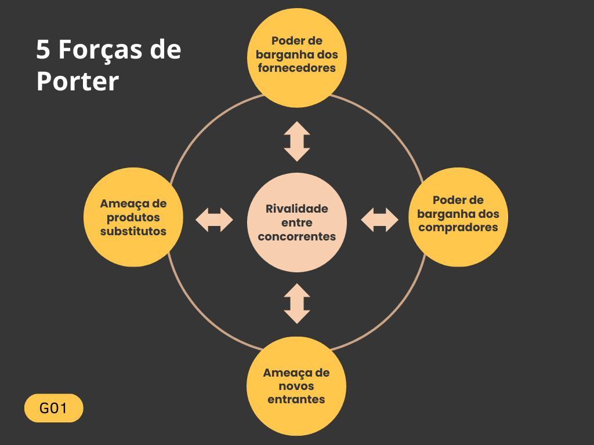 

   <sup>Fonte: Material produzido pelos autores (2024)</sup>

</div>

 &nbsp;&nbsp;&nbsp;&nbsp;Confira a imagem exposta acima por meio do link: (https://abre.ai/cincoforcas).

**Rivalidade entre concorrentes existentes**

&nbsp;&nbsp;&nbsp;&nbsp;A _Compass_ atua na distribuição de gás natural, um setor não conhecido pela competitividade em relação ao número de participantes, mas formado por empresas bem estabelecidas em suas regiões, como a Naturgy, Bahiagás e a Casmig, e com isso podem disputar através da qualidade dos insumos, eficiência operacional e inovação tecnológica. Entretanto, a Compass destaca-se como detentora das maior parte das marcas de gás natural no Sudeste, Sul e Nordeste — suas regiões de atuação —, ou seja, representa uma das principais fornecedoras e investidoras do ramo, garantindo uma presença bem distribuída em várias localidades do Brasil, o que a evidencia como uma forte concorrente no mercado.

**Poder de barganha de fornecedores**

&nbsp;&nbsp;&nbsp;&nbsp;Sabendo-se que a Compass é detentora das principais marcas de distribuição de gás natural de suas regiões de atuação, essa posição consolidada no mercado faz com que ela não seja tão ameaçada pelo poder de barganha dos fornecedores, afinal, possui um maior controle sobre sua cadeia de suprimentos e pode negociar termos favoráveis com os fornecedores. Além disso, a presença forte em diversas localidades estratégicas, como no Sudeste, Sul e Nordeste, oferece à empresa uma vantagem competitiva, pois pode diversificar suas fontes de abastecimento e, assim, reduzir sua dependência de um único fornecedor.

**Poder de barganha de compradores**

&nbsp;&nbsp;&nbsp;&nbsp;O poder de barganha dos compradores no setor de distribuição de gás natural é relativo à categoria residencial do cliente, podendo-se citar dois exemplos de utilização:<br>
&nbsp;&nbsp;&nbsp;&nbsp;No caso de clientes que residem em condomínios ou prédios que já possuem alguma marca da Compass como contratada para a distribuição de gás — cenário especialmente favorável em regiões onde as marcas da Compass são predominantes —, é improvável que os moradores tenham autonomia para escolher livremente a distribuidora para sua casa ou apartamento, afinal, a respectiva troca de infraestrutura acaba por ser inviável ou não permitida pela administração destes tipos residenciais, portanto, o poder de barganha dos compradores nesse cenário acaba por ser reduzido.<br>
&nbsp;&nbsp;&nbsp;&nbsp;Por outro lado, em relação ao uso doméstico e, em alguns casos, industrial, o cliente possui autonomia para escolher entre distribuidoras de gás natural, bem como pode decidir se irá utilizar o gás natural ou outra fonte alternativa. Neste caso, o poder de barganha dos compradores é relativamente elevado, o que lhes dá liberdade para pressionar distribuidoras de gás em relação a preço, qualidade do serviço, infraestrutura, entre outros fatores, consistindo em um ponto de atenção para as relações entre clientes e Compass, e para o seu posicionamento no mercado.<br>
&nbsp;&nbsp;&nbsp;&nbsp;Por fim, percebe-se que a ameaça do poder de barganha de compradores é relativo a fatores como localidade e tipo de cliente, tornando-se clara a importância de analisar as diferentes facetas dessa influência por parte dos clientes finais, em prol de aprimorar o posicionamento da Compass no setor de distribuição de gás natural.

**Ameaça entre novos entrantes**

&nbsp;&nbsp;&nbsp;&nbsp;A ameaça de novos entrantes no mercado de distribuição de gás natural também é reduzida devido a algumas barreiras de entrada, como a infraestrutura inicial necessária — como a construção e manutenção de redes de gasodutos —, exige um grande investimento e tempo maior para implementação. Além disso, o setor é conhecido pela sua forte regulamentação, o que pode ser um obstáculo para novos entrantes com menos experiência ou recursos para atender aos padrões de conformidade. Nesse sentido, ainda que se tenha a ameaça de novos competidores, considerando que a Compass é uma das lideranças do mercado, ela ainda tem a capacidade de investir em inovação, melhoria contínua de seus serviços e companhias menores, reforçando sua posição de liderança no mercado.

**Ameaça de produtos substitutos**

&nbsp;&nbsp;&nbsp;&nbsp;O gás natural é uma fonte de energia limpa e eficiente, frequentemente utilizada em aplicações residenciais, de transporte, comerciais e industriais (Reis, 2018). Existem alternativas energéticas, como eletricidade, biocombustíveis e energia solar, cada uma delas possuindo seus benefícios e limitações em termos de custo, infraestrutura e aplicabilidade. É possível que, conforme circunstâncias de localidades e suas distribuidoras disponíveis, precificação, finalidade e outros fatores, possa se optar por fontes de energia diferentes do gás natural. Com isso, entende-se que a ameaça de produtos substitutos é relativamente moderada.

&nbsp;&nbsp;&nbsp;&nbsp;Dessa forma, evidencia-se a importância de se implementar do modelo de Cinco Forças de Porter em relação à *Compass* com o objetivo de compreender as influências que o setor de distribuição de gás natural exerce na atuação e desempenho da empresa. O entendimento desses possíveis pontos de ameaça setoriais — como as fontes de energias alternativas ao gás natural e o poder de barganha de fornecedores — é imprescindível para a delimitação do presente projeto, que visa elaborar um modelo de predição de anomalias no consumo e prevenção de fraudes, afinal, para isso, deve-se sempre considerar os fatores de risco, tanto internos como externos, a fim de uma solução viável e prática para as necessidades da empresa parceira.

#### 4.1.6. Matriz de Riscos

&nbsp;&nbsp;&nbsp;&nbsp;Segundo os autores Tomaz; Gagliasso; Malavota (2020), uma Matriz de Riscos é uma poderosa ferramenta de gestão responsável por fornecer auxílio para que grupos possam identificar riscos e ameaças que possam impactar negativamente um determinado projeto. Uma Matriz de Riscos é elaborada partindo da probabilidade de algo negativo acontecer durante o projeto e relacionando isso com o impacto que esse algo teria sobre o projeto. Ainda de acordo com os autores, um fator muito importante de uma Matriz de Riscos é a sua iteratividade. De maneira simplificada, um grupo trabalhando em um projeto deve sempre estar retornando à Matriz de Riscos a fim de entender se os riscos previamente identificados ainda carregam a mesma probabilidade/impacto de acontecerem. <br>
&nbsp;&nbsp;&nbsp;&nbsp;Além da Matriz de Riscos, times também podem se beneficiar da elaboração de uma Matriz de Oportunidades, que tem como objetivo identificar as principais ocorrências das quais o grupo tocando o projeto pode tirar maior proveito. Assim como a Matriz de Riscos, na de oportunidades o foco está em aproveitar as ações que requerem menor esforço, possuem maior probabilidade de ocorrerem e impactem mais o projeto.   

<div align="center">
   
   <sub>Figura 4 - Matriz de Riscos e Oportunidades Sprint 1 </sub>

   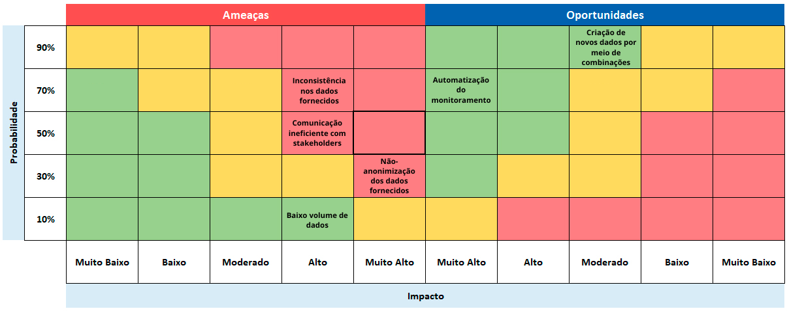 
   
   <sup>Fonte: Material produzido pelos autores (2024)</sup>
   
</div>

&nbsp;&nbsp;&nbsp;&nbsp;Em relação aos riscos identificados para este projeto, temos:
- **Não-anonimização dos dados fornecidos**: Caso a empresa forneça dados que não estejam anonimizados de acordo com a LGPD (<a href="https://www.planalto.gov.br/ccivil_03/_ato2015-2018/2018/lei/l13709.htm">Lei Geral de Proteção dos Dados</a>), o projeto pode sofrer com impactos legais e sanções da ANPD (<a href="https://www.gov.br/anpd/pt-br">Autoridade Nacional de Proteção dos Dados</a>). O plano de ação para caso tal risco venha a se concretizar inclui a própria equipe realizando a anonimização dos dados por meio de técnicas como mascaremento. 
- **Inconsistência nos dados fornecidos**: Com inconsistência, apontamos que os dados fornecidos podem necessitar de uma quantidade de tratamento e pré-processamento, que constitui o processo de limpar e remover *outliers* dos dados, maior que a esperada, causando atrasos no projeto. É entendível que, num projeto de ciência de dados, boa parte do tempo é despendido adequando a fonte de dados. Entretanto, uma fonte de dados muito inconsistente pode fazer com que tenhamos que passar muito tempo limpando esses dados (removendo valores nulos, tratando _outliers_, etc). Como plano de ação para este risco, definimos que é necessário estudar os dados a fim de entender a qualidade deles e, caso necessário, traçar rotas mais ideais para se realizar a limpeza, diminuindo o tempo necessário para adequar os dados para rodar um modelo preditivo. 
- **Baixo volume de dados**: No mundo de ciência de dados e criação de modelos preditivos, quase sempre é regra que “quanto mais dados, melhor”. Isso ocorre porque modelos desse tipo precisam, antes de realizar qualquer predição, ser treinados. Dessa forma, uma baixa quantidade de dados pode inferir diretamente na qualidade de treinamento dos modelos, o que resultaria em uma baixa acurácia. No presente projeto, identificamos que possuímos apenas 5 meses de dados, uma quantidade considerada relativamente baixa. Dessa forma, um impacto que pode decorrer disso é que não é possível observar efeitos de sazonalidade nos dados. Um possível plano de ação para este risco inclui realizar um tratamento mais aprofundado dos dados, a fim de fazer com que eles sejam mais úteis para o treinamento dos modelos. Além disso, podem ser utilizadas técnicas para se gerar novos dados a partir de dados existentes e também realizar o enriquecimento dos dados com fontes extras, como API's para obter a temperatura de determinado local. 
- **Comunicação ineficiente com _stakeholders_**: Como o projeto que está sendo desenvolvido é para uma empresa parceira, é de extrema importância se atentar aos requisitos que essa empresa coloca sobre o projeto e o que ela espera da solução que estamos desenvolvendo. Dessa forma, uma comunicação ineficiente com esta empresa pode levar a mal-entendidos quanto aos requisitos dos projetos. Para amenizar este risco, o grupo pretende estabelecer uma comunicação objetiva com os _stakeholders_, sempre deixando claro o que entendemos do projeto e o que podemos e pretendemos entregar.

&nbsp;&nbsp;&nbsp;&nbsp;Em relação às oportunidades, identificamos:
- **Automatização do monitoramento**: O processo de executar o modelo e obter possíveis clientes que estejam fraudando o consumo de gás pode ser automatizado a fim de ser executado, por exemplo, 1 vez por semana, a fim de sempre manter as informações atualizadas. Ao passo em que isto não está incluido no escopo do projeto, é uma oportunidade que pode ser explorada futuramente e pode ser realizada a partir do desenvolvimento de uma *pipeline* de análise de dados, que consegue receber um *input* de novos dados e classificar aqueles que, por exemplo, possuam um consumo anormal.
- **Criação de novos dados por meio de combinações**: Em projetos de análise de dados, uma oportunidade comum de se aproveitar é a criação de novos dados a partir da combinação de dados já existentes. Por exemplo, a partir da altura e peso de um cliente, podemos inferir o seu IMC. Neste projeto, podemos utilizar os dados disponíveis para gerar novas colunas com dados que possam servir para aumentar a acurácia do modelo. Além disso, foi possível identificar a oportunidade de se utilizar uma API externa que disponibiliza dados históricos de temperatura para diversas cidades. A partir disso, podemos enriquecer os dados com valores históricos de temperatura, que podem ter relação direta com o consumo de gás da região.

&nbsp;&nbsp;&nbsp;&nbsp;Dessa forma, percebe-se como uma ferramenta como a Matriz de Riscos e Oportunidades pode ser extremamente útil, nos ajudando a identificar, durante todo o decorrer do projeto, os riscos que podem afetar o nosso desenvolvimento. Por fim, a elaboração dessas matrizes serve para que o que o grupo fique atento a essas ameaças e consiga as combater caso ocorram. 

#### 4.1.7. Personas

&nbsp;&nbsp;&nbsp;&nbsp;Segundo Page Laubheimer, especialista sênior em Experiência do Usuário no Nielsen Norman Group, personas são representações fictícias - mas que guardam características identificáveis e reais - do público alvo de determinado produto. Nesse contexto, o design de produtos e serviços com foco na experiência do usuário se mostra mais assertivo, pois identifica mais claramente quais são as dores que o público sofre e quais são os seus desejos, permitindo o desenvolvimento de soluções que fazem sentido para seu usuário final.

&nbsp;&nbsp;&nbsp;&nbsp;É possível criar 3 tipos diferentes de persona, a depender do objetivo da solução, dos aspectos que se quer conhecer sobre o público alvo e do método utilizado para o desenvolvimento da representação: proto personas, personas qualitativas e personas estatísticas.

- A proto persona é uma representação feita pelo time de desenvolvimento a partir de ideias pré-concebidas sobre seu público alvo e sem a interferência de dados externos àqueles já conhecidos;
- A persona qualitativa é um retrato do usuário feito por meio de entrevistas com 5 a 30 pessoas e que busca identificar aspectos subjetivos e pessoais do público, como suas dores, seus desejos e quais aspectos da solução mais estão em conformidade com o que o consumidor espera;
- A persona estatística é feita por meio de processos de entrevistas com pelo menos 100 pessoas e tem por objetivo encontrar interesses em comum dentre um grande número de possíveis usuários finais.

&nbsp;&nbsp;&nbsp;&nbsp;O processo de criação e desenvolvimento de persona escolhido pela equipe foi o de proto persona, tendo em vista o tempo inábil para coleta de respostas da equipe de dados das empresas parceiras *Compass* e *IOLIT* e construção de personas qualitativas por meio de entrevistas e respostas com um pequeno grupo de pessoas do público alvo - profissionais da equipe de dados que utilizarão o modelo preditivo em seu dia a dia na *startup IOLIT*.

&nbsp;&nbsp;&nbsp;&nbsp;Para embasamento e maior fidedignidade da primeira proto persona, o Thiago, foi utilizado o último relatório (edição de 2023) da pesquisa *State of Data*, realizada anualmente pela comunidade *Data Hackers* e que coleta dados sobre os profissionais e o ambiente profissional de dados no Brasil. Além disso, foi utilizado o site de apresentação da *startup* parceira, de forma a encontrar quais aspectos eram mais valorizados e que são a base para o fit cultural da equipe de profissionais da mesma. Além disso, para o embasamento de segunda persona, a Thalyta, foi utilizada a edição de 2021-2022 do Panorama de Mercado de Product Management, produzido pela PM3, do Grupo Alura. O referido relatório foi uma importante referência para a interpretação de dados demográficos e de comportamento relacionados ao perfil desejado, que busca representar um cargo de gestão de negócios da Compass.

&nbsp;&nbsp;&nbsp;&nbsp;Informações como sexo, idade média, nível de cargo, formação média e localidade foram utilizadas para criação dos perfis demográficos, bem como para embasar a biografia, os interesses e motivações das proto personas, as quais pode ser analisada nas imagens abaixo.

<div align="center">
   
   <sub>Figura 5 - Persona 1 </sub>

    
   
   <sup>Fonte: Material produzido pelos autores (2024)</sup>
   
</div>

&nbsp;&nbsp;&nbsp;&nbsp;A primeira persona contém as seguintes informações:

- Perfil: possui nome, gênero, idade, cidade de moradia e posição ou cargo desempenhado na empresa em que trabalha.
   - Nome: Thiago Ferreira da Silva;
   - Gênero: Masculino;
   - Idade: 27 anos;
   - Cidade: São Paulo - SP;
   - Posição: CIentista de dados;
   <br>

- Biografia: conta a origem e características pessoais e culturais da persona.
   - Thiago nasceu no Rio de Janeiro e começou a se interessar por matemática durante o ensino Ensino Fundamental, quando ajudou seu avô a cuidar das finanças de seu bar, enquanto seu hobby favorito era jogar videogame. Decidiu fazer sua graduação em Ciência da Computação na UFRJ e se especializou em Inteligência Artificial. Hoje, atua na empresa Compass e é um dos chefes de inovação da área de dados e na formação da startup IOLIT, na qual emprega seus conhecimentos de negócios e matemática para inovar os processos da empresa e na experiência de clientes.
   <br>

- Frustrações: dores que o público alvo carrega diariamente e que se relacionam com a proposta de valor do produto desenvolvido pela equipe.
   - Precisa fazer análises de dados demoradas;
   - Seu fluxo de trabalho possui poucas automações;
   - Não sabe como encontrar anomalias entre os dados.
   <br>

- Motivações: aspectos da personalidade e valores que são importantes para a persona e que podem ser identificadas pela semelhança de valores das empresas parceiras.
   - Interessa-se pela inovação e por projetos de impacto cultural e deseja ser um gestor sênior que identifique oportunidades de melhoria econômica e social de sua empresa por meio da tecnologia de dados e inteligência artificial.
   <br>
- Interesses: gostos e preferências expostos pelo público alvo e que se relacionam com a solução proposta.
   - Inteligência artificial;
   - Estatística;
   - Negócios.

<div align="center">
   
   <sub>Figura 6 - Persona 2 </sub>

    
   
   <sup>Fonte: Material produzido pelos autores (2024)</sup>
   
</div>

&nbsp;&nbsp;&nbsp;&nbsp;A segunda persona contém as seguintes informações:

- Perfil:
   - Nome: Thalyta Meideiros Souza;
   - Gênero: Feminino;
   - Idade: 34 anos;
   - Cidade: São Paulo - SP;
   - Posição: Gerente de Produto;
   <br>

- Biografia:
   - Nascida e criada em São Paulo, Thalyta sempre se destacou pela sua curiosidade e criatividade diante de desafios, além de seu interesse por Informática, o que a levou a cursar Engenharia de Produto na Universidade Presbiteriana Mackenzie e, posteriormente, fazer um MBA em Tecnologia e Inovação. Ao adentrar à  Compass e conhecer a iniciativa da IOLIT, Thalyta enxergou a possibilidade de conhecer mais sobre o mercado de distribuição gás e auxiliar na modernização do gerenciamento do consumo. Mais do que mergulhar em novos projetos, Thalyta ama praticar natação nos fins de semana.
   <br>

- Frustrações:
   - Possui dificuldade em determinar um timing adequado para o oferecimento personalizado de propaganda;
   - Possui dificuldade em interpretar o comportamento de consumo de clientes da Compass através dos métodos manuais; 
   - Sente necessidade de implementar tecnologia nos processos de gestão de consumo.
   <br>

- Motivações:
   - Acredita no poder da integração de tecnologia inovadora para o aprimoramento de processos internos, de forma a diminuir custos e aumentar a receita empresarial. Planeja no futuro ser sócia da Compass.
   <br>
- Interesses: gostos e preferências expostos pelo público alvo e que se relacionam com a solução proposta.
   - Negócios;
   - Vendas;
   - Tecnologia.

&nbsp;&nbsp;&nbsp;&nbsp;Dessa forma, as personas do Thiago e da Thalyta devem servir como guias estratégicos para a equipe de desenvolvimento. Utilizando esses perfis, o time poderá direcionar o modelo preditivo de maneira mais precisa, garantindo que a solução final atenda não apenas às expectativas técnicas, mas também às necessidades emocionais e funcionais do público representado. Isso aumentará a probabilidade de entregar um produto que realmente agrega valor e se aproxime das motivações e preferências reais dos usuários finais.

##### 4.1.7.1 User Stories

&nbsp;&nbsp;&nbsp;&nbsp;As *User Stories*, segundo *Max Rehkopf, Product Marketing Manager na Atlassian*, são explicações simples e sucintas de funcionalidades de um produto feitas com base na perspectiva e experiência do usuário final. Nesse sentido, essa ferramenta é utilizada pela equipe de desenvolvimento porque traz benefícios e facilitações, como:
- Entendimento de como as funcionalidades da solução entregam valor para o cliente final;
- Priorização de tarefas tendo em vista as que mais impactam o usuário;
- Melhor entendimento de o que está sendo desenvolvido e o porquê de estar sendo desenvolvido.

&nbsp;&nbsp;&nbsp;&nbsp;A estrutura de uma *User Story* traz a descrição da funcionalidade, o motivo pelo qual ela é importante para o usuário final e qual valor ela entrega ao mesmo, e usualmente é escrita em linguagem não-técnica na 1ª pessoa do singular.

&nbsp;&nbsp;&nbsp;&nbsp;Além disso, as histórias de usuário também trazem consigo os critérios de aceite, parâmetros utilizados para validar como e em quais condições uma *User Story* é atendida correta e completamente.

&nbsp;&nbsp;&nbsp;&nbsp;Dessa forma, as *User Stories* desenvolvidas para atender às necessidades da persona de Thiago Ferreira, apresentada anteriormente na seção 4.1.7, bem como seus respectivos critérios de aceite, podem ser vistos nas tabelas abaixo:

<div align="center">

<sub>Tabela 1 - User Stories </sub>

</div>

Identificação | 01
--- | ---
Persona | Thiago Ferreira da Silva
User Story | "Como cientista de dados da startup IOLIT, gostaria de utilizar soluções tecnológicas que estejam na plataforma Google Collaboratory, para facilitar a utilização de bibliotecas de análise de dados enquanto compartilho o material com minha equipe em tempo real."
Critério de aceite 1 | CR1: Thiago acessa a internet logado com sua conta Google e entra na interface da ferramenta Google Collaboratory.
Critério de aceite 2 | CR2: Ele acessa o notebook no qual o modelo preditivo foi desenvolvido e pode compartilhá-lo com sua equipe.

Identificação | 02
--- | ---
Persona | Thiago Ferreira da Silva
User Story | "Como cientista de dados da startup IOLIT, gostaria de utilizar soluções tecnológicas nas quais não preciso instalar dependências e bibliotecas no meu computador, para que meus equipamentos mantenham um bom desempenho e o processo de setup não seja tão demorado."
Critério de aceite 1 | CR1: Thiago acessa o notebook no qual o modelo preditivo foi desenvolvido.
Critério de aceite 2 | CR2: Ele aciona a primeira célula de código do notebook, na qual são importadas as bibliotecas utilizadas pelo modelo preditivo.
Critério de aceite 3 | CR3: Ao terminar de acionar a primeira célula, Thiago pode utilizar as bibliotecas sem instalá-las em seu computador.

Identificação | 03
--- | ---
Persona | Thiago Ferreira da Silva
User Story | "Como cientista de dados da startup IOLIT, gostaria de utilizar automações e inteligência artificial no meu processo de trabalho, para que as análises de dados que eu já faço sejam executadas com maior rapidez e para que eu descubra insights valiosos referentes aos padrões de consumo de gás dos clientes."
Critério de aceite 1 | CR1: Thiago faz o upload das bases de dados que gostaria que fossem analisadas pelo modelo preditivo no notebook.
Critério de aceite 2 | CR2: Ao acionar as células de código referentes ao modelo preditivo, ele recebe os insights associados aos dados de consumo de gás das bases de dados analisadas.
Critério de aceite 3 | CR3: Ao acionar as células de código referentes à visualização gráfica, Thiago recebe gráficos relevantes contendo as análises já recebidas anteriormente.

Identificação | 04
--- | ---
Persona | Thalyta Meideiros Souza
User Story |"Como gerente de produto da Compass, quero ter acesso a análises simplificadas que me permitam visualizar insights gerados pelo modelo preditivo, para que eu possa compreender as tendências e tomar decisões informadas, mesmo sem profundo conhecimento em análise de dados."
Critério de aceite 1 | CR1: Ao acessar o sistema, Thalyta visualiza uma análise que apresenta gráficos e indicadores chave que resumem as tendências e padrões identificados nos dados, permitindo uma compreensão rápida.
Crtério de aceite 2 | CR2:  Ao interpretar os dados apresentados, Thalyta consegue compartilhar a análise com sua equipe e alinhar as estratégias de gerenciamento do produto de acordo com os insights gerados.
Critério de aceite 3 | CR3: Ao acessar a análise de dados, Thalyta visualiza as médias e os desvios padrão, apresentadas em gráficos e tabelas de fácil entendimento.


Identificação | 05
--- | ---
Persona | Thalyta Meideiros Souza
User Story | "Como gerente de produto da Compass, quero que a utilização do notebook para importar os dados fosse simples e fácil, e que os dados utilizados nas análises estejam devidamente limpos e tratados, para assegurar que as estratégias de gerenciamento de produto sejam baseadas em informações precisas e confiáveis."
Critério de aceite 1 | CR1: Ao acessar as análises, Thalyta visualiza dados que foram limpos e tratados, sem valores ausentes significativos.
Critério de aceite 2 | CR2: Ao precisar fazer o upload da base de dados, Thalyta recebe um tutorial de como realizar a importação e a execução dos dados no notebook.


&nbsp;&nbsp;&nbsp;&nbsp;Assim, é esperado que as User Stories sejam utilizadas pela equipe de desenvolvimento durante a construção da solução final, de forma a não só melhorar a produtividade e a priorização de tarefas conforme a metodologia de trabalho ágil, mas também para que o produto final atenda as necessidades principais de seus usuários e entregue valor em todas as suas funcionalidades.

#### 4.1.8. Jornadas do Usuário

&nbsp;&nbsp;&nbsp;&nbsp;O mapeamento da jornada do usuário, segundo *Gerry McGovern*, é essencial para identificar os pontos de contato mais importantes onde o conteúdo pode ser mais eficaz. Dessa maneira, ao mapear cada etapa do usuário, desde o primeiro contato até a conclusão da interação com o produto, torna-se possível entender suas expectativas em cada fase, prever possíveis dificuldades e desenvolver estratégias eficazes para resolvê-las. Consequentemente, esse processo é fundamental para criar uma experiência mais convincente, garantindo que o produto atenda às necessidades dos usuários.

&nbsp;&nbsp;&nbsp;&nbsp;Com isso em mente, desenvolvemos um template de mapeamento da jornada do usuário para nossas personas. Esse template detalha as experiências durante as diferentes fases de utilização do nosso produto: importação dos dados, visualização e análise dos dados, e conclusão sobre os dados.

&nbsp;&nbsp;&nbsp;&nbsp;Para melhor compreender o processo vivenciado por nossos usuários, nosso mapa de jornada inclui os seguintes elementos:

- **Atividade:** São as ações que o usuário realiza em cada fase.
- **Necessidades:** São as principais necessidades do usuário durante as atividades.
- **Emoções:** São os sentimentos do usuário ao longo da jornada.
- **Oportunidades:** São as soluções para os problemas identificados que podem melhorar a experiência do usuário.

&nbsp;&nbsp;&nbsp;&nbsp;Após entender a estrutura do nosso template de mapeamento da jornada do usuário, aplicamos esse modelo à persona Thiago, um cientista de dados da _Compass_ e da _startup_ IOLIT, que recebeu a tarefa de identificar e prever possíveis fraudes e anomalias no consumo de gás natural utilizando um modelo preditivo. Ele espera poder analisar os dados de forma rápida e eficiente, visualizando informações claras e precisas. Dessa maneira, detalhamos como Thiago interage com nosso produto ao longo das diferentes fases do processo, explorando suas ações, necessidades, emoções e as oportunidades de melhoria identificadas, atendendo as User Stories 2 e 3.

<div align="center">
   
   <sub>Figura 7 - Persona 1 </sub>

    
   
   <sup>Fonte: Material produzido pelos autores (2024)</sup>
   
</div>

<div align="center">
   
   <sub>Figura 8 - Jornada do Usuário 1 </sub>

   
  
  <sup>Fonte: Material produzido pelos autores (2024)</sup>
  
</div>

&nbsp;&nbsp;&nbsp;&nbsp;Confira a imagem exposta acima por meio do link: (https://abrir.link/agLrh)

&nbsp;&nbsp;&nbsp;&nbsp;A jornada do usuário contém as seguintes informações:

- *Importação dos dados:*

  - **Atividades**: Thiago abre o notebook do modelo preditivo e realiza o upload de um arquivo .csv de uma base de dados.

  - **Necessidades**: Durante a fase de importação dos dados, Thiago sente a necessidade de conseguir realizar a visualização dos dados; manter a segurança e a integridade dos dados; saber utilizar o notebook; e receber insights de fácil compreensão.

  - **Emoções**: Thiago sente medo de perder os dados e sente insegurança de não saber utilizar o notebook.

  - **Oportunidades**: Para ajudar Thiago, a equipe oferece uma instrução de como realizar a importação de dados no notebook.

- *Visualização e análise dos dados:*

   - **Atividades**: Thiago clica em executar os códigos; visualiza as tabelas e os gráficos dos dados importados, a partir da programação do modelo; cria hipóteses sobre as possíveis anomalias  no consumo de gás; analisa os insights para valisar ou refutar as hipóteses levantadas.

   - **Necessidades**: Durante a fase de visualização e análise, Thiago sente a necessidade de receber dados confiáveis e úteis para uma análise mais rápida e eficiente; obter gráficos claros que facilitem a interpretação precisa dos dados; e alcançar seu objetivo de identificar anomalias e fraudes no consumo de gás natural rapidamente.

   - **Emoções**: Thiago fica concentrado e pensativo ao realizar a análise e, logo em seguida, fica contente por conseguir visualizar os gráficos e as tabelas gerados.

   - **Oportunidades**: Como soluções para atender suas necessidades, poderiam ser fornecidos guias para interpretar os modelos de gráficos apresentados, e de disponibilizar um documento que certifique que os dados estão limpos, garantindo sua confiabilidade para as análises.

- *Conclusão sobre os dados:*

   - **Atividades**: Thiago valida ou refuta as hipóteses levantadas após uma análise mais detalhada dos dados; identifica anomalias no consumo de gás; e registra a conclusão de sua análise em um documento.

   - **Necessidades**:Durante a fase de conclusão sobre os dados, Thiago sente a necessidade de compartilhar os resultados com a equipe e de receber feedback sobre sua análise.

   - **Emoções**: Thiago fica feliz por conseguir interpretar o modelo e identificar as anomalias.

   - **Oportunidades**: Para melhorar a organização e clareza dos registros, desenvolver um modelo/template para documentar as conclusões da análise, garantindo que os resultados sejam apresentados de forma acessível e estruturada para toda a equipe.

&nbsp;&nbsp;&nbsp;A seguir, tem-se a jornada do usuário baseada na persona Thalyta, a qual representa a perspectiva de uma personalidade de negócios no time da Compass/IOLIT que pretende utilizar o modelo preditivo para não somente implementar ações em relação a possíveis anomalias de consumo, mas também para elaborar estratégias comerciais de marketing, de forma a tomar decisões baseadas em dados factíveis. É importante salientar que, diferentemente do Thiago, a Thalyta não possuirá contato com a execução em si do modelo, somente com as hipóteses e resultados alcançados, sintetizados em uma documentação feita pelo Thiago. Tal framework foi preenchido com base nas User Stories 04 e 05. 

<div align="center">
   
   <sub>Figura 9 - Persona 2 </sub>

    
   
   <sup>Fonte: Material produzido pelos autores (2024)</sup>
   
</div>

<div align="center">
   
   <sub>Figura 10 - Jornada de Usuário da Persona 2, Thalyta </sub>

   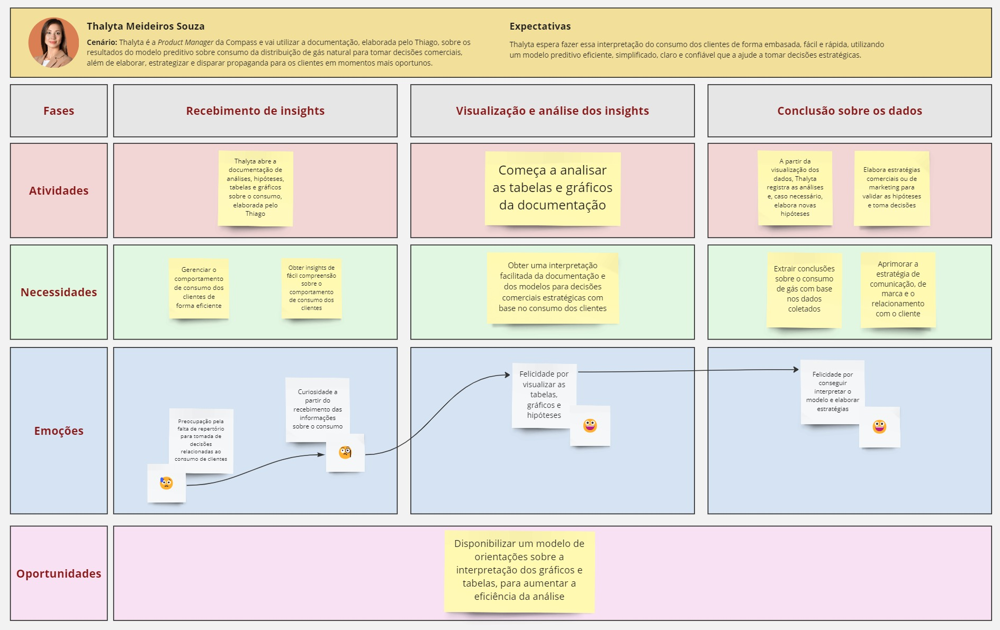 

<sup>Fonte: Material produzido pelos autores (2024)</sup>

</div>

 &nbsp;&nbsp;&nbsp;&nbsp;Confira a imagem exposta acima por meio do link: (https://bit.ly/4dJ22hB).<br>

 &nbsp;&nbsp;&nbsp;&nbsp;**Thalyta Meideiros Souza**

 - *Recebimento de insights*:

   - **Atividades**: Thalyta abre a documentação de análises, hipóteses, tabelas e gráficos sobre o consumo de gás, elaborada pelo Thiago;

   - **Necessidades**: gerenciar o comportamento de consumo dos clientes da Compass, identificando anormalidades de forma eficiente; obter insights de fácil compreensão sobre o comportamento de consumo dos clientes;

   - **Emoções**: neste momento inicial, Thalyta sente peocupação pela falta de repertório em seu dia a dia comercial para a tomada de decisões relacionadas ao consumo de clientes da Compass. Então, com o recebimento dos insights do Thiago, sente curiosidade com o que poderia extrair de análise.
   
 - *Visualização e análise dos insights*:

   - **Atividades**: então, Thalyta começa a analisar as tabelas, gráficos e hipóteses da documentação.

   - **Necessidades**: obter uma interpretação facilitada da documentação e dos modelos para decisões comerciais estratégicas com base no consumo dos clientes;

   - **Emoções**: quando consegue visualizar o repertório de informações, sente-se feliz e satisfeita pela utilidade do sistema como ferramenta de auxílio e colaboração entre a equipe.

 - *Conclusão sobre os dados*:

   - **Atividades**: a partir da visualização dos dados, Thalyta registra conclusões mais diretas a partir do modelo e elabora novas hipóteses, caso necessárias. Então, cria estratégias comerciais, de marketing ou outro campo de interesse, com a intenção de validar essas hipóteses e/ou tomar decisões.

   - **Necessidades**: nessa etapa, Thalyta sente necessidade de extrair conclusões sobre o consumo de gás com base nos dados coletados, bem como aprimorar a estratégia de comunicação, de marca e o relacionamento com o cliente da Compass.

   - **Emoções**: sente felicidade por conseguir interpretar o modelo e elaborar estratégias com sucesso.

- **Oportunidades**: em todas as fases, para aumentar a eficiência da análise da Thalyta, a equipe pode disponibilizar uma documentação de orientações sobre a interpretação dos gráficos e tabelas.

&nbsp;&nbsp;&nbsp;A partir da elaboração da Jornada de Usuário, foi possível estimular a empatia com as duas personas idealizadas pela equipe, elaboradas para refletir dois tipos de perfis de usuário da equipe de Tecnologia e Produto da Compass que poderão se beneficiar da ferramenta. Com isso, foi possível alcançar suposições essenciais em relação às tarefas, necessidades, emoções e oportunidades em toda a trajetória de uso do modelo preditivo, obtendo-se insights valiosos sobre os possíveis pontos de atenção e melhoria para o seu desenvolvimento.

#### 4.1.9 Política de Privacidade

&nbsp;&nbsp;&nbsp;A política de privacidade é um documento que busca descrever a forma que uma organização coleta, utiliza, armazena e, principalmente, protege os dados pessoais de seus usuários, em conformidade com a Lei Geral de Proteção de Dados (LGPD) no Brasil. A LGPD é responsável por estabelecer diretrizes claras sobre o tratamento de dados pessoais, assegurando que os direitos dos titulares sejam devidamente respeitados. A política de privacidade garante um tratamento de dados de forma ética, segura e em conformidade com a legislação vigente desde 2020 no país.

**Data da última atualização da política de privacidade:** Aug 2024.

&nbsp;&nbsp;&nbsp;**A COMPASS GAS E ENERGIA S.A**, pessoa jurídica de direito privado, com sede na Avenida Brigadeiro Faria Lima, nº 4.100, 16º andar, Sala 24, Itaim Bibi, São Paulo, SP, Brasil, CEP 04538-132, Telefone (11) 3897-9797, E-mail ri@compassbr.com, inscrita no CNPJ/MF sob o nº 21.389.501/0001-81, leva a sua privacidade a sério e zela pela segurança e proteção de dados de todos os seus clientes, parceiros, fornecedores e usuários (“Usuários” ou “você”) do site “www.compassbr.com/” e qualquer outro site, empresa, aplicativo operado pelo prestador de serviço (aqui designados, simplesmente, “empresa”).

&nbsp;&nbsp;&nbsp;Esta Política de Privacidade (“Política de Privacidade”) destina-se a informá-lo sobre o modo como nós utilizamos e divulgamos informações coletadas em suas visitas à nossa empresa e em mensagens que trocamos com você (“Comunicações”).

&nbsp;&nbsp;&nbsp;**AO ACESSAR A EMPRESA, ENVIAR COMUNICAÇÕES OU FORNECER QUALQUER TIPO DE DADO PESSOAL, VOCÊ DECLARA ESTAR CIENTE E DE ACORDO COM ESTA POLÍTICA DE PRIVACIDADE,** a qual descreve as finalidades e formas de tratamento de seus dados pessoais que você disponibilizar na empresa.

##### Definições

- **Dados Pessoais**: Qualquer informação que, direta ou indiretamente, identifique ou possa identificar uma pessoa natural, como por exemplo, nome, CPF, data de nascimento, endereço IP, dentre outros.
- **Dados Pessoais Sensíveis**: Qualquer informação que revele, em relação a uma pessoa natural, origem racial ou étnica, convicção religiosa, opinião política, filiação a sindicato ou a organização de caráter religioso, filosófico ou político, dado referente à saúde ou à vida sexual, dado genético ou biométrico.
- **Tratamento de Dados Pessoais**: Qualquer operação efetuada no âmbito dos Dados Pessoais, por meio de meios automáticos ou não, tal como a recolha, gravação, organização, estruturação, armazenamento, adaptação ou alteração, recuperação, consulta, utilização, divulgação por transmissão, disseminação ou, alternativamente, disponibilização, harmonização ou associação, restrição, eliminação ou destruição.
- **Leis de Proteção de Dados**: Todas as disposições legais que regulem o Tratamento de Dados Pessoais, incluindo, porém sem se limitar, a Lei nº 13.709/18, Lei Geral de Proteção de Dados Pessoais (“LGPD”).

##### Uso de Dados Pessoais

Coletamos e usamos Dados Pessoais para:

- Gerenciar seu relacionamento conosco e melhor atendê-lo quando você estiver adquirindo produtos e/ou serviços na empresa, personalizando e melhorando sua experiência.
- Confirmar ou corrigir as informações que temos sobre você.
- Enviar informações que acreditamos ser do seu interesse.
- Personalizar sua experiência de uso da empresa.
- Personalizar o envio de publicidades para você, baseada em seu interesse em nossa empresa.
- Entrar em contato por um número de telefone e/ou endereço de e-mail fornecido.

Exemplos de uso dos dados incluem:

- **Detecção de Anomalias no Consumo de Gás**: Coleta de dados para identificar padrões anômalos no consumo de gás, que possam indicar problemas como vazamentos ou falhas nos equipamentos.
- **Identificação de Fraudes**: Análise dos dados de consumo para detectar padrões de comportamento que possam sugerir fraudes.
- **Aprimoramento de Gestão de Riscos**: Uso dos dados coletados para desenvolver modelos de predição que melhorem a gestão de riscos para os clientes e parceiros.

##### Não fornecimento de Dados Pessoais

&nbsp;&nbsp;&nbsp;Você não é obrigado a compartilhar os Dados Pessoais que solicitamos, no entanto:

- Se você optar por não compartilhá-los, em alguns casos, não poderemos fornecer a você acesso completo à empresa, alguns recursos especializados ou ser capaz de prestar a assistência necessária.
- Não poderemos viabilizar a entrega do produto ou prestar o serviço contratado por você.

##### Dados coletados

- **Navegação Geral na empresa**: O público em geral poderá navegar na empresa sem necessidade de qualquer cadastro e envio de Dados Pessoais.
- **Contato com a empresa**: Nós podemos coletar dados como nome, sobrenome, número de telefone, cidade, estado e endereço de e-mail.
- **Preferências e Navegação**: Informações sobre suas preferências e interesses em relação aos produtos/serviços, além de dados sobre suas visitas e atividades na empresa.

##### Compartilhamento de Dados Pessoais com terceiros

&nbsp;&nbsp;&nbsp;Nós poderemos compartilhar seus Dados Pessoais:

- Com empresas parceiras que você selecionar ou optar em enviar os seus dados, dúvidas, perguntas, etc.
- Com provedores de serviços ou parceiros para gerenciar ou suportar certos aspectos de nossas operações comerciais em nosso nome.
- Com terceiros, caso ocorra qualquer reorganização, fusão, venda, joint venture, cessão, transmissão ou transferência de toda ou parte da nossa empresa.

##### Transferências internacionais de Dados

&nbsp;&nbsp;&nbsp;Dados Pessoais e informações de outras naturezas coletadas por nós podem ser transferidos ou acessados por entidades pertencentes ao grupo corporativo das empresas parceiras em todo o mundo de acordo com esta Política de Privacidade.

##### Forma de coleta automática de Dados Pessoais

&nbsp;&nbsp;&nbsp;Quando você visita a empresa, ela pode armazenar ou recuperar informações em seu navegador, seja na forma de cookies e de outras tecnologias semelhantes. 

Exemplos incluem:

- **Uso de cookies**: Permite a coleta de informações como tipo de navegador, tempo dispendido na empresa, as páginas visitadas, etc.
- **Uso de pixel tags e outras tecnologias similares**: Utilizados para rastrear ações de usuários da empresa, medir o sucesso das nossas campanhas de marketing e coletar dados estatísticos sobre o uso da empresa e taxas de resposta.

##### Período de Retenção dos Dados

&nbsp;&nbsp;&nbsp;Seus Dados Pessoais serão armazenados pelo período necessário para cumprir com as finalidades descritas nesta Política de Privacidade, exceto se um período de retenção mais longo for exigido ou permitido por lei.

##### Finalidades de Uso dos Dados

Os Dados Pessoais coletados são utilizados para:

- **Detecção de Anomalias no Consumo de Gás**
- **Identificação de Fraudes**
- **Aprimoramento de Gestão de Riscos**

##### Uso de Cookies

&nbsp;&nbsp;&nbsp;Este website usa cookies para melhorar a experiência do usuário. Ao utilizar o nosso website, você estará concordando com nossa Política de Cookies. Para mais informações, consulte nossa Declaração de Cookies.

##### Direitos do Usuário

Você pode, a qualquer momento, requerer:

- Confirmação de que seus Dados Pessoais estão sendo tratados.
- Acesso aos seus Dados Pessoais.
- Correções a dados incompletos, inexatos ou desatualizados.
- Anonimização, bloqueio ou eliminação de dados desnecessários, excessivos ou tratados em desconformidade com o disposto em lei.
- Portabilidade de Dados Pessoais a outro prestador de serviços, contanto que isso não afete nossos segredos industriais e comerciais.
- Eliminação de Dados Pessoais tratados com seu consentimento, na medida do permitido em lei.
- Informações sobre as entidades às quais seus Dados Pessoais tenham sido compartilhados.

### 4.2. Compreensão dos Dados

&nbsp;&nbsp;&nbsp;&nbsp;Esta seção tem como objetivo compreender todo o processo de compreensão de dados do projeto. Este processo é responsável por ser o primeiro momento de real contato dos integrantes do grupo com os dados fornecidos pela empresa parceira. Dessa forma, é um momento destinado a entender a estrutura e composição destes dados, realizando diversas consultas, aplicando métodos de estatística descritiva, identificando quais colunas são numéricas e quais são categóricas, realizando também o pré-processamento, normalização e limpeza dos dados fornecidos. A partir da exploração e do pré-processamento dos dados, também são criadas hipóteses sobre a relação dos dados e o problema.

#### 4.2.1. Exploração de dados

&nbsp;&nbsp;&nbsp;&nbsp;Segundo De Oliveira (2020), quando estamos realizando o processo de análise de dados é crucial que tenhamos conhecimento dos tipos de variáveis que estamos tratando, sendo, principalmente, a categorização delas entre categóricas e variáveis algo fundamental no desenvolvimento. Desse modo, de acordo ainda com tal estudo, as variáveis numéricas são aquelas que definem quantidade, podendo ser medidas ou contadas, além de serem usadas para operações matemáticas, sendo divididas entre contínuas e discretas, e apresentadas, como por exemplo, no formato de dados que tragam idade, salário, altura, etc. Assim, as variáveis categóricas trazem logicamente o oposto, tendo em vista que são elas que trazem dados qualitativos, sendo divididas entre nominais e ordinais, identificando grupos e classificações, como cores, gêneros, tipos de produtos, entre outros. <br>

&nbsp;&nbsp;&nbsp;&nbsp;Dessa maneira, considerando o nosso projeto atual, iremos fazer essa análise tendo em vista os dois tipos de base de dados que temos atualmente: a base de dados de cadastro do cliente e a de consumo do cliente. Começando pelo estudo das variáveis da base de dados de cadastro dos usuários da *Compass*, como é apresentado na tabela abaixo: <br>

<div align="center">

<sub>Tabela 2 - Tabela de Classificação das Variáveis da Base de Dados Cadastral </sub>

</div>

| **Variável**                       | **Tipo**     | **Descrição**                                                                 | **Classificação**  |
|------------------------------------|--------------|-------------------------------------------------------------------------------|--------------------|
| `clientCode`                       | Categórica   | Identificador único do cliente, vinculado ao CPF ou CNPJ do cliente.          | Nominal            |
| `clientIndex`                      | Categórica   | Identificador único para cada instalação (medidor) vinculada ao cliente.      | Nominal            |
| `cep`                              | Categórica   | CEP da instalação.                                                            | Nominal            |
| `bairro`                           | Categórica   | Bairro da instalação.                                                         | Nominal            |
| `cidade`                           | Categórica   | Cidade da instalação.                                                         | Nominal            |
| `categoria`                        | Categórica   | Categoria do cliente na qual ele se enquadra.                                 | Nominal            |
| `contratacao`                      | Categórica   | Data da contratação do serviço.                                               | Nominal            |
| `situacao`                         | Categórica   | Situação atual do cliente (ex.: consumindo gás ou desativado).                | Nominal            |
| `perfil_consumo`                   | Categórica   | Tipo/Perfil de consumo do cliente, indicando em quais situações utiliza o serviço de gás. | Nominal            |
| `condCode`                         | Categórica   | Identificador único do condomínio.                                            | Nominal            |
| `condIndex`                        | Categórica   | Identificador único para cada instalação realizada na área comum do condomínio. | Nominal            |

<div align="center">

<sup>Fonte: Material produzido pelos autores (2024)</sup>

</div>

&nbsp;&nbsp;&nbsp;&nbsp;É possível identificar que todas as variáveis trabalhadas nessa base são do tipo categóricas, além de serem também nominais, a julgar que essa base tem como objetivo trazer dados qualitativos do cliente, a fim de conhecer melhor o seu perfil, como consumidor. <br>

&nbsp;&nbsp;&nbsp;&nbsp;Em seguida, temos a base de dados focada no consumo do cliente, trazendo também colunas e informações trazidas na base de dados anterior: <br>

<div align="center">

<sub>Tabela 3 - Tabela de Classificação das Variáveis da Base de Dados de Consumo </sub>

</div>

| **Variável**                       | **Tipo**     | **Descrição**                                                                 | **Classificação**  |
|------------------------------------|--------------|-------------------------------------------------------------------------------|--------------------|
| `clientCode`                       | Categórica   | Identificador único do cliente, vinculado ao CPF ou CNPJ do cliente.          | Nominal            |
| `clientIndex`                      | Categórica   | Identificador único para cada instalação (medidor) vinculada ao cliente.      | Nominal            |
| `datetime`                         | Categórica   | Data de recepção da informação pelo ecossistema LoRa.                         | Nominal            |
| `meterIndex`                       | Numérica     | Valor da leitura atual do medidor.                                            | Contínua           |
| `initialIndex`                     | Numérica     | Valor inicial do equipamento ao realizar a instalação do sensor.              | Contínua           |
| `pulseCount`                       | Numérica     | Valor de pulsos lidos, referencial ao consumo.                                | Discreta           |
| `gain`                             | Numérica     | Fator de multiplicação de pulsos para metros cúbicos.                         | Contínua           |
| `rssi`                             | Numérica     | Intensidade de sinal do sensor ao gateway da publicação.                      | Contínua           |
| `gatewayGeoLocation.alt`           | Numérica     | Altitude ou altura da instalação do gateway.                                  | Contínua           |
| `gatewayGeoLocation.lat`           | Numérica     | Latitude da instalação do gateway.                                            | Contínua           |
| `gatewayGeoLocation.long`          | Numérica     | Longitude da instalação do gateway.                                           | Contínua           |
| `model`                            | Categórica   | Modelo do equipamento.                                                        | Nominal            |
| `meterSN`                          | Categórica   | Número do medidor de cada instalação.                                         | Nominal            |
| `inputType`                        | Categórica   | Tipo de leitura do medidor.                                                   | Nominal            |

<div align="center">

<sup>Fonte: Material produzido pelos autores (2024)</sup>

</div>

&nbsp;&nbsp;&nbsp;&nbsp;Feito o estudo da tabela, podemos observar uma variação entre variáveis numéricas e variáveis categóricas, tendo nessa base somente seis variáveis categóricas, todas nominais, trazendo agora não somente informações sobre o cliente, mas sobre o desempenho dos equipamentos de medições. Todavia, quando vamos para as variáveis numéricas, temos oito variáveis numéricas pontuadas, sendo só uma delas considerada discreta, a julgar que é a variável que diz respeito ao número de pulsos do medidor (número inteiro), sendo as demais variáveis contínuas, considerando que elas trazem valores dentro de um intervalo, como a variável de leitura do medidor. <br>

&nbsp;&nbsp;&nbsp;&nbsp;Logo, podemos concluir que a nossa base de dados traz uma grande variação de categorias de variáveis, sendo bem precisas nos tipos de informações que são trazidas, dando a devida atenção e trazendo equilíbrio no que tange dados quantitativos e qualitativos. Portanto, feito esse estudo, a análise dos dados pode ser muito melhor trabalhada, no que diz respeito às contas matemáticas para pesquisa de anomalias e estudos de perfil de clientes. <br>

&nbsp;&nbsp;&nbsp;Conforme o apresentado acima, para ilustrar o supramencionado, iremos realizar algumas análises de gráficos que se demonstram interessantes ao longo do levantamento de informações. Mais gráficos e análises podem ser encontradas no notebook do projeto.

##### 4.2.1.1. Distribuição Geográfica dos Gateways com Altitude

&nbsp;&nbsp;&nbsp;O gráfico intitulado "Distribuição Geográfica dos Gateways com Altitude" visualiza a relação entre latitude, longitude e altitude dos gateways instalados. As cores utilizadas no gráfico variam do amarelo ao roxo, onde o amarelo representa altitudes superiores a 900 metros, enquanto o roxo indica altitudes inferiores a 100 metros. Gateways são dispositivos de rede que atuam como pontos de acesso entre diferentes redes de comunicação, permitindo a transmissão e recepção de dados entre elas. No contexto de sistemas de monitoramento, como os utilizados para a detecção de anomalias e vazamentos de gás, os gateways coletam dados de vários sensores distribuídos geograficamente, incluindo informações de altitude, e os retransmitem para um sistema central, onde esses dados são analisados. 

&nbsp;&nbsp;&nbsp;A análise do gráfico revela duas áreas de maior concentração de dados. A primeira área está localizada entre as coordenadas de longitude -51 a -52 e latitude -29 a -31, onde predominam altitudes mais baixas, embora alguns pontos indiquem altitudes mais elevadas. A segunda área em destaque está situada entre as longitudes -48 a -46 e latitudes -24 a -22, onde também se observa uma concentração relevante de gateways. 
Compreender este gráfico no desenvolvimento de um modelo preditivo faz com que possamos visualizar o impacto da altitude na performance dos gateways. Dessa forma, podemos ajustar o modelo preditivo, garantindo que ele leve em conta variações de altitude que possam afetar a detecção de anomalias, como oscilações na transmissão de dados ou interferências na comunicação, especialmente em regiões de grande variação altimétrica.

<div align="center">
   
   <sub>Figura 11 - Gráfico de Distribuição Geográfica dos Gateways com Altitude </sub>

    
   
   <sup>Fonte: Material produzido pelos autores (2024)</sup>
   
</div>

##### 4.2.1.2. Distribuição de Tipo de Leitura por Modelo

&nbsp;&nbsp;&nbsp;Além da análise da altitude dos gateways supramencionada, a distribuição dos tipos de leitura por modelo também desempenha um papel essencial na análise preditiva. O gráfico de distribuição dos tipos de leitura por modelo é representado por um gráfico de barras que destaca as leituras realizadas pelos medidores IG1-K-L-v2 e Infinity V2.

&nbsp;&nbsp;&nbsp;No medidor IG1-K-L-v2, as leituras são categorizadas como DI1, DI2, DI3, DI4, DI5, DI6, DI7 e DI8, enquanto o medidor Infinity V2 realiza leituras remotas. A unidade de medida utilizada nesta planilha é 1e6, o que significa um milhão, 1.000.000. Essa notação pode ser encontrada em análises onde as contagens ou valores são muito grandes, facilitando a interpretação e comparação dos dados. 

&nbsp;&nbsp;&nbsp;Os resultados mostram que a leitura Remota do modelo Infinity V2 se aproxima de 1.0 (ou seja, 1 milhão de leituras), seguida pela leitura DI1, que registra 0,6 (600 mil leituras), e pela leitura DI2, com 0,4 (400 mil leituras). 

&nbsp;&nbsp;&nbsp;Essa análise para um modelo preditivo de anomalias e vazamento de gás permite identificar padrões de leitura mais frequentes, ajudando na calibração e no ajuste do modelo para detecção mais precisa de anomalias. Quanto maior a precisão na análise da distribuição das leituras, mais eficiente será o modelo preditivo em identificar potenciais vazamentos de gás e outras irregularidades.

<div align="center">
   
   <sub>Figura 12 - Gráfico de Distribuição de Tipo de Leitura por Modelo </sub>

    
   
   <sup>Fonte: Material produzido pelos autores (2024)</sup>
   
</div>

##### 4.2.1.3. Situação dos Clientes

&nbsp;&nbsp;&nbsp;Em continuidade à análise das leituras e considerando a distribuição dos gateways, a situação dos clientes também fornece dados para aprimorar a eficácia dos modelos preditivos. 

&nbsp;&nbsp;&nbsp;O gráfico de situação dos clientes é fundamental para entender a caracterização dos contratos e o comportamento dos clientes em relação ao consumo de gás. A análise revela que 96,9% dos clientes estão ativamente consumindo gás, um dado que demonstra a ampla utilização do serviço. Além disso, 1,3% dos clientes estão sob contrato, mas não apresentam consumo de gás, o que totaliza 98,2% de clientes ativos em relação ao total.

&nbsp;&nbsp;&nbsp;Por fim, o número de clientes desativados é relativamente baixo, representando apenas 1,8% do total levantado. 

&nbsp;&nbsp;&nbsp;A importância dessa análise para o desenvolvimento de um modelo preditivo de anomalias e vazamento de gás é o auxílio a compreensão da distribuição e a situação dos clientes, o modelo pode ser ajustado para identificar padrões de consumo anômalos. Para trazer um exemplo na prática, podemos pontuar a identificação de clientes que possuem contrato, mas não apresentam consumo, pode indicar possíveis falhas no sistema, desvios ou até mesmo vazamentos não detectados. 

&nbsp;&nbsp;&nbsp;Além disso, a baixa taxa de clientes desativados sugere uma estabilidade na base de clientes, o que é relevante para a previsão e monitoramento contínuo de possíveis anomalias no consumo de gás.

<div align="center">
   
   <sub>Figura 13 - Gráfico de Situação dos Clientes </sub>

    
   
   <sup>Fonte: Material produzido pelos autores (2024)</sup>
   
</div>

&nbsp;&nbsp;&nbsp;A análise integrada dos dados geográficos dos gateways, dos tipos de leitura por modelo e da situação dos clientes é essencial para o desenvolvimento de um modelo preditivo de alta precisão para detecção de anomalias e vazamentos de gás. A correlação entre altitude e performance dos gateways, os padrões de leitura e o comportamento dos clientes oferece uma visão mais ampla que pode nos permitir adaptar o modelo para diferentes cenários, garantindo uma resposta eficiente e proativa em situações de risco, como vazamentos ou falhas nos sistemas de monitoramento. 


#### 4.2.2. Pré-processamento dos dados

&nbsp;&nbsp;&nbsp;&nbsp;Entende-se por "pré-processamento de dados" o processo responsável por converter dados brutos em dados que podem, de fato, ser utilizados em projetos de análise de dados, sendo essa uma etapa indispensável para a realização da análise e modelagem dos dados (Pinheiro, 2021). Dessa forma, o pré-processamento se faz importantíssimo, uma vez que utilizar dados não-preparados faz com que os resultados do modelo preditivo fiquem muito aquém do esperado. Portanto, realizar uma boa higienização dos dados garante um processo de modelagem mais confiável e robusto. <br> 

##### 4.2.2.1 Pré-processamento das tabelas de consumo

&nbsp;&nbsp;&nbsp;&nbsp; Para o presente projeto, iniciamos o pré-processamento dos dados juntando todos os arquivos de dados de meses diferentes em um só *dataframe*:

```python
df_combined = pd.concat([df_mes1, df_mes2, df_mes3, df_mes4, df_mes5], ignore_index=True)
```

&nbsp;&nbsp;&nbsp;&nbsp;Após isso, identificamos quais colunas seriam descartadas na análise. Ao realizar uma busca, percebemos que 4 colunas (gatewayGeoLocation.alt, gatewayGeoLocation.lat, gatewayGeoLocation.long e rssi) possuíam, em sua grande maioria, valores atribuídos como None, ou seja, não possuíam valor. Assim, removemos essas 4 colunas da tabela:

```python
df_combined = df_combined.drop(columns=['gatewayGeoLocation.alt', 'gatewayGeoLocation.lat', 'gatewayGeoLocation.long', 'rssi'])

```

&nbsp;&nbsp;&nbsp;&nbsp;Após remover as colunas consideradas não vantajosas para a análise, realizamos uma encodificação do tipo *label* para a coluna *inputType*. A encodificação do tipo *label* converte os valores categóricos para um valor numérico. No nosso caso, convertemos o *inputType* DI1 para 1, DI2 para 2, e assim por diante. Ainda no tópico de encodificação, também realizamos uma *One-Hot Encoding* na coluna de *model*, criando duas novas colunas que representam, por meio de um valor booleano, se tal registro foi feito a partir de tal medidor. 

```python

## Label Encoding
encoder = LabelEncoder()

df_combined['inputType_encoded'] = df_combined['inputType'].map({'DI1': 1, 'DI2': 2, 'DI3': 3, 'DI4': 4, 'DI5': 5, 'DI6': 6, 'DI7': 7, 'DI8': 8, 'leituraRemota': 9})

unique_inputType_encoded = df_combined['inputType_encoded'].unique()
for input_type in unique_inputType_encoded:
    first_result = df_combined[df_combined['inputType_encoded'] == input_type].iloc[0]
    print(f"InputType: {first_result['inputType']}, Encoded: {input_type}")

## One-Hot Encoding
df_combined = pd.get_dummies(df_combined, columns=['model'])


```

&nbsp;&nbsp;&nbsp;&nbsp;Após realizar essa encodificação, também já removemos a coluna *inputType*, restando apenas a *inputType_encode*. Além disso, também foi removida a coluna *meterSN*, que guarda o valor serial do medidor da instalação. Identificamos que esta coluna é apenas identificadora e não impacta na análise, então a removemos. 

```python
df_combined = df_combined.drop(columns=['inputType', 'meterSN'])
```

&nbsp;&nbsp;&nbsp;&nbsp;O próximo passo após remover essas colunas foi procurar e tratar por valores que estavam faltando nas colunas restantes. Dessa forma, identificamos que, dentre todas as colunas, apenas a coluna *gain* possuía valores faltando, e, mais especificamente, esse valor aparecia como nulo apenas nas linhas em que o modelo do medidor era o *Infinity V2*. Dessa forma, decidimos que, em toda linha que o modelo do medidor fosse desse tipo, o *gain* seria igual a 0:

```python
df_combined.loc[df_combined['model_Infinity V2'] == True, 'gain'] = 0

```

&nbsp;&nbsp;&nbsp;&nbsp;Por fim, outras ações que realizamos foram:
* Encodificação label para índice do cliente, trocando o identificador dos clientes de um *hash* para um valor inteiro mais fácil de ser identificado.
* Utilização de um Standard Scaler para colocar todos os valores numéricos na mesma escala.
* Conversão da coluna *datetime* para Unix Timestamp
* Verificação por valores duplicados, que retornou que nenhuma linha na tabela estava duplicada.
* Em relação aos valores considerados *outliers*, ou seja, fora da média, decidimos por mantê-los, uma vez que tais valores podem, por si só, representarem uma anomalia no consumo de gás, e, portanto, podem ser úteis para a modelagem dos dados.

##### 4.2.2.2 Pré-processamento da tabela de informações cadastrais

&nbsp;&nbsp;&nbsp;&nbsp;Depois de terminar o pré-processamento inicial das tabelas de consumo, decidimos começar o pré-processamento da tabela de informações cadastrais. Essa tabela contém informações como código do cliente, código do condomínio, cidade, bairro, CEP, e padrão de consumo.

&nbsp;&nbsp;&nbsp;&nbsp;Primeiramente, importamos a tabela para o *notebook* já utilizado para o pré-processamento das tabelas anteriores e retiramos as colunas que não impactariam a análise, sendo elas as colunas 'condCode', 'contratacao' e 'cep'.

```python
df_cadastro.drop(columns=['condCode', 'contratacao', 'cep'], inplace=True)
```
&nbsp;&nbsp;&nbsp;&nbsp;Depois, efetuamos uma encodificação do tipo *One-Hot-Encoding* na coluna 'situacao', separando-a em três colunas com valores booleanos para o tipo de situação atrelado a cada clientCode.

```python
df_cadastro = pd.get_dummies(df_cadastro, columns=['situacao'])
```

&nbsp;&nbsp;&nbsp;&nbsp;Após o processo de *encode*, decidimos analisar a quantidade e os tipos de perfil de consumo dos clientes cadastrados.

```python
perfil_consumo_counts = df_cadastro['perfil_consumo'].value_counts()
```
&nbsp;&nbsp;&nbsp;&nbsp;Assim, descobrimos que o perfil de consumo que mais se repetia era o perfil "Cocção + Aquecedor", tendo 1479 clientes atrelados a essa identificação. Além disso, havia 5 clientes com o valor "-" ocupando a coluna de perfil de consumo. Dessa forma, decidimos substituir os valores "-" pela moda da coluna. Após a substituição, também foi aplicada a encodificação *One-Hot-Encoding*.

```python
df_cadastro['perfil_consumo'] = df_cadastro['perfil_consumo'].replace('-', 'Cocção + Aquecedor')
df_cadastro = pd.get_dummies(df_cadastro, columns=['perfil_consumo'])
```
&nbsp;&nbsp;&nbsp;&nbsp;Depois, identificamos quais eram as categorias de cliente que mais apareciam na tabela de informações cadastrais para entender como a categoria de cliente poderia impactar o tipo de consumo. Nesse sentido, foi identificado que a maioria dos clientes moram em moradias individuais que se localizam em prédios.

```python
categoria_counts = df_cadastro['categoria'].value_counts()
categoria_mais_frequente = categoria_counts.idxmax()
categoria_mais_frequente
categoria_counts
```
&nbsp;&nbsp;&nbsp;&nbsp;Para preparar as tabelas para o *merge* entre as duas, começamos a verificar a relação entre os valores de *clientIndex* e *clientCode* de ambas as tabelas, procurando entender se havia linhas com o mesmo código de cliente, mas índices diferentes. Ao final, encontramos quais eram as instalações únicas, ou seja, aquelas que possuiam um único *clientCode* atrelado a um único *clientIndex*.

```python
len(df_combined['clientCode'].unique())
df_combined.groupby('clientCode')['clientIndex'].nunique().gt(1).any()
unique_combinations = df_combined.groupby(['clientCode', 'clientIndex']).size()
quantidade_unicas = unique_combinations.count()
print(f"Quantidade de linhas com combinações únicas de clientCode e clientIndex: {quantidade_unicas}")
```

&nbsp;&nbsp;&nbsp;&nbsp;Por fim, foi realizado o *left join* das duas tabelas, processo esse que trouxe as informações da tabela de informações cadastrais para a tabela de informações de consumo, mantendo a correspondência entre os atributos *clientCode* e *clientIndex*. Entretanto, vimos que havia valores que não possuíam nenhuma correspondência, ou seja, existem clientes com dados de consumo, mas que não foram cadastrados na tabela de informações cadastrais.

```python
df_merged = pd.merge(df_combined, df_cadastro, on=['clientCode', 'clientIndex'], how='left')
df_merged
```

&nbsp;&nbsp;&nbsp;&nbsp;Começamos, então, o processo de tratamento dos dados sem correspondência após o *merge* das tabelas. Para o tratamento, decidimos preencher as colunas com valores vazios com a moda de cada uma das features.

```python
df_merged['situacao_CONSUMINDO GÁS'] = df_merged['situacao_CONSUMINDO GÁS'].fillna(True)
df_merged['situacao_CONTRATADO'] = df_merged['situacao_CONTRATADO'].fillna(False)
df_merged['situacao_DESATIVADO'] = df_merged['situacao_DESATIVADO'].fillna(False)
```

```python
df_merged['perfil_consumo_Cocção + Aquecedor'] = df_merged['perfil_consumo_Cocção + Aquecedor'] = df_merged['perfil_consumo_Cocção + Aquecedor'].fillna(True)
df_merged['perfil_consumo_Aquecedor'] = df_merged['perfil_consumo_Aquecedor'].fillna(False)
df_merged['perfil_consumo_Cocção'] = df_merged['perfil_consumo_Cocção'].fillna(False)
df_merged['perfil_consumo_Caldeira'] = df_merged['perfil_consumo_Caldeira'].fillna(False)
df_merged['perfil_consumo_Cocção + Aquecedor + Piscina'] = df_merged['perfil_consumo_Cocção + Aquecedor + Piscina'].fillna(False)
df_merged['perfil_consumo_Cocção + Caldeira'] = df_merged['perfil_consumo_Cocção + Caldeira'].fillna(False)
```

```python
df_merged['categoria'] = df_merged['categoria'].fillna(categoria_mais_frequente)
df_merged['bairro'] = df_merged['bairro'].fillna(df_merged['bairro'].mode().iloc[0])
df_merged['cidade'] = df_merged['cidade'].fillna(df_merged['cidade'].mode().iloc[0])
df_merged['condIndex'] = df_merged['condIndex'].fillna(df_merged['condIndex'].mode().iloc[0])
```
&nbsp;&nbsp;&nbsp;&nbsp;Também foram identificadas as colunas de cidade que traziam o mesmo valor, mas escrito de forma diferente (com e sem acento). Assim, também efetuamos a concatenação e juntamos todos os valores em uma única coluna para cada cidade.

```python
import unidecode

# Remover acentos, converter para minúsculas, e garantir consistência
df_merged['cidade'] = df_merged['cidade'].str.lower()
df_merged['cidade'] = df_merged['cidade'].apply(lambda x: unidecode.unidecode(x))
df_merged['cidade'] = df_merged['cidade'].str.strip()
```

Por fim, foram efetuadas as encodificações *One-Hot-Encode* nas colunas de cidade e categoria e *Label encode* na coluna de bairro.

```python
df_merged = pd.get_dummies(df_merged, columns=['cidade'])
df_merged = pd.get_dummies(df_merged, columns=['categoria'])
df_merged['bairro_encoded'] = encoder.fit_transform(df_merged['bairro'])
```

##### 4.2.2.3 Mesclagem da tabela com dados de temperatura diária

&nbsp;&nbsp;&nbsp;&nbsp;Para auxílio nas análises futuras, decidimos mesclar com a tabela de consumo as temperaturas diárias já relacionadas com suas datas. Nesse sentido, foi utilizada a API *Weatherbit* por meio da geração de chaves de API por dois membros do grupo e a cada chamada, a API retornava as temperaturas diárias de 15 em 15min. Ao fim do tratamento, decidimos calcular somente a temperatura média diária.

```python
from fastapi import FastAPI
import requests
import uvicorn
import pandas as pd

import os
from dotenv import load_dotenv
load_dotenv()

app = FastAPI()

```
&nbsp;&nbsp;&nbsp;&nbsp;Primeiramente, foram importadas as bibliotecas necessárias para utilizar a API. Além disso, a API escolhida funciona por meio de coordenadas geográficas, então foram criadas variáveis para cada cidade contendo as coordenadas de latitude e longitude.

```python
canoas = [-29.91288005916852, -51.183972626036535]
porto_alegre = [-30.123022146019036, -51.19501166428309]
novo_hamburgo = [-29.69698953260176, -51.13017124234447]
gravatai = [-29.922741757628337, -51.020177029221045]
sao_leopoldo = [-29.768932683065, -51.14485480703105]
seabra = [-12.417641332786426, -41.77453344526071]
```
&nbsp;&nbsp;&nbsp;&nbsp;Depois de armazenar as coordenadas, foi criada a função de chamada da API, que utiliza as API keys geradas por dois membros da equipe. Além disso, a chamada retornou os dados de temperatura registrados de 15 em 15 minutos, então a função incluiu a transformação de valor para a média diária. 

```python
@app.get("/canoas")
def call_api_canoas():
    months = ["02", "03", "04", "05", "06"]
    year = "2024"
    
    all_records = []
    
    for month in months:
        start_date = f"{year}-{month}-01"
        end_date = f"{year}-{month}-31" if month != "02" else "2024-02-29"  # Fevereiro pode ter 29 dias
        
        url = f"https://api.weatherbit.io/v2.0/history/subhourly?lat={canoas[0]}&lon={canoas[1]}&start_date={start_date}&end_date={end_date}&key={os.getenv('API_KEY')}"
        print(f"Fetching data for: {start_date} to {end_date}")
        response = requests.get(url)
        data = response.json()
        
        if response.status_code != 200:
            print(f"Failed to fetch data for {month}/{year}. Status Code: {response.status_code}")
            continue

        for entry in data['data']:
            temp = entry['temp']
            date = entry['timestamp_local'].replace("T", " ")[:10]
            all_records.append({"date": date, "temp": round(temp, 2)})
    
    df = pd.DataFrame(all_records)
    
    daily_avg_temps = df.groupby("date")["temp"].mean().round(2).reset_index()
    
    daily_avg_temps.to_csv("daily_avg_temps_canoas.csv", index=False)
    
    city_name = data.get('city_name', 'Unknown City')
    for _, row in daily_avg_temps.iterrows():
        date = row['date']
        avg_temp = row['temp']
        print(f"City: {city_name}, Average Temperature: {avg_temp:.1f}°C, Date: {date}")

    return daily_avg_temps.to_dict(orient="records")
```

&nbsp;&nbsp;&nbsp;&nbsp;Após repetir o processo com todas as cidades que possuem registros no conjunto de dados de consumo, os valores de temperatura diária foram salvos em arquivos CSV e importados para o *notebook* onde o pré-processamento foi realizado.

```python
csv_files = {
    'canoas': '../daily_avg_temps_canoas.csv',
    'gravatai': '../daily_avg_temps_gravatai.csv',
    'novo_hamburgo': '../daily_avg_temps_novo_hamburgo.csv',
    'porto_alegre': '../daily_avg_temps_porto_alegre.csv',
    'sao_leopoldo': '../daily_avg_temps_sao_leopoldo.csv'
}

## cria uma lista com os dataframes de temperatura e depois os concatena
temp_data = []
for cidade, file_name in csv_files.items():
    temp_df = pd.read_csv(file_name)
    temp_df['cidade'] = cidade  
    temp_data.append(temp_df)

df_temperatura = pd.concat(temp_data, ignore_index=True)
```
&nbsp;&nbsp;&nbsp;&nbsp;Além disso, foi utilizado o método de chunks, ou seja, o carregamento de grupos de células em vez de carregar todas as células de uma única vez.

```python
chunk_size = 100000

results = []

def get_cidade(row):
    for cidade in csv_files.keys():
        if row[f'cidade_{cidade}']:
            return cidade
    return None

for start in range(0, len(df_merged), chunk_size):
    end = min(start + chunk_size, len(df_merged))
    chunk = df_merged.iloc[start:end].copy()

    chunk['cidade'] = chunk.apply(get_cidade, axis=1)

    chunk['data'] = chunk['datetime'].dt.date

    results.append(chunk)
```

&nbsp;&nbsp;&nbsp;&nbsp;Por fim, os valores de temperatura diária de cada cidade foram pareados com as linhas em que a cidade fosse relacionada com a temperatura, permitindo a análise dos dados de consumo tendo também a informação climática do dia em que o dado foi registrado.

##### 4.2.2.4 Normalização da tabela e tratamento de valores *outliers*

&nbsp;&nbsp;&nbsp;&nbsp;Ao analisar a coluna, foram identificadas colunas com valores numéricos em escalas muito diferentes, e tal diferença entre os valores máximos e mínimos de cada uma das colunas pode ser prejudicial ao treinamento do modelo.

&nbsp;&nbsp;&nbsp;&nbsp;Tentando impedir os prejuízos dos dados numéricos em escalas diferentes, foi utilizado o *Standard Scaler*, uma técnica de pré-processamento utilizada largamente no tratamento de escalas dos valores.

```python
from sklearn.preprocessing import StandardScaler

scaler = StandardScaler()
numeric_columns = ['meterIndex', 'initialIndex', 'pulseCount', 'model_IG1K-L-v2', 'model_Infinity V2', 'inputType_encoded', 'gain', 'timestamp']
df_combined[numeric_columns] = scaler.fit_transform(df_combined[numeric_columns])
df_combined
```
&nbsp;&nbsp;&nbsp;&nbsp;Depois, para as tentativas de identificação de *outliers*, utilizamos o *Isolation Forest*, um algoritmo que encontra anomalias em *datasets*. Ao implementá-lo, quase 30 mil colunas foram classificadas como anomalias entre os dados da tabela.

```python
from sklearn.ensemble import IsolationForest

model = IsolationForest(contamination=0.01, random_state=42)
df_combined['anomaly'] = model.fit_predict(df_combined[numeric_columns])
```

&nbsp;&nbsp;&nbsp;&nbsp;Para fins de teste, também foi utilizado o método *z-score*, uma ferramenta estatística que calcula quantos desvios-padrão um valor está de distância da média do conjunto de dados e também é utilizada para encontrar valores *outliers*. Ao utilizá-lo, quase 5 mil linhas foram classificadas como anomalias. Entretanto, os valores anômalos não foram retirados do conjunto de dados, pois eles podem eventualmente ser classificados como as anomalias que o modelo preditivo deve encontrar. Dessa forma, não foi realizado o *drop* desses valores.

&nbsp;&nbsp;&nbsp;&nbsp;O cálculo do z-score foi implementado na coluna *meterIndex* da seguinte forma: ao calcular a média de consumo a partir do valor mostrado pelo medidor, foi também calculado o desvio-padrão acima e abaixo do valor da média. Além disso, foi definido que os valores dentro do intervalo de até 2 desvios-padrão acima ou abaixo da média não seriam considerados *outliers*.

```python
from scipy import stats

df_merged['z_score_meterIndex'] = np.abs(stats.zscore(df_merged['meterIndex']))

threshold = 3
df_merged['outlier'] = df_merged['z_score_meterIndex'] > threshold

outliers = df_merged[df_merged['outlier']]

print(f"Outliers identificados: {len(outliers)}")
```
&nbsp;&nbsp;&nbsp;&nbsp;Depois de encontrar os valores outliers que foram identificados pelo z-score, os mesmos foram armazenados em uma variável. A utilização do z-score é uma ferramenta com resultados promissores para as análises futuras e busca de valores que sejam anômalos no conjunto de dados, pois utiliza a quantidade de pulsos e o valor do medidor para identificação dos *outliers*, exatamente as colunas que mais se relacionam com o consumo por parte dos clientes.

```python
unique_installations = outliers.groupby(['clientCode', 'clientIndex']).size()
num_unique_installations = unique_installations.count()
print(f"Número de instalações únicas outliers: {num_unique_installations}")
```

&nbsp;&nbsp;&nbsp;&nbsp;Por fim, foi realizado o pré-processamento de dados utilizando todo o volume de dados disponibilizado pela empresa parceira. Dessa maneira, é esperado que o tratamento prévio do conjunto de dados aumente a consistência e qualidade dos dados para o início do treinamento do modelo e para a formação das hipóteses da seção 4.2.3.

#### 4.2.3. Hipóteses
&nbsp;&nbsp;&nbsp;&nbsp;Segundo o Dicionário Escolar da Língua Portuguesa (2015), a palavra "hipótese" é definida como sendo "uma explicação possível, mas que ainda não se provou [...]". Nesse contexto, após termos realizado a primeira etapa de exploração de dados e, logo em sequência, o pré-processamento e higienização de tais dados, surgiram algumas hipóteses acerca dos dados que possuímos.

**Variação de consumo de acordo com mês do ano:** <br>
&nbsp;&nbsp;&nbsp;&nbsp;A primeira hipótese que surgiu ao nos depararmos com dados de consumo de gás é de que os clientes iriam consumir mais durante meses mais frios, uma vez que a queda de temperatura causa uma demanda maior pelo gás que é utilizado para aquecer água para atividades como o banho. No notebook do projeto, executamos um algoritmo que calcula as médias de consumo de cada mês e plota um gráfico, obtendo o seguinte resultado:

<div align="center">
   
   <sub>Figura 14 - Gráfico de variação de consumo de acordo com o mês </sub>

   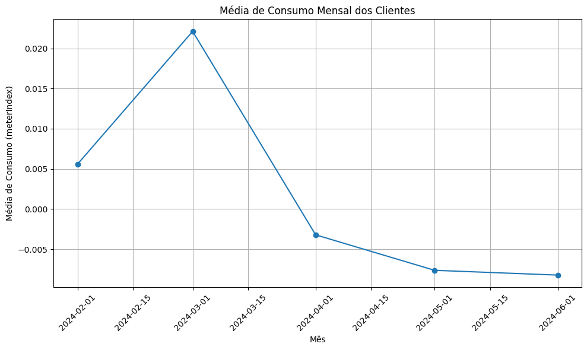 
   
   <sup>Fonte: Material produzido pelos autores (2024)</sup>
   
</div>

&nbsp;&nbsp;&nbsp;&nbsp;Ao analisar o gráfico, podemos perceber claramente que a hipótese não se mostra verdadeira. Na verdade, houve um pico de consumo na metade final do mês de Fevereiro e início de Março, porém, logo após isso, temos uma queda brusca. Este fenômeno provavelmente ocorreu por conta das grandes enchentes que ocorreram no estado do Rio Grande do Sul nessa época do ano, o que provavelmente levou diversas famílias que ficaram desabrigadas a deixar de consumir ou consumir gás em quantidades significativamente menores.

**Diferença entre números de instalações residenciais familiares e outras:** <br>
&nbsp;&nbsp;&nbsp;&nbsp;A segunda hipótese que trazemos é a de que a base de dados possuirá um número muito pequeno de instalações de categoria residencial unifamiliar. Essa hipótese se deu em uma conversa com a empresa parceira, que nos disse que o simples ato de fazer a instalação do encanamento do gás para uma residência comum é muito cara e não vale a pena, e, por conta disso, a maior parte das pessoas opta por utilizar outras opções de gás, como o botijão de gás. No notebook do projeto, executamos um algoritmo que realiza a contagem de valores para as categorias e também calcula a porcentagem de instalações que pertencem à categoria residencial familiar, obtendo um resultado onde percebemos que a hipótese se mostra verdadeira, uma vez que, dos cerca de 3.000.000 de registros, apenas 1949 são de residências unifamiliares, sendo este um percentual de 0,07%.

**Diferença de consumo para perfis de consumo que possuam caldeiras:** <br>
&nbsp;&nbsp;&nbsp;&nbsp;Para a última hipótese, temos a ideia de que instalações que possuam um perfil de consumo igual a "Caldeira" ou "Cocção + Caldeira" terão uma média de consumo maior do que os demais perfis, uma vez que estas instalações provavelmente estão vinculadas a indústrias ou a grandes residências prediais. No notebook do projeto, executamos um algoritmo que faz o cálculo da média de consumo para as categorias mencionadas e então comparamos os resultados, obtendo que a hipótese se mostra verdadeira, uma vez que a média de consumo das instalações que possuem um perfil de consumo com caldeira é de 0.202 e o de outros perfis é de -0.00037. Isso pode nos confirmar que a quantidade de gás que as empresas consomem é consideravelmente maior do que residências. Vale ainda ressaltar que esses valores não representam a medida real de metros cúbicos de gás que foram consumidos por conta da normalização de valores numéricos que foi feita com o *Standard Scaler*, que coloca todos os valores na mesma escala. 

&nbsp;&nbsp;&nbsp;&nbsp;De acordo com tudo que foi explorado, percebemos que estas hipóteses são de grande utilidade para o projeto que está sendo desenvolvido. O principal exemplo disto está na exploração da primeira hipótese, onde pode-se perceber que existe uma queda brusca no consumo geral de gás por conta das enchentes que afetaram o Rio Grande do Sul. Dessa forma, essas hipóteses podem nos ajudar a entender melhor o contexto nos quais os dados que possuímos foram coletados e como devemos ajustar melhor o nosso modelo para isso (por exemplo, passamos a entender que a temperatura não se mostrará como um fator tão influente no consumo de gás).

### 4.3. Preparação dos Dados e Modelagem
&nbsp;&nbsp;&nbsp;&nbsp;Nesta seção, será apresentado o processo de preparação dos dados para a construção do nosso modelo não-supervisionado. O primeiro passo consiste na escolha das features e suas justificativas, seguido pelo desenvolvimento do primeiro modelo candidato para o problema. E a partir disso, realizar uma discussão sobre os resultados do modelo. Em seguida, será apresentada a justificativa para a definição do valor de K no modelo, finalizando com a elaboração de um sistema de recomendação.

#### 4.3.1. Justificativa das features
&nbsp;&nbsp;&nbsp;&nbsp;A partir de uma análise das colunas disponíveis, foram selecionadas as features para o desenvolvimento da modelagem, levando em consideração o impacto que esses dados podem ter na detecção de anomalias no consumo de gás natural. Sendo assim, a seguir estão as justificativas das escolhas de cada uma dessas features.

&nbsp;&nbsp;&nbsp;&nbsp;A feature “temp_scaled” foi selecionada, pois a temperatura ambiente influencia significativamente o consumo de gás. Em períodos mais frios, por exemplo, é comum que o consumo aumente devido ao uso intensificado de aquecedores e caldeiras. Assim, é importante incluir essa feature para analisar possíveis anomalias, sempre considerando a temperatura média do dia em uma determinada região. Dessa maneira, essa análise pode ajudar a explicar mudanças de consumo que sejam resultado de variações climáticas e não de comportamentos anômalos.

&nbsp;&nbsp;&nbsp;&nbsp;As features “perfil_consumo_Aquecedor”, “perfil_consumo_Caldeira”, “perfil_consumo_Cocção”, “perfil_consumo_Cocção + Aquecedor”, “perfil_consumo_Cocção + Aquecedor + Piscina” e “perfil_consumo_Cocção + Caldeira” foram incluídas para representar o perfil de consumo do cliente, isto é, em que tipo de equipamentos o cliente utiliza o gás natural. Esses perfis variam entre aquecedores, cocção, caldeiras e piscinas. Em muitos casos, os clientes podem utilizar o gás em mais de uma dessas aplicações, como ilustrado pela feature “perfil_consumo_Cocção + Aquecedor”, o que significa que o consumo pode ser maior que aquele que utiliza apenas um equipamento. 

&nbsp;&nbsp;&nbsp;&nbsp;A feature “consumo em m^3” é uma nova coluna que foi criada a partir da multiplicação das colunas “gain” e “pulseCount”, resultando na quantidade de gás consumido pelo cliente em metros cúbicos. Além disso, gerou-se uma segunda coluna chamada “variação_consumo”, que permite ver a variação do consumo em um determinado período de tempo. Dessa forma, essas duas novas features, “consumo em m^3” e “variação_consumo”, mostram-se relevantes para o modelo, uma vez que nos dá informações indispensáveis para a análise.  

&nbsp;&nbsp;&nbsp;&nbsp;A feature “timestamp” representa a quantidade de segundos que se passaram desde 1º de janeiro de 1970 até a data definida. Com essa coluna é possível analisar padrões de consumo de gás em diferentes períodos, como picos em determinadas horas, dias ou meses. Assim, é possível realizar uma análise temporal mais detalhada, o que facilita a detecção de anomalias relacionadas a intervalos específicos de tempo.

&nbsp;&nbsp;&nbsp;&nbsp;Além das features escolhidas, também há aquelas que não foram selecionadas, e suas exclusões foram analisadas com base no impacto insignificante na detecção de anomalias ou por redundância em relação a outras variáveis. Por exemplo, as features relacionadas à localização, como "bairro_encoded", "cidade_canoas", "cidade_gravatai", entre outras, não foram consideradas essenciais, pois a análise já inclui a coluna de temperatura, que registra a média da temperatura do ambiente em um determinado dia e influencia diretamente o consumo de gás, tornando as variáveis de localização redundantes para esse fim.

&nbsp;&nbsp;&nbsp;&nbsp;Portanto, as justificativas apresentadas evidenciam a importância dessas features na modelagem, destacando como elas podem influenciar na detecção de anomalias no consumo de gás natural. Assim, com essa seleção, o processo de análise de dados torna-se mais centrado e objetivo, garantindo menor tempo de processamento da análise.

#### 4.3.2 Justificativa para a definição do K do modelo
&nbsp;&nbsp;&nbsp;&nbsp;Modelos de aprendizagem não-supervisionada são aqueles que devem ser utilizados em casos de análise de dados onde tais dados não estão rotulados. No caso atual, como não existe nenhum tipo de rótulo sobre anomalias/fraudes no consumo de gás na base de dados, o modelo a ser usado será um não-supervisionado. Como discutido acima, utilizaremos, inicialmente, o modelo K-Means, e a presente seção tem como objetivo rodar um algoritmo que consiga identificar qual o melhor valor de K (quantidade de clusters que o modelo utilizará) para rodar este modelo (Thiago, 2023). <br><br>
&nbsp;&nbsp;&nbsp;&nbsp;O algoritmo criado roda o modelo Kmeans para diversos valores em um intervalo de 1 a 10 e analisa a inércia em cada caso, ou seja, o quanto de variação existe entre um K e outro. O objetivo disto reside em salvar esses valores de inércia, e, então, fazer um gráfico chamado de “gráfico do cotovelo”, onde podemos analisar como a quantidade de clusters influencia o modelo. De acordo com a análise do gráfico, definimos inicialmente um valor de K = 3, uma vez que este é o ponto onde há a “quebra”.

<div align="center">
   <sup>Figura 15 - Gráfico do cotovelo gerado para valores K de 1 a 10 </sup>

   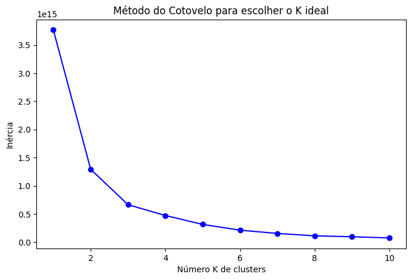<br>
   
   <sub>Fonte: Material produzido pelos autores (2024)</sub>
</div>
 &nbsp;&nbsp;&nbsp;&nbsp;Confira a imagem exposta acima por meio do link: (https://bit.ly/4ed0egY).<br><br>

&nbsp;&nbsp;&nbsp;&nbsp;Dessa forma, a identificação de um valor ideal para o K do modelo é de grande importância para a etapa de modelagem dos dados, uma vez que significa que o modelo preditivo irá separar e classificar os dados em uma quantidade correta/adequada de clusters.

#### 4.3.3. Modelagem do problema

&nbsp;&nbsp;&nbsp;&nbsp;No contexto de aprendizado de máquina, depois que um *dataset* passa pelos processos de tratamento e pré-processamento ou demais metodologias iniciais, deve-se implementar operações, lógicas e algoritmos sobre a base de dados normalizada para evidenciar relações entre as colunas, tentando identificar e representar visualmente padrões em  entre os registros (Géron, 2019).<br><Br>
&nbsp;&nbsp;&nbsp;&nbsp;No presente projeto de aprendizado de máquina não supervisionado, ou seja, descontido de rótulos prévios dos padrões desejados, será utilizado o modelo de clusterização — categorização — *k-means*, o qual funciona dividindo um conjunto de dados em k grupos, sendo k um valor definido pelo usuário ou pela equipe. O processo começa com a seleção de k centróides (pontos iniciais que representam cada grupo). Em seguida, cada ponto da base de dados é atribuído ao seu centróide mais próximo através de um cálculo de distância entre pontos no plano cartesiano. Com isso, os centróides são recalculados como a média dos pontos atribuídos a eles, e o processo se repete até que os centróides não apresentarem mais mudanças significativas (Filho, 2017). Com isso, busca-se a aplicação do modelo para identificar e agrupar padrões de consumo de gás natural, para assim detectar dados extrapolantes ou suspeitos que possam indicar anomalias na utilização.<br>

**Importação das bibliotecas e obtenção das features selecionadas**

&nbsp;&nbsp;&nbsp;&nbsp;Como primeiro passo para a modelagem do problema, utilizou-se os componentes *KMeans* e *silhouette_score* da biblioteca *Sklearn* para a composição de gráficos com as features selecionadas para a modelagem. Com o objetivo de selecionar um repertório com as colunas mais importantes do *DataFrame* normalizado, de forma a acarretar uma análise bem direcionada sobre o consumo de gás natural, de 51 colunas foram escolhidas 9 como mais relevantes para compor os gráficos do modelo. Com isso, guardou-se as colunas selecionadas na seguinte lista:

```python
colunas_selecionadas = [
    'temp_scaled',
    'perfil_consumo_Aquecedor',
    'perfil_consumo_Caldeira',
    'perfil_consumo_Cocção',
    'perfil_consumo_Cocção + Aquecedor',
    'perfil_consumo_Cocção + Aquecedor + Piscina',
    'perfil_consumo_Cocção + Caldeira',
    'consumo em m^3',
    'variação_consumo',
]

```
&nbsp;&nbsp;&nbsp;&nbsp;Em seguida, para fins de eficiência de testagem, a equipe optou por implementar um algoritmo de recorte aleatório dos dados do DataFrame, inicialmente reduzido para 12% do conjunto. Dessa forma, apenas as colunas selecionadas foram integrados à redução do DataFrame "*df_merged*" , compondo, assim, o novo DataFrame "*df_sample*".

```python

df_sample = df_merged.sample(frac=0.12, random_state=42) # 12% dos dados
## Converte valores booleanos para int (True = 1, False = 0)
df_sample[colunas_selecionadas] = df_sample[colunas_selecionadas].astype(int)
df_sample[colunas_selecionadas].info()

```

**Programação do modelo K-Means**

&nbsp;&nbsp;&nbsp;&nbsp;Após a realização do cálculo de *k* (número de *clusters*), alcançando-se o valor 3, construiu-se o algoritmo do k-means exposto e comentado abaixo. Com a execução do código, será exposto o gráfico que categoriza os 3 clusters considerando valores de data (timestamp) e variação de consumo. O critério utilizado para a definição das anomalias consistiu nos 5% de pontos com maiores distâncias dos clusters encontrados.<br>


```python

# Número de k definido pela equipe
k = 3

# Aplicando o K-Means, com o número de clusters 3
kmeans = KMeans(n_clusters=k, random_state=42)
kmeans.fit(df_sample[colunas_selecionadas]) #Adaptação do k-means às colunas selecionadas do dataframe

# Atribuindo os clusters
df_sample['cluster'] = kmeans.labels_

# Calculando a distância aos centroides para cada ponto do gráfico
df_sample['distance_to_centroid'] = np.min(kmeans.transform(df_sample[colunas_selecionadas]), axis=1)

# Definindo um limiar para identificar anomalias, os 5% de pontos com maiores distâncias serão consideradas como anomalias
threshold = np.percentile(df_sample['distance_to_centroid'], 95)

# Identificando anomalias de acordo com o cálculo acima
df_sample['anomaly'] = df_sample['distance_to_centroid'] > threshold

df_sample_positive = df_sample[df_sample['variação_consumo'] >= 0]

plt.figure(figsize=(10, 6))

for cluster in range(k):
    cluster_data = df_sample_positive[df_sample_positive['cluster'] == cluster]
    plt.scatter(cluster_data['timestamp'], 
                cluster_data['variação_consumo'], 
                label=f'Cluster {cluster}')

plt.title('Clusters de Variação de Consumo de Gás (Apenas Variação de Consumo Positiva)')
plt.xlabel('Timestamp')
plt.ylabel('Consumo em m³')
plt.legend()

plt.grid(True)
plt.show()

```
&nbsp;&nbsp;&nbsp;&nbsp;Nesse contexto, dentro do seguinte gráfico, os pontos de mesma cor são de mesma categoria, e foram apenas considerados os pontos de variação positiva de consumo de gás natural, em metros cúbicos. Nesse sentido, em hipótese, os pontos laranja representam em maior parte as linhas de consumo em que não houve, ou houve muito pouca, variação de consumo. Os pontos em azul significam uma diferença de consumo mais significativa, ao longo do tempo. Já os pontos em verde apresentam variação do consumo praticamente nula. No geral, uma parte reduzida dos dados que compõem o modelo evidencia variação; das 2.900.000 linhas, só 400.000 tem diferença e o restante não apresenta variação.

<div align="center">
   <sup>Figura 16 - Gráfico de Clusters de Variação Positiva do Consumo de Gás </sup>

   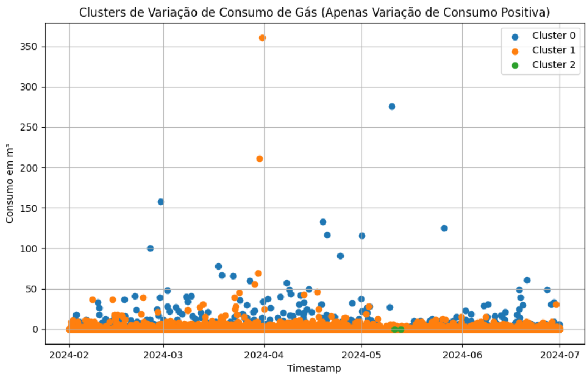

   <sub>Fonte: Material produzido pelos autores (2024)</sub>

</div>
 &nbsp;&nbsp;&nbsp;&nbsp;Confira a imagem exposta acima por meio do link: (https://bit.ly/3z6QfLb).<br><br>

 &nbsp;&nbsp;&nbsp;&nbsp;Também foi elaborado o algoritmo abaixo que plota o gráfico para demonstração de clusters por consumo acumulado (e não variação) de gás natural. Os pontos em laranja representam o menor consumo acumulado, seguidos dos pontos em azul que possuem consumo mais significativo, observando-se, por fim, os pontos em verde que evidenciam uma utilização exacerbada de gás natural, o que pode ser levado como aspecto de atenção para a detecção de anomalias.

 ```python
 plt.figure(figsize=(10, 6))

## Loop para plotar os clusters
for cluster in range(k):
    cluster_data = df_sample_positive[df_sample_positive['cluster'] == cluster]
    plt.scatter(cluster_data['timestamp'], 
                cluster_data['consumo em m^3'], 
                label=f'Cluster {cluster}')

plt.title('Clusters de Consumo de Gás Acumulado')
plt.xlabel('Timestamp')
plt.ylabel('Consumo acumulado em m³ (pulsecount * gain)')
plt.legend()

plt.grid(True)
plt.show()
 ```

<div align="center">
   <sup>Figura 17 - Gráfico de Clusters de Consumo Acumulado de Gás </sup>

   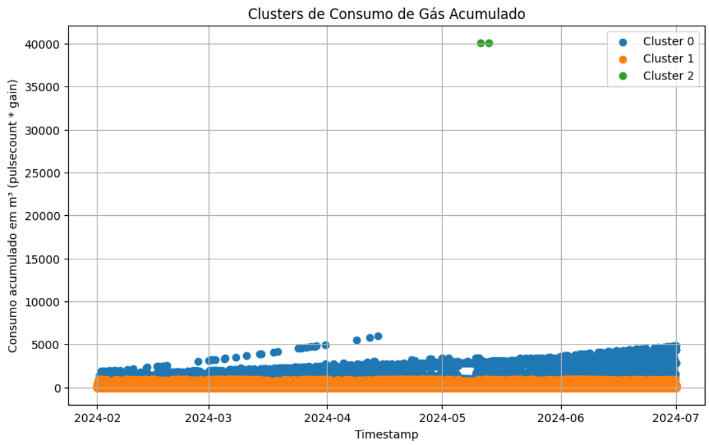

   <sub>Fonte: Material produzido pelos autores (2024)</sub>

</div>

 &nbsp;&nbsp;&nbsp;&nbsp;Confira a imagem exposta acima por meio do link: (https://bit.ly/3XrTXHc).<br>

&nbsp;&nbsp;&nbsp;&nbsp;Com isso, implementou-se uma outra programação para contagem valores obtidos em cada um dos 3 clusters.

```python
cluster_counts = df_sample_positive['cluster'].value_counts()

plt.figure(figsize=(8, 5))
plt.bar(cluster_counts.index, cluster_counts.values, color='skyblue')

plt.title('Quantidade de Valores em Cada Cluster')
plt.xlabel('Clusters')
plt.ylabel('Quantidade de Valores')

## Adicionando os valores acima das barras
for i, v in enumerate(cluster_counts.values):
    plt.text(cluster_counts.index[i] - 0.1, v + 10, str(v), color='black', fontweight='bold')

plt.grid(axis='y')
plt.show()

```
<div align="center">

   <sup>Figura 18 - Gráfico de Contagem de Dados por Cluster </sup>

   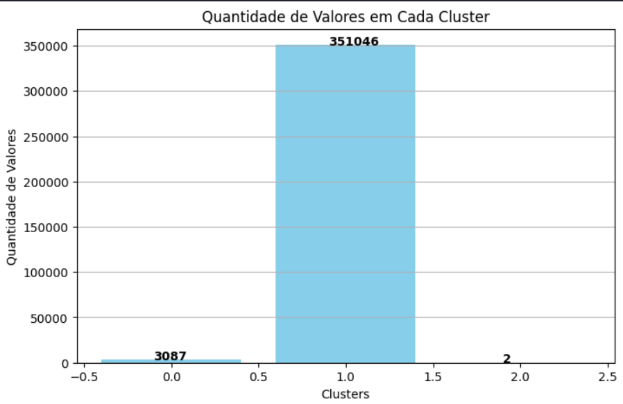

   <sub>Fonte: Material produzido pelos autores (2024)</sub>

</div>
 &nbsp;&nbsp;&nbsp;&nbsp;Confira a imagem exposta acima por meio do link: (https://bit.ly/4ep6ySx).<br><Br>

&nbsp;&nbsp;&nbsp;&nbsp;Por fim, como método de validação da quantificação de dados encontrados em cada cluster, tem-se o seguinte algoritmo de cálculo do coeficiente de silhueta, que ajuda a avaliar o modelo e detectar valores adequados, ou não, para o coeficiente k de clusters. A variação do coeficiente deve estar entre -1 e 1, sendo valores negativos ou mais próximos de zero indicadores de um agrupamento inadequado de clusters, e valores próximos de 1 representantes um agrupamento cada vez mais delimitado, o que é desejado para o modelo preditivo (Scaldelai, 2022).


```python
# Remover possíveis anomalias para calcular a silhueta apenas para os dados normais (sem outliers)
df_sample_no_anomalies = df_sample_positive[df_sample_positive['anomaly'] == False]

# Selecionar as colunas utilizadas para a criação dos clusters
X = df_sample_no_anomalies[colunas_selecionadas]

# Calcular o coeficiente da silhueta
silhouette_avg = silhouette_score(X, df_sample_no_anomalies['cluster'])

print(f'Coeficiente da Silhueta: {silhouette_avg}')
# Output: Coeficiente da Silhueta: 0.9790473924065777

```

&nbsp;&nbsp;&nbsp;&nbsp;Após a execução do modelo, tem-se como output o coeficiente de silhueta no valor 0.9790473924065777 (97%), que significa que os pontos estão muito bem agrupados dentro dos seus clusters e bem separados dos pontos de outros clusters. Apesar de que, quanto maior este coeficiente, melhor, nem sempre isso se mostra como verdade. Um coeficiente de 97% indica que os dados estão agrupados de forma quase excelente, havendo o risco de se indicar que pode ter ocorrido um *overfitting* dos dados.

&nbsp;&nbsp;&nbsp;&nbsp;Conclui-se, então, que a equipe alcançou êxito na aplicação da base de dados normalizada para a implementação do modelo preditivo K-Means, demonstrando pensamento crítico e competência na aplicação dos conhecimentos de programação adquiridos na Sprint para a escolha de algoritmos e a preparação dos dados. O alto coeficiente de silhueta de 0.979 indica uma possível eficácia do modelo em identificar padrões e possíveis anomalias no consumo de gás natural, entretanto, também evidencia uma possibilidade de overfitting do modelo, algo que necessitará correção. Esses resultados servirão de base para discussões sobre as áreas de aprimoramento, além de contribuir para a evolução do modelo no contexto de detecção de anomalias.

#### 4.3.4. Análise do Modelo
&nbsp;&nbsp;&nbsp;&nbsp;O modelo k-means é um algoritmo de aprendizado não supervisionado usado para agrupar dados em clusters, feito dividindo um conjunto de dados em k grupos, onde  k é um número definido pelo usuário (AHMED, 2020). Assim, o algoritmo inicialmente escolhe k centros (centróides) de forma aleatória e, em seguida, atribui cada ponto de dados ao centro mais próximo, formando clusters. Depois, os centróides são ajustados para serem o ponto médio de todos os dados em seus respectivos clusters. Desse modo, esse processo de atribuição e ajuste continua até que os centróides não mudem mais significativamente, indicando que os clusters estão estáveis, caracterizando em um algoritmo simples e eficiente, sendo amplamente utilizado em análise exploratória de dados, detecção de padrões e segmentação, principalmente em grandes volumes de dados.

&nbsp;&nbsp;&nbsp;&nbsp; Nesse sentido, o modelo aqui presente foi desenvolvido seguindo esse tipo de algoritmo, com o objetivo de identificar padrões e agrupar dados de forma não supervisionada, sendo especialmente útil para detecção de anomalias em grandes conjuntos de dados, como no caso trago pela Compass. No contexto específico, a equipe definiu k=3, ou seja, três clusters, para agrupar as variações de consumo de gás. Após a aplicação do k-means nas 9 colunas selecionadas do DataFrame, os dados foram organizados em clusters com base na proximidade aos centróides, que são ajustados iterativamente para minimizar a distância entre os dados e seus respectivos centros. A distância de cada ponto ao centróide mais próximo foi calculada, e um limiar foi estabelecido para identificar anomalias, considerando os 5% dos pontos com maiores distâncias como desvios. Em seguida, o modelo foi então visualizado em um gráfico que destaca as variações de consumo positivas e seus respectivos clusters, facilitando a análise das anomalias e dos comportamentos regulares de consumo, como apresentado abaixo.

<div align="center">
   
   <sub>Figura 19 - Gráfico do Modelo apresentando Variação do Consumo de Gás </sub>

   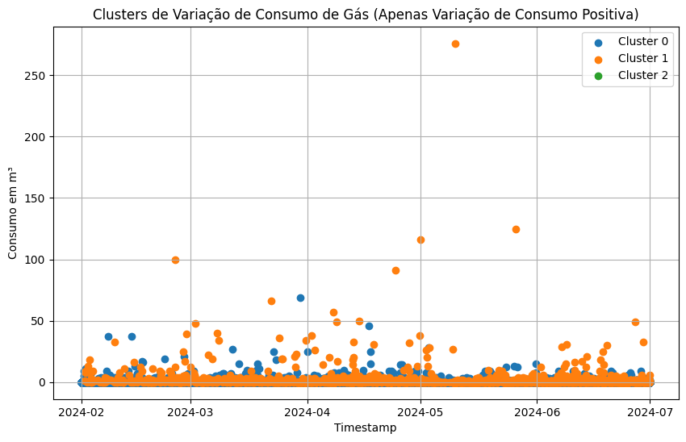 
   
   <sup>Fonte: Material produzido pelos autores (2024)</sup>
   
</div>

&nbsp;&nbsp;&nbsp;&nbsp;Desse modo, ao longo da análise do modelo desenvolvido, alguns pontos positivos foram destacados, como:

- **Uso de Clusters com K-means**: O modelo K-means foi adaptado para trabalhar com 9 colunas (features) do dataframe, o que permite uma maior compreensão dos padrões de consumo de gás, indo além das três variáveis tradicionais. Isso pode melhorar a segmentação dos clusters e a detecção de anomalias, já que mais informações estão sendo utilizadas na análise. 
- **Cálculo da Distância aos Centróides**: A inclusão da distância aos centróides (distance_to_centroid) para cada ponto de dado é uma abordagem útil para identificar anomalias. Isso ajuda a distinguir dados que estão afastados dos centros dos clusters, que podem ser considerados comportamentos fora do padrão (anômalos).
- **Limiar para Anomalias**: A definição de um limiar (os 5% com maior distância, no caso do modelo apresentado) para detectar anomalias torna o processo automático e facilita a identificação de possíveis outliers no consumo de gás. Essa abordagem quantitativa é vantajosa, pois apresenta de maneira clara a distorção dos dados ao longo do modelo. 
- **Gráfico de Clusters por Variação Positiva no Consumo**: Os colunas escolhidas para apresentar o modelo, que mostra apenas a variação positiva no consumo de gás, é bem informativo, pois foca em dados que podem ser mais relevantes para a análise (aumento de consumo). Essa abordagem ajuda a simplificar a visualização e a destacar padrões importantes.

&nbsp;&nbsp;&nbsp;&nbsp; À vista disso, essas características foram destacadas por sua importância na eficiência global do modelo, uma vez que são elementos essenciais para o seu funcionamento adequado. Ao considerar esses aspectos, garantimos que o modelo opere de maneira otimizada, assegurando a precisão e a robustez dos resultados obtidos.

&nbsp;&nbsp;&nbsp;&nbsp; Todavia, ao longo da criação do modelo, pontos de ressalva foram aparecendo, ajudando na compreensão do modelo como um todo, no que diz respeito também os passos futuros:

- **Avaliar Diferentes Limiares**: Testar diferentes percentuais ou estratégias para definir o limiar de anomalias é fundamental para adaptar o modelo à distribuição dos dados. Isso garante uma detecção mais precisa, evitando a sub ou superestimação de anomalias. Ajustes adequados aumentam a eficácia na identificação de padrões anômalos, otimizando a performance do modelo. 
- **Número de Clusters Fixo**: O número de clusters no K-means é um parâmetro que deve ser ajustado manualmente. Se o número de clusters não for escolhido corretamente, o modelo pode sub ou superestimar os grupos, impactando a detecção de anomalias. Embora exista o Método do Cotovelo para encontrar o k, um valor fixo de clusters não é interessante no que diz respeito o contexto de anomalias, considerando que ele é baseado na suposição de que todos os clusters são representativos de padrões normais, o que pode não ser ideal no cenário trabalhado.
- **Detecção de Anomalias**: O K-means não é originalmente um modelo de detecção de anomalias (BUENO, 2021). Ele pode ser usado para esse fim ao identificar pontos que estão distantes dos centróides dos clusters, mas isso pode não ser tão eficiente quanto métodos mais específicos, como Isolation Forest ou DBSCAN, que são projetados para identificar outliers.
- **Utilização de Apenas um Modelo**: Modelos diferentes podem ter desempenhos distintos para o mesmo conjunto de dados. O K-means, apesar de ser eficaz em muitas situações, pode não capturar todas as anomalias, especialmente em dados complexos. Testar mais de um modelo permite avaliar qual oferece as melhores previsões e identifica os padrões de maneira mais precisa. É fundamental comparar os resultados de cada modelo em termos de precisão, recall, e taxa de falsos positivos. A análise deve incluir essas métricas para justificar por que um modelo pode ser preferido ao outro. 
- **Dificuldade da Visualização das Anomalias do Modelo**: O gráfico inicialmente escolhido não representa adequadamente a disposição dos clusters, pois alguns deles se sobrepõem, dificultando a visualização e a identificação das anomalias. Para melhorar a clareza, foi apresentado uma nova visualização que inclui uma coluna adicional, o "timestamp". Essa nova visualização agrupa as amostras dos clusters de maneira mais eficaz, facilitando a análise e identificação das anomalias, como visto abaixo:

<div align="center">
   
   <sub>Figura 20 - Gráfico do Modelo apresentando Variação do Consumo de Gás (Após Melhoria) </sub>

   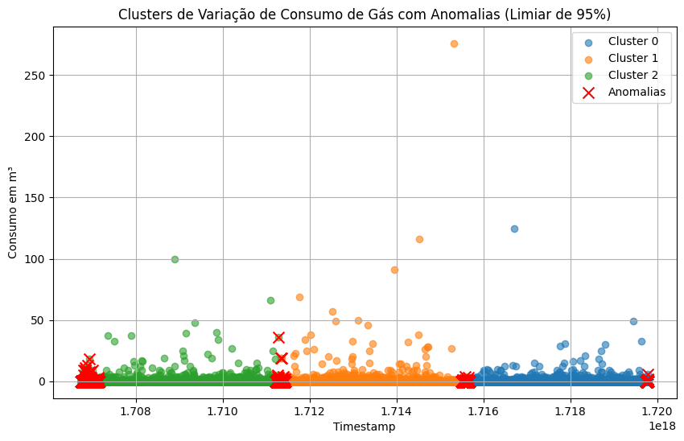 
   
   <sup>Fonte: Material produzido pelos autores (2024)</sup>
   
</div>

&nbsp;&nbsp;&nbsp;&nbsp; Nesse sentido, a análise desses pontos negativos foi fundamental, pois trouxe clareza sobre áreas de melhoria, contribuindo para o desenvolvimento de um modelo visualmente mais eficaz. Além disso, essa avaliação esclareceu os próximos passos a serem tomados, especialmente no que diz respeito à modelagem e à seleção de features, orientando o grupo para futuras decisões mais embasadas.

&nbsp;&nbsp;&nbsp;&nbsp; Logo, podemos ver que analisar um modelo preditivo de anomalias é essencial para futuras implementações e melhorias, pois proporciona uma compreensão detalhada do desempenho do modelo e das suas limitações. Assim, essa análise permite identificar padrões de erro e áreas onde o modelo pode não estar capturando anomalias de maneira eficaz, possibilitando, com base nesses *insights*, ajustar algoritmos, aprimorar a seleção de features e refinar os parâmetros do modelo, garantindo uma detecção mais precisa e robusta de anomalias. 

#### 4.3.5 Análise dos resultados do modelo

&nbsp;&nbsp;&nbsp;&nbsp;Ao utilizar um modelo de aprendizado não supervisionado, conforme o qual foi utilizado e apresentado nas seções 4.3.1 e 4.3.2, é importante entender como ocorre a avaliação dos resultados após as predições do modelo. Por se tratar de um modelo que não utiliza dados rotulados, o *K-means*, modelo de *machine learning* escolhido, analisa os dados e procura agrupá-los em *clusters* com base nas características que os mesmos possuem em comum. Apesar de ser uma ótima ferramenta para dados não categorizados, as métricas para entendimento dos resultados são diferentes das métricas mais utilizadas para modelos supervisionadas, como precisão, *recall* e acurácia, pois não é possível fazer comparações entre os dados com rótulos reais e as categorias preditas pelo modelo.

&nbsp;&nbsp;&nbsp;&nbsp;A partir disso, foram escolhidas 3 métricas para analisar quão bem o modelo não supervisionado consegue distinguir os dados entre normais ou anômalos, sendo elas: o teste de Komogorov-Smirnov, o Silhouette Score e a comparação de features entre as anomalias detectadas.

##### 4.3.5.1 Teste de Komogorov-Smirnov

&nbsp;&nbsp;&nbsp;&nbsp;O teste de Komogorov-Smirnov, também conhecido como teste KS, é um algoritmo que realiza testes estatísticos e compara diferentes distribuições tentando entender quão diferentes as mesmas são, o que possibilita entender quão bem os dados foram separados. Como o teste KS é um teste não paramétrico - ou seja, funciona para distribuições estatísticas além das normais e binomiais -, ele é um forte candidato à métrica para o modelo. Além disso, o teste KS é composto por duas variáveis: o KS, que quanto mais se aproxima de 1, é melhor; e o p-value, que quanto mais se aproxima de 0, é melhor.

&nbsp;&nbsp;&nbsp;&nbsp;O teste foi executado comparando as features selecionadas para o modelo nos 3 diferentes clusters utilizados pelo K-means, mas para que o entendimento de cada variável/valor de teste fosse mais fácil, foram encontrados as 10 comparações com maior valor de KS, as 10 comparações com menor valor de p-value e as melhores comparações levando em consideração tanto o valor de KS quanto o valor de p-value.


&nbsp;&nbsp;&nbsp;&nbsp;Abaixo, é possível ver as comparações com maior valor de KS.

<div align="center">
   
   <sub>Figura 21 - Gráfico das 10 melhores comparações em relação ao KS</sub>

   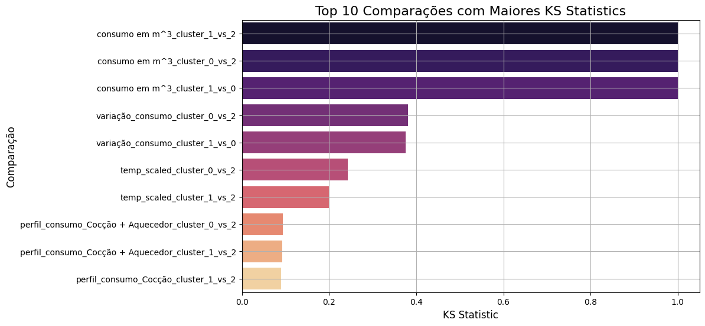 
   
   <sup>Fonte: Material produzido pelos autores (2024)</sup>
   
</div>


&nbsp;&nbsp;&nbsp;&nbsp;Depois, é possível observar as comparações com menor p-value.

<div align="center">
   
   <sub>Figura 22 - Gráfico das 10 melhores comparações em relação ao p-value</sub>

   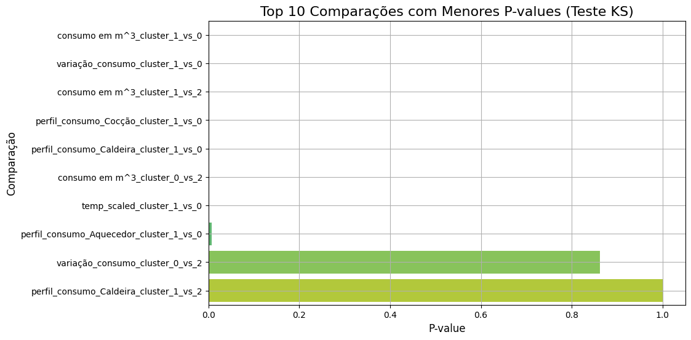 
   
   <sup>Fonte: Material produzido pelos autores (2024)</sup>
   
</div>


&nbsp;&nbsp;&nbsp;&nbsp;Por fim, as melhores comparações levando em consideração tanto os valores de KS quanto os valores de p-value.

<div align="center">
   
   <sub>Figura 23 - Gráfico das melhores comparações do teste geral</sub>

   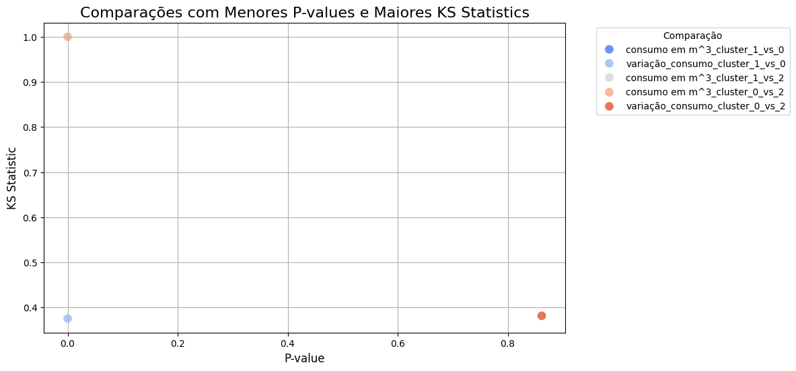 
   
   <sup>Fonte: Material produzido pelos autores (2024)</sup>
   
</div>


&nbsp;&nbsp;&nbsp;&nbsp;Dessa forma, teste de Komogorov-Smirnov mostrou que o modelo K-means detectou apenas 11% das comparações com KS maior que 0.8 e p-value menor que 5%, o que demonstra a necessidade de treinar o modelo novamente para que o número de anomalias que dentre os 3 clusters possam ser identificadas com mais facilidade e também detectadas pelo teste KS.

##### 4.3.5.2 Silhouette Score

&nbsp;&nbsp;&nbsp;&nbsp;O Silhouette Score, ou coeficiente da silhueta, é um cálculo que possibilita identificar quão bem clusterizados estão os dados por meio do modelo. Esse coeficiente funciona por meio do cálculo de 2 variáveis: a coesão e a separação.
- A separação dos dados diz respeito ao cálculo da distância média entre um ponto qualquer e todos os pontos do cluster mais próximo ao qual ele não pertence;
- A coesão dos dados diz respeito ao cálculo da distância média entre um ponto qualquer e todos os pontos do cluster ao qual ele próprio pertence.

&nbsp;&nbsp;&nbsp;&nbsp;Dessa forma, o coeficiente da silhueta varia de -1 a 1. Quanto mais se aproxima de 1, mais os dados estão clusterizados e bem agrupados, e quanto mais se aproxima de -1, mais os dados estão dispersos.


&nbsp;&nbsp;&nbsp;&nbsp;Ao calcular o silhouette score médio de todos os dados do dataset, o resultado obtido foi 0.96, o que indica um bom resultado para o coeficiente da silhueta. Entretanto, este score pode significar também o overfitting do modelo, o que indica a necessidade de refazer o cálculo com o mesmo dataset e outros modelos de clusterização.

##### 4.3.5.3 Análise e comparação de features entre os dados anômalos


&nbsp;&nbsp;&nbsp;&nbsp;A última etapa de análise dos resultados do modelo K-means se baseia em uma investigação mais aprofundada sobre como as predições afetam o conjunto de dados de consumo. Para isso, os dados classificados como anomalias foram armazenados em um dataframe único e separado dos dados gerais, e a partir do dataframe de anomalias, foram feitas 3 comparações e análises: as anomalias de variação de consumo por cluster, a quantidade de anomalias por categoria de residência e a relação entre a distância ao centróide e a variação de consumo.

&nbsp;&nbsp;&nbsp;&nbsp;Primeiro, foi analisado como as anomalias em relação à feature de variação de consumo estavam distribuídas entre os clusters. Descobriu-se que a maioria das anomalias de consumo negativo, as quais podem significar possíveis fraudes ou erros de registro, estavam mais presentes no cluster [].

<div align="center">
   
   <sub>Figura 24 - Gráfico das anomalias: variação de consumo x clusters</sub>

   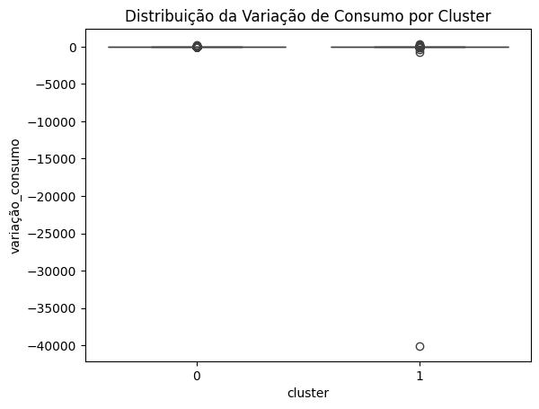 
   
   <sup>Fonte: Material produzido pelos autores (2024)</sup>
   
</div>

&nbsp;&nbsp;&nbsp;&nbsp;Ademais, foi investigado como as anomalias se relacionavam entre a variação de consumo e a distância ao centróide, o que possibilitou a visualização de anomalias muito distantes dos centróides de seus clusters como também anomalias com distância insignificante ou muito pequena, indicando que o trabalho de identificação e classificação de dados anômalos pelo K-means deve ser revisto.

<div align="center">
   
   <sub>Figura 25 - Gráfico das anomalias: variação de consumo x distância ao centróide</sub>

    
   
   <sup>Fonte: Material produzido pelos autores (2024)</sup>
   
</div>

&nbsp;&nbsp;&nbsp;&nbsp;Por fim, foi observada a quantidade de anomalias pelas categorias de residência identificadas no primeiro dataframe de informações cadastrais. Dessa maneira, foi possível identificar que a maior quantidade de anomalias estão na categoria Prédio Existente Individual. Entretanto, é necessário analisar a possibilidade da distribuição de clientes entre as diferentes categorias ser muito concentrada em uma categoria específica para que se afirme a maior propensão de anomalias em um tipo de instalação.

<div align="center">
   
   <sub>Figura 26 - Gráfico das anomalias: distribuição entre categorias de residência</sub>

   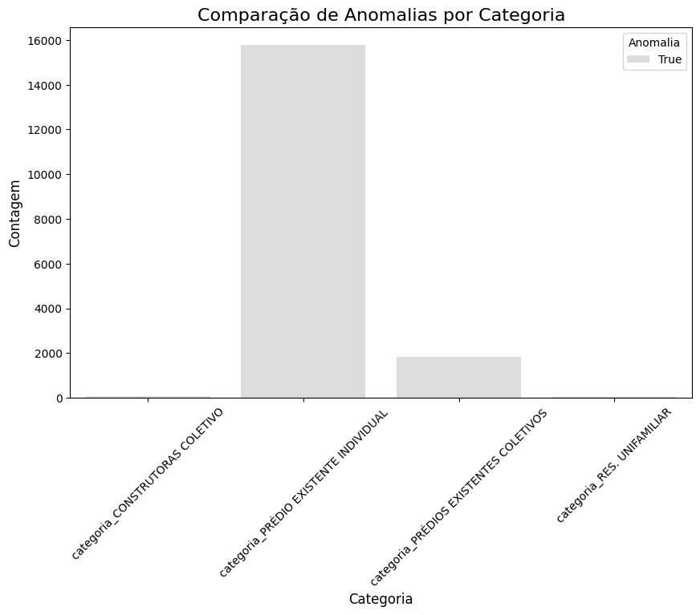 
   
   <sup>Fonte: Material produzido pelos autores (2024)</sup>
   
</div>

&nbsp;&nbsp;&nbsp;&nbsp;Portanto, as métricas utilizadas foram meios de observar quão bem o modelo não supervisionado K-means efetuou a clusterização dos dados e a identificação das possíveis anomalias e são um ponto de partida para a comparação de futuros modelos não supervisionados, possibilitando a reutilização dos mesmos conceitos e cálculos para encontrar um modelo mais ideal para os objetivos da *Compass*.


  
#### 4.3.6 Sistemas de recomendação

&nbsp;&nbsp;&nbsp;&nbsp;Os sistemas de recomendação são ferramentas essenciais que utilizam algoritmos especializados e técnicas de aprendizado de máquina para processar dados e fornecer sugestões personalizadas aos usuários. Esses sistemas conseguem identificar padrões e prever as preferências de um usuário com base em interações anteriores, mesmo antes de ele expressar diretamente suas opiniões. A aplicação desses algoritmos permite que empresas ofereçam uma experiência mais personalizada, aumentando a satisfação e o engajamento do cliente.

&nbsp;&nbsp;&nbsp;&nbsp;Há diferentes tipos de sistemas de recomendação, cada um com abordagens distintas para atender a essa demanda. A filtragem colaborativa, por exemplo, baseia-se na análise do comportamento coletivo de grupos de usuários com preferências semelhantes para fazer recomendações. Esse método é amplamente utilizado em plataformas de streaming e e-commerce, ajudando a sugerir produtos ou conteúdos com base nas escolhas de outros usuários com gostos parecidos. A filtragem baseada em conteúdo, por outro lado, foca nas características dos itens que o usuário já demonstrou interesse, como filmes, livros ou produtos, para sugerir outros semelhantes, criando um perfil de preferências individuais.

&nbsp;&nbsp;&nbsp;&nbsp;Outro modelo popular é o sistema híbrido, que combina as técnicas de filtragem colaborativa e baseada em conteúdo para fornecer recomendações ainda mais precisas e abrangentes. Plataformas como a Netflix utilizam essa abordagem para melhorar a precisão das sugestões, cruzando informações sobre os hábitos de consumo dos usuários e as características dos itens consumidos. Além disso, existem sistemas de recomendação baseados em demografia, que categorizam os usuários com base em atributos como idade e localização, e sistemas baseados em utilidade, que levam em consideração a funcionalidade e relevância do produto para o usuário.

&nbsp;&nbsp;&nbsp;&nbsp;Esses sistemas desempenham um papel fundamental em várias indústrias, desde o varejo até o entretenimento, ajudando a maximizar conversões, aumentar o valor médio de pedidos e otimizar campanhas de marketing. Ao personalizar a experiência do usuário, os sistemas de recomendação não apenas facilitam a descoberta de novos produtos e conteúdos, como também fortalecem a lealdade do cliente, criando um ciclo de retenção e engajamento contínuo.

##### 4.3.6.1 Formulação dos Sistemas de Recomendação

&nbsp;&nbsp;&nbsp;&nbsp;Durante o processo de formulação de um sistema de recomendação com base nos dados de consumo de gás fornecidos à equipe, foi considerado realizar a análise com o objetivo de identificar padrões de uso e sugerir estratégias para otimizar o consumo, evitando congestionamentos e sobrecargas no sistema, além de melhorar a eficiência do fornecimento. A partir desse estudo, propomos soluções para diferentes perfis de usuários, incluindo consumidores residenciais, empresariais e gerais.

&nbsp;&nbsp;&nbsp;&nbsp;O processo de tratamento dos dados dos usuários foi estruturado em três etapas, conforme descrito a seguir:

- Segmentação do Consumo em Blocos de 4 Horas:
&nbsp;&nbsp;&nbsp;&nbsp;Para identificar picos de consumo, os dados foram separados em intervalos de 4 horas. Essa segmentação permite uma análise granular, destacando os períodos de maior e menor demanda ao longo do dia.

- Geração de Gráficos para Visualização:
&nbsp;&nbsp;&nbsp;&nbsp;Após a segmentação dos dados, gráficos foram gerados para visualizar os picos e os períodos de baixa demanda.

- Análise dos Blocos de Menor Congestionamento:
&nbsp;&nbsp;&nbsp;&nbsp;Com base nas médias de consumo dos blocos de 4 horas, foram identificados os horários de menor congestionamento. A ideia é que esses horários possam ser utilizados pela Compass para criar incentivos e estimular os clientes a consumir gás nesses períodos, promovendo um uso mais equilibrado do sistema.

&nbsp;&nbsp;&nbsp;&nbsp;Para realizar esta análise, foram traçados três cenários distintos de uso, que ajudaram a segmentar melhor o comportamento dos consumidores e propor soluções específicas:

1. Uso Geral: Refere-se a todos os clientes, independentemente do perfil. Esse cenário abrange o comportamento padrão de consumo de gás de forma geral, sem segmentações específicas.

2. Uso Empresarial: Focado em clientes corporativos, como empresas e condomínios, que tendem a ter padrões de consumo mais intensos e concentrados em horários específicos. A análise aqui busca otimizar o consumo em horários de menor demanda para evitar picos que possam sobrecarregar o sistema.

3. Uso Residencial: Destinado a clientes que utilizam gás em suas residências. O foco é entender o comportamento de consumo residencial e sugerir horários de menor utilização, de modo a equilibrar o fornecimento sem comprometer a conveniência dos usuários.

##### 4.3.6.2 CENÁRIO 1 - USO GERAL

<div align="center">
   
   <sub>Figura 27 - Gráfico do cenário 1 do Sistema de Recomendação - Uso Geral </sub>

    
   
   <sup>Fonte: Material produzido pelos autores (2024)</sup>
   
</div>

&nbsp;&nbsp;&nbsp;&nbsp;Na análise do consumo geral, foi gerado um gráfico com base no uso de gás de todos os usuários. A partir da visualização do mapa de calor, é possível identificar padrões claros de consumo ao longo do dia. Observa-se que os blocos de horário entre 00h e 03h, assim como entre 20h e 23h, apresentam menores volumes de consumo.

&nbsp;&nbsp;&nbsp;&nbsp;Ao aplicar um sistema de recomendação para sugerir o melhor horário de menor consumo, identificamos que o bloco mais adequado é o que se inicia às 20h, com um consumo médio de 0,30 m³. Vale destacar que, para fins de visualização, o gráfico foi gerado com dados de 100 usuários. No entanto, o cálculo final para a recomendação considerou o total de 1.716 usuários.

##### 4.3.6.3. CENÁRIO 2 - USO EMPRESARIAL

<div align="center">
   
   <sub>Figura 28 - Gráfico do cenário 2 do Sistema de Recomendação - Uso Empresarial </sub>

    
   
   <sup>Fonte: Material produzido pelos autores (2024)</sup>
   
</div>

&nbsp;&nbsp;&nbsp;&nbsp;Para a análise de consumo empresarial, que inclui perfis de empresas e condomínios, também foi gerado um gráfico a partir do uso geral de gás desses perfis. A análise do mapa de calor revela que os blocos de horário entre 12h e 15h, e entre 16h e 19h, concentram os maiores picos de consumo. Esses períodos refletem o funcionamento intenso das atividades comerciais.

&nbsp;&nbsp;&nbsp;&nbsp;Ao utilizar o sistema de recomendação para identificar o horário de menor demanda, foi indicado que o bloco mais apropriado para otimizar o uso de gás empresarial é o das 20h, com um consumo médio de 0,89 m³. Esse intervalo noturno pode ser explorado por empresas que têm flexibilidade operacional para transferir atividades que consomem gás para horários fora do pico.

&nbsp;&nbsp;&nbsp;&nbsp;Tanto o gráfico quanto os cálculos foram gerados considerando todos os perfis empresariais disponíveis na base de dados.

##### 4.3.6.4. CENÁRIO 3 - USO RESIDENCIAL

<div align="center">
   
   <sub>Figura 29 - Gráfico do cenário 3 do Sistema de Recomendação - Uso Residencial </sub>

    
   
   <sup>Fonte: Material produzido pelos autores (2024)</sup>
   
</div>

&nbsp;&nbsp;&nbsp;&nbsp;Na análise do uso residencial, foi gerado um gráfico com base no consumo geral dos usuários domésticos. A partir do mapa de calor, é perceptível que os blocos de horários entre 00h e 03h e entre 20h e 23h são aqueles em que o consumo tende a ser maior.

&nbsp;&nbsp;&nbsp;&nbsp;Com a aplicação do sistema de sugestão de horários, constatou-se que o melhor momento para reduzir o consumo residencial é o bloco que começa às 4h, com um consumo médio de 0,28 m³. 

&nbsp;&nbsp;&nbsp;&nbsp;É importante frisar que o gráfico foi gerado utilizando dados de 80 usuários para fins de visualização, mas o cálculo final de recomendação foi baseado no total de 1.676 usuários.

##### 4.3.6.5. Conclusão

&nbsp;&nbsp;&nbsp;&nbsp;Com base nos padrões de consumo observados nos três cenários, sugerimos à _Compass_ a implementação de um esquema otimizado de horários, dividido em quatro intervalos distintos, para promover o uso mais eficiente do gás. Esses horários podem ser aproveitados para direcionar iniciativas como descontos e promoções durante os períodos de menor demanda, ajudando a evitar sobrecargas no sistema e a incentivar o uso racional.

&nbsp;&nbsp;&nbsp;&nbsp;Essas ações poderiam ser responsáveis por otimizar o uso de gás e proporcionar benefícios aos usuários finais, criando um sistema mais sustentável e equilibrado.

### 4.4. Comparação de Modelos
&nbsp;&nbsp;&nbsp;&nbsp; Esta seção tem como objetivo documentar as comparações entre os diferentes modelos que foram utilizados para cumprir o objetivo do projeto durante a Sprint 4. Anteriormente, foi escolhido e explorado apenas um modelo candidato. Para a seção atual, serão testados diversos modelos, a fim de realmente encontrar um que melhor se encaixe no projeto atual. 

#### 4.4.1 Isolation Forest
&nbsp;&nbsp;&nbsp;&nbsp;Para o nosso próximo modelo, escolhemos o *Isolation Forest*, um modelo preditivo não supervisionado utilizado para detecção de anomalias, que funciona isolando pontos de dados por meio da construção de árvores de decisão. Desse modo, a ideia principal desse modelo é que as anomalias, por serem menos frequentes e diferentes do restante dos dados, sejam mais fáceis de isolar, ou seja, precisem de menos divisões na árvore para serem separadas (LIU, 2008). Assim, o algoritmo seleciona aleatoriamente uma característica e um valor de corte, e ao repetir esse processo várias vezes, ele consegue identificar as observações que se desviam do padrão, sendo, consequentemente, o *Isolation Forest* um modelo eficiente, escalável e amplamente utilizado em áreas como detecção de fraudes, análise de segurança e monitoramento de redes.

&nbsp;&nbsp;&nbsp;&nbsp;Desse modo, além da construção do modelo, a etapa de análise dos resultados de suas métricas é essencial para avaliar a sua eficácia em identificar padrões anômalos sem o uso de rótulos previamente definidos. Métricas como o Índice de Silhueta, o Índice de Davies-Bouldin (DBI) e o Índice de Calinski-Harabasz (CH) fornecem insights sobre a coesão e separação dos grupos detectados, ajudando a entender a qualidade da segmentação entre os dados normais e anômalos. Uma análise cuidadosa dessas métricas permite refinar o modelo, identificar limitações e ajustar parâmetros para obter maior precisão na detecção de anomalias, garantindo que o modelo atenda às expectativas do projeto (STRAUSS, 2022).

&nbsp;&nbsp;&nbsp;&nbsp; Á vista disso, utilizando o modelo desenvolvido, e tendo como métricas *Davies-Bouldin Index (DBI)*, *Calinski-Harabasz Index (CH Index)* e *Silhouette Score*, fomos capazes de identificar 8850 anomalias de 177075 amostras coletadas, como pode ser visto no gráfico abaixo:

<div align="center">
   
   <sub>Figura 30 - Gráfico de Contagem de Amostras: Normais vs Anomalias </sub>

    
   
   <sup>Fonte: Material produzido pelos autores (2024)</sup>
   
</div>

&nbsp;&nbsp;&nbsp;&nbsp;Além disso, no estudo de seus resultados, também fomos capazes de identificar o seu impacto nos perfis de consumo, tendo em vista que as anomalias se encontram bem mais concentrados no perfil do cliente que usa cocção e no do cliente que usa cocção e aquecedor, sendo o primeiro bem mais evidente, como podemos ver no gráfico a seguir:

<div align="center">
   
   <sub>Figura 31 - Gráfico de Contagem Perfis de Consumo: Normais vs Anomalias </sub>

    
   
   <sup>Fonte: Material produzido pelos autores (2024)</sup>
   
</div>

&nbsp;&nbsp;&nbsp;&nbsp;Logo, com base na análise dos resultados do modelo *Isolation Forest* e nas métricas utilizadas, podemos concluir que o desempenho na detecção de anomalias foi eficaz, pois elas ajudaram a validar a separação clara entre as anomalias e os dados normais, indicando que o modelo conseguiu isolar de forma eficaz os outliers sem comprometer a integridade do restante dos dados. Portanto, a combinação do isolamento das anomalias com a análise de qualidade da separação entre clusters permitiu uma visão mais completa da robustez do modelo, garantindo maior confiabilidade na detecção de comportamentos atípicos, considerando as *features* utilizadas.

##### 4.4.1.1 Fine tuning dos hiperparâmetros

&nbsp;&nbsp;&nbsp;&nbsp;O processo de fine tuning de hiperparâmetros é um procedimento realizado para encontrar a melhor combinação de hiperparâmetros que faça com que o modelo tenha a melhor performance. Nesse sentido, os hiperparâmetros são configurações externas ao tratamento dos dados e ao próprio modelo e que devem ser escolhidas manualmente, o que faz com que, a cada nova combinação de configurações, o modelo tenha um resultado diferente.

&nbsp;&nbsp;&nbsp;&nbsp;Para isso, existem algoritmos especializados que automatizam o processo de ajuste fino dos hiperparâmetros e testam todas as combinações. Com efeito, a ferramenta escolhida para realizar o fine tuning no Isolation Forest foi o RandomizedSearchCV, um algoritmo que realiza a validação cruzada do modelo com diferentes hiperparâmetros aleatória e repetidamente conforme o número de iterações escolhido.

&nbsp;&nbsp;&nbsp;&nbsp;Para que o RandomizedSearchCV possa realizar as iterações, foi necessário selecionar quais os possíveis valores que gostaríamos de testar para os hiperparâmetros:

```
param_dist = {
    'n_estimators': [50, 100, 150, 200, 300],
    'max_samples': ['auto', 0.5, 0.75, 1.0],
    'contamination': [0.01, 0.05, 0.1, 'auto'],
    'max_features': [0.5, 0.75, 1.0],
    'bootstrap': [True, False],
    'n_jobs': [-1, 1],
    'warm_start': [True, False],
    'verbose': [0, 1]
}
```
&nbsp;&nbsp;&nbsp;&nbsp; Depois, foi necessário configurar o RandomizedSearchCV, escolhendo qual modelo deveria ter seus hiperparâmetros ajustados, o número de validações cruzadas e quantas iterações o modelo deve ter. Além disso, é necessário escolher uma métrica para que o algoritmo consiga identificar qual combinação de hiperparâmetros faz o modelo performar melhor. Entretanto, como escolhemos um modelo não supervisionado e escolhemos 3 métricas, foi necessário criar uma função que unisse as 3 métricas para que fossem utilizadas de uma única vez pelo algoritmo de fine tuning.

```
```
&nbsp;&nbsp;&nbsp;&nbsp;Após isso, o modelo retornou as métricas do Isolation Forest com a utilização da nova escolha de hiperparâmetros. Nessa situação o modelo, após o ajuste fino de hiperparâmetros, performou e conseguiu atingir um score de xxx no coeficiente da silhueta, xxx no DBI e xxx no CH Index, o que mostra uma melhoria visível na separação dos dados.

##### 4.4.1.2 Análise de resultados após o ajuste fino de hiperparâmetros

&nbsp;&nbsp;&nbsp;&nbsp;Para entender se a nova configuração de hiperparâmetros realmente ajudou o modelo a ter uma melhor performance, foi necessário realizar uma nova análise de resultados ao mesmo molde da análise anterior à aplicação da nova configuração do modelo. Os seguintes testes foram realizados para entender os novos resultados:

1. Contagem de anomalias e dados normais: foi realizada a contagem de quantos dados foram classificados como anomalias ou não. Nesse sentido, pouco mais de 8.500 dados da amostra foram classificados como anômalos, enquanto quase 170.000 foram classificados como dados normais, evidenciando que 5.07% dos dados da amostra são anomalias.

<div align="center">
   
   <sub>Figura 32 - Gráfico de Contagem Perfis de Consumo: Normais vs Anomalias </sub>

   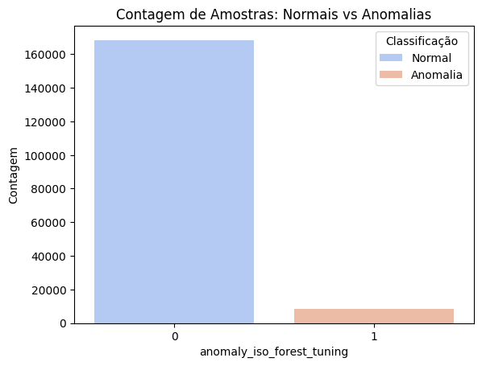 
   
   <sup>Fonte: Material produzido pelos autores (2024)</sup>
   
</div>

2. Contagem de anomalias entre o consumo horarizado e o consumo total em metros cúbicos: foi criado o gráfico que possibilita ver os dados anômalos relacionados ao consumo em metros cúbicos (colunas pulseCount e gain) e ao consumo horarizado (diferença de consumo entre duas medições de um mesmo cliente dividida pela diferença de tempo entre as medições). É possível entender que o Isolation Forest entende os dados de consumo que saem da média total como anômalos (dados em laranja) e que são os exemplos mais dispersos no gráfico e fora da maior concentração (dados em azul). Entretanto, ainda assim há dados dentro da concentração que são classificados como anomalias e que devem ser investigados na próxima sprint.

<div align="center">
   
   <sub>Figura 33 - Gráfico de Contagem Perfis de Consumo: Normais vs Anomalias </sub>

   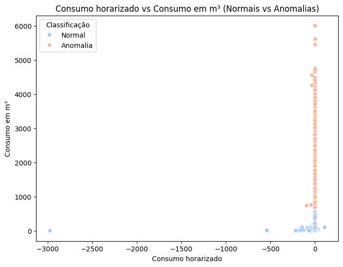 
   
   <sup>Fonte: Material produzido pelos autores (2024)</sup>
   
</div>

3. Quantidade de anomalias e dados normais entre os perfis de consumo: para que se pudesse entender como as anomalias estão distribuídas em cada perfil de consumo, foi criado um gráfico de barras que permite ver a distribuição de consumo em cada perfil e a classificação dada pelo modelo. Os perfis de consumo Cocção e Cocção + Aquecedor são os que mais possuem clientes cadastrados, mas, ainda assim, o perfil Cocção recebeu mais dados classificados como anomalias diferentemente do perfil Cocção + Aquecedor. Essa configuração aponta para a necessidade de identificar quais clientes possuem o perfil que mais predominam os dados anômalos e entender se a classificação é coerente com a realidade.

<div align="center">
   
   <sub>Figura 34 - Gráfico de Contagem Perfis de Consumo: Normais vs Anomalias </sub>

   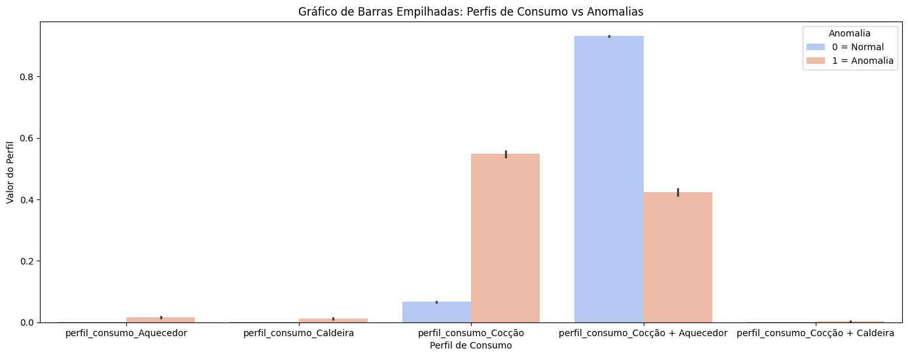 
   
   <sup>Fonte: Material produzido pelos autores (2024)</sup>
   
</div>

4. Quantidade de anomalias de acordo com o tempo: depois, foi necessário entender como as anomalias se comportavam ao longo do tempo registrado nas medições. No gráfico a seguir, é possível compreender que houve um salto no número de anomalias a partir de maio, o que pode ser explicado por clientes que não tinham consumo nos primeiros 3 meses de medições, sazonalidade ou outras questões econômicas e/ou culturais.

<div align="center">
   
   <sub>Figura 35 - Gráfico de Contagem Perfis de Consumo: Normais vs Anomalias </sub>

   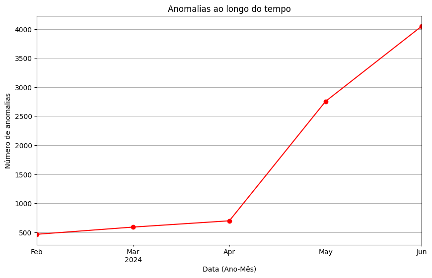 
   
   <sup>Fonte: Material produzido pelos autores (2024)</sup>
   
</div>

5. Anomalias pela diferença de tempo em horas entre medições: a última análise foi feita relacionando a variação de consumo a cada hora e a diferença em horas entre duas medições consecutivas de um mesmo cliente. Nesse quesito, o modelo Isolation Forest encontrou anomalias dentro do conjunto de dados mais concentrados, o que leva a entender que a diferença de tempo entre as medições, quando não uma diferença abrupta, pode não ser a melhor característica para definir um dado anômalo ou não.

<div align="center">
   
   <sub>Figura 36 - Gráfico de Contagem Perfis de Consumo: Normais vs Anomalias </sub>

   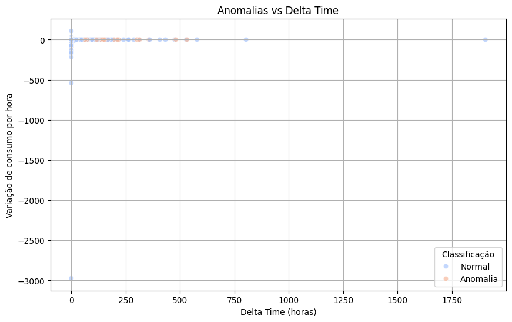 
   
   <sup>Fonte: Material produzido pelos autores (2024)</sup>
   
</div>

##### 4.4.1.3 Conclusão

&nbsp;&nbsp;&nbsp;&nbsp;Por fim, é possível entender que o modelo Isolation Forest, após o ajuste fino de hiperparâmetros, conseguiu identificar anomalias e trazer insights valiosos sobre em quais perfis ou dinâmicas de consumo os dados anômalos se concentram, permitindo uma investigação mais aplicada e profunda na última sprint para entender como relacionar cada anomalias com as instalações que as geraram.

#### 4.4.2 One Class SVM  

&nbsp;&nbsp;&nbsp;&nbsp;De acordo com Cortes (2021), o Support Vector Machine (SVM) é um modelo de aprendizado supervisionado amplamente utilizado para tarefas de classificação e regressão. Seu objetivo principal é encontrar um hiperplano que separe os dados em diferentes classes, maximizando a margem, ou seja, a distância entre os pontos mais próximos de classes distintas, chamados de vetores de suporte. O SVM é especialmente eficaz em espaços de alta dimensionalidade e pode lidar com dados não linearmente separáveis por meio de funções de kernel. Essas funções transformam os dados em um espaço de maior dimensão, onde a separação entre as classes se torna viável.

&nbsp;&nbsp;&nbsp;&nbsp;Como mencionado, as funções de kernel são técnicas essenciais no SVM, pois permitem a transformação dos dados para um espaço de maior dimensão, possibilitando que padrões que não são linearmente separáveis no espaço original se tornem separáveis nesse novo espaço. Elas são fundamentais para o poder do SVM na resolução de problemas complexos, especialmente quando os dados apresentam alta não linearidade.

&nbsp;&nbsp;&nbsp;&nbsp;Com base nesse conceito, espera-se que as funções de kernel, em vez de encontrar diretamente uma linha de separação nos dados originais — o que pode não ser viável —, projetem os dados em um novo espaço, onde a separação linear é possível. Vale destacar que essa projeção ocorre sem a necessidade de calcular explicitamente a transformação de cada ponto.

&nbsp;&nbsp;&nbsp;&nbsp;Ao longo do tempo, uma variação do SVM foi desenvolvida para lidar com problemas específicos de detecção de anomalias e outliers, dando origem ao One-Class SVM. Essa variação é uma adaptação do SVM tradicional, projetada para cenários em que há exemplos apenas de uma classe. O objetivo do One-Class SVM é identificar se novos exemplos são semelhantes à classe normal ou se diferem, sendo considerados anomalias.

&nbsp;&nbsp;&nbsp;&nbsp;Desta forma, conclui-se que o One-Class SVM é uma variante do SVM projetada para a detecção de anomalias. Ele busca definir uma fronteira que envolva a maioria das amostras normais no espaço de características, separando-as de possíveis anomalias. Durante o treinamento, o algoritmo ajusta um hiperplano que encapsula as amostras normais, enquanto na fase de teste, amostras que caem fora dessa margem são classificadas como anômalas. Esse método é amplamente utilizado em tarefas como detecção de outliers, fraudes e em sistemas com informações limitadas sobre a distribuição de dados anômalos (Bando, 2024).

##### 4.4.2.1 Criação de modelo e utilização das métricas

&nbsp;&nbsp;&nbsp;&nbsp;HiperparâmetrosPara o desenvolvimento do modelo preditivo One-Class SVM, utilizamos um conjunto de features selecionadas com base em sua relevância para a detecção de anomalias no consumo de gás natural. As features escolhidas foram:

- temp_scaled
- perfil_consumo_Aquecedor
- perfil_consumo_Caldeira
- perfil_consumo_Cocção
- perfil_consumo_Cocção + Aquecedor
- perfil_consumo_Cocção + Aquecedor + Piscina
- perfil_consumo_Cocção + Caldeira
- consumo em m³
- consumo_horarizado
- delta_time
- variação_consumo

&nbsp;&nbsp;&nbsp;&nbsp;Após a definição dessas features, utilizamos três métricas principais para avaliar a qualidade do modelo e garantir sua eficácia na detecção de anomalias: o Silhouette Score, o Calinski-Harabasz Index (CH Index) e o Davies-Bouldin Index (DBI).

- Silhouette Score: Essa métrica avalia o quão bem os dados estão agrupados, medindo a coesão dentro dos clusters e a separação entre eles. Valores próximos de 1 indicam que os dados estão bem separados e que os clusters são compactos.
- Calinski-Harabasz Index (CH Index): O CH Index mede a dispersão entre os clusters em comparação com a dispersão dentro dos clusters. Valores mais altos indicam uma melhor separação e definição entre os grupos.
- Davies-Bouldin Index (DBI): O DBI mede a similaridade entre os clusters. Valores mais baixos, próximos de 0, indicam que os clusters estão bem separados, ou seja, com baixa sobreposição entre os grupos.

&nbsp;&nbsp;&nbsp;&nbsp;A aplicação dessas métricas no contexto do nosso projeto é fundamental para avaliar e aprimorar a eficácia do modelo na detecção de anomalias, garantindo que ele identifique de forma precisa os desvios no consumo de gás natural.


**Primeira execução do modelo One-CLass SVM:**

&nbsp;&nbsp;&nbsp;&nbsp;Durante o desenvolvimento do modelo preditivo One-Class SVM, projetado para a detecção de anomalias, realizamos a primeira execução do modelo sem ajustes de hiperparâmetros. Nesta etapa inicial, ao analisarmos o gráfico gerado, observamos uma quantidade significativa de anomalias, embora o número de dados normais (28.036) seja consideravelmente maior que o de anomalias (1.476). Esse resultado preliminar sugere que, apesar de identificar uma quantidade relevante de anomalias, o modelo ainda pode ser aprimorado com ajustes finos nos hiperparâmetros para alcançar uma detecção mais precisa.

<div align="center">
   
   <sub>Figura 37 - Primeira visualização de clusters gerada pelo modelo One-Class SVM </sub>

   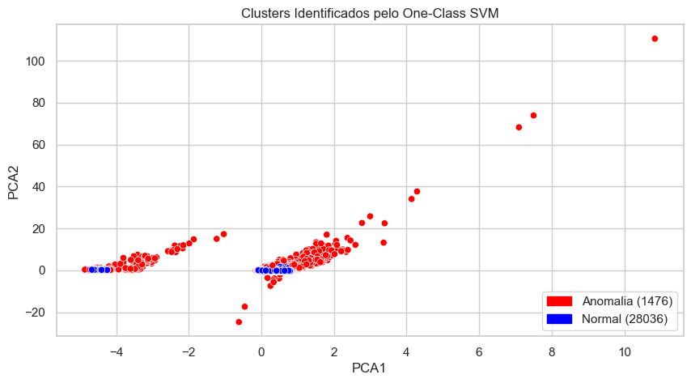

   <sup>Fonte: Material produzido pelos autores (2024)</sup>
   
</div>


##### 4.4.2.2 Hiperparâmetros do modelo One Class SVM

&nbsp;&nbsp;&nbsp;&nbsp;Hiperparâmetros em um modelo preditivo são valores que precisam ser definidos antes do processo de treinamento, controlando como o algoritmo será ajustado aos dados de entrada. Eles são responsáveis por influenciar diretamente o desempenho do modelo. Diferente dos parâmetros do modelo, que são ajustados automaticamente durante o treinamento, os hiperparâmetros precisam ser configurados manualmente ou por meio de técnicas de otimização.

&nbsp;&nbsp;&nbsp;&nbsp;Nesse contexto, existem técnicas que auxiliam na busca pelos melhores hiperparâmetros, como o GridSearchCV e o RandomizedSearchCV, que facilitam a tarefa de encontrar a combinação ideal. O GridSearchCV realiza uma nomeada busca exaustiva, testando todas as combinações possíveis de hiperparâmetros dentro de uma grade definida, o que garante que todas as opções serão avaliadas. 

&nbsp;&nbsp;&nbsp;&nbsp;Por outro lado, o RandomizedSearchCV adota uma abordagem mais aleatória, selecionando um número limitado de combinações possíveis a partir de uma distribuição ou intervalo de valores, reduzindo o tempo necessário para encontrar uma boa solução, mas sem garantir a avaliação de todas as combinações.


##### 4.4.2.2.1 GridSearchCV

&nbsp;&nbsp;&nbsp;&nbsp;Conforme já mencionado acima, o GridSearchCV é uma técnica usada para encontrar os melhores hiperparâmetros de um modelo de aprendizado de máquina. Esse método é especialmente útil para otimizar modelos como o OneClassSVM, que é comumente usado em tarefas de detecção de anomalias. O GridSearchCV ajuda a ajustar hiperparâmetros importantes, como nu (fração esperada de outliers) e gamma (que define a forma do kernel do modelo), garantindo que a combinação ideal seja selecionada. 

&nbsp;&nbsp;&nbsp;&nbsp;Nesse contexto, ao aplicarmos este método, chegamos aos seguintes resultados: 
- nu: 0.01 
- gamma: 0.001

##### 4.4.2.2.2 RandomizedSearchCV

&nbsp;&nbsp;&nbsp;&nbsp;O RandomizedSearchCV é uma técnica utilizada para encontrar hiperparâmetros de um modelo de aprendizado de máquina de uma maneira que pode ser tida como mais eficiente. No entanto, ao contrário do GridSearchCV, que testa todas as combinações possíveis dentro de uma grade de hiperparâmetros, o RandomizedSearchCV seleciona aleatoriamente um número limitado de combinações para avaliação.

&nbsp;&nbsp;&nbsp;&nbsp;Nesse contexto, ao aplicarmos este método, também chegamos aos seguintes resultados: 
- nu: 0.01 
- gamma: 0.001

##### 4.4.2.2.3 Aplicando os hiperparametros encontrados 

&nbsp;&nbsp;&nbsp;&nbsp;Com os hiperparâmetros otimizados identificados através dos métodos GridSearchCV e RandomizedSearchCV, podemos agora aplicá-los ao modelo OneClassSVM. Ambas as técnicas indicaram os mesmos valores ideais para nu e gamma, sendo nu = 0.01 e gamma = 0.001. Esses valores foram ajustados para maximizar o desempenho do modelo na tarefa de detecção de anomalias, garantindo um equilíbrio adequado entre a sensibilidade ao identificar outliers e a forma do kernel do modelo.

**Execução do modelo após os hiperparâmetros ajustados:**

&nbsp;&nbsp;&nbsp;&nbsp; Após o ajuste dos hiperparâmetros do modelo, o mesmo código foi executado novamente, gerando o gráfico de visualização de clusters. Com os ajustes aplicados, é possível notar algumas diferenças:

1. A quantidade de dados anômalos diminuiu significamente de 1476 para 296, e a quantidade de dados normais aumentou de 28036 para 29216. Dessa forma a diferença da quantidade de dados de cada cluster (anomalia e normal) obteve um aumento.

2. A visualização dos dados normais (pontos em azul) está mais frequente, o que demostra melhor agora um aumento da quantidade desses dados.

<div align="center">
   
   <sub>Figura 38 - Visualização de clusters gerada pelo modelo One-Class SVM após ajuste </sub>

   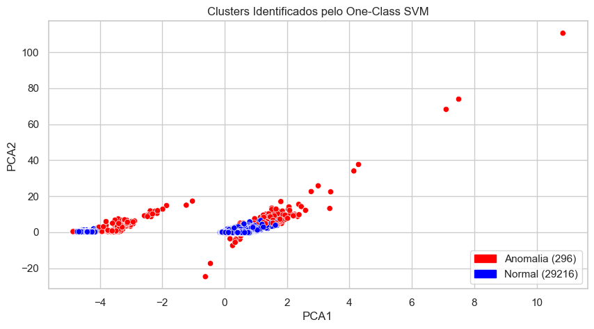

   <sup>Fonte: Material produzido pelos autores (2024)</sup>
   
</div>

&nbsp;&nbsp;&nbsp;&nbsp;Portanto, é evidente a importância das métricas e dos ajustes de hiperparâmetros na melhoria do desempenho do modelo preditivo. As mudanças observadas entre a primeira e a segunda execução do modelo mostram como esses ajustes podem aumentar a precisão na detecção de anomalias. Dessa forma, é essencial realizar testes contínuos e refinamentos no modelo para garantir que ele seja o mais eficiente e fiel possível na identificação de padrões anômalos.

#### 4.4.3 DBSCAN

&nbsp;&nbsp;&nbsp;&nbsp;Segundo Gabriel Monteiro (2020), o modelo DBSCAN utiliza uma abordagem que agrupa pontos com base na densidade. A formação dos clusters ocorre a partir da densidade de pontos em uma determinada área. Se um ponto não atender aos critérios de densidade ou aos limites de distância estabelecidos, ele não será classificado em um cluster.

&nbsp;&nbsp;&nbsp;&nbsp;Desse modo, a definição dos parâmetros é fundamental para o funcionamento adequado do algoritmo. O parâmetro Eps define a distância máxima em que dois pontos podem estar para serem considerados parte do mesmo cluster. Já o parâmetro Min Samples estabelece a quantidade mínima de pontos em uma região necessária para garantir que haja densidade suficiente para formar um cluster. O DBSCAN não requer a definição prévia do número de clusters e é mais rápido que o k-means. Ele identifica padrões não lineares e lida com outliers, mas pode enfrentar dificuldades em datasets com alta variabilidade de densidade e em dados de alta dimensionalidade, a escolha dos parâmetros é crítica, e a ordem dos dados pode afetar os resultados.

&nbsp;&nbsp;&nbsp;&nbsp;Como primeiro passo da implementação do DBScan, para fins de eficiência na testagem dos códigos, fez-se necessária uma nova redução do DataFrame. Considerando os últimos ajustes de pré-processamento, configurando a variação de consumo de forma horarizada, ou seja, calculada de horário em horário, a lista de features selecionadas para a construção do modelo DBScan também foi refeita, fazendo a inclusão das novas colunas *consumo_horarizado* e *delta_time*.

```python
colunas_selecionadas2 = [
    'temp_scaled',
    'perfil_consumo_Aquecedor',
    'perfil_consumo_Caldeira',
    'perfil_consumo_Cocção',
    'perfil_consumo_Cocção + Aquecedor',
    'perfil_consumo_Cocção + Aquecedor + Piscina',
    'perfil_consumo_Cocção + Caldeira',
    'consumo em m^3',
    'consumo_horarizado',
    'delta_time'
]

# Redução do modelo na variável df_sample2 para testagem do DBScan
df_sample2 = df_merged[colunas_selecionadas2].sample(frac=0.008, random_state=42).astype(int).copy() # 8% dos dados

```
&nbsp;&nbsp;&nbsp;&nbsp;Com isso, fez-se a programação do DBScan, a qual começa com a escalonagem das features selecionadas para implementar uma normalização, auxiliando nas operações lógicas. Então, o DBScan é implementado, configurando-se um valor determinado de *eps* (para cada ponto, o raio máximo para a detecção de pontos vizinhos) e do *min_samples* (quantidade mínimas de pontos de um agrupamento para ser considerado um cluster). Então, para auxiliar na plotagem do gráfico, fez-se a redução de dimensionalidade com PCA para apenas 2 componentes, e plotou-se o gráfico (Figura 39). Com base no algoritmo, com um eps de 0.6 e um min_samples de 100, foram gerados cerca de 8 clusters, sendo os clusters com valor -1 considerados como "ruídos", ou anomalias.

```python
## Importação das bibliotecas
from sklearn.decomposition import PCA
from sklearn.cluster import DBSCAN

# Normalização das colunas selecionadas com o Standart Scaler
scaler = StandardScaler()
features_scaled = scaler.fit_transform(df_sample2)

# Modelo DBSCAN. Eps = distância mínima para 2 pontos serem considerados vizinhos. Min_samples = número mínimo de pontos em uma vizinhança para ser considerado um cluster
dbscan = DBSCAN(eps=0.6, min_samples=100) # Parâmetros iniciais, os quais serão aprimorados com o futuro fine tuning
clusters = dbscan.fit_predict(features_scaled)

# Redução de dimensionalidade para visualização do gráfico
pca = PCA(n_components=2)
features_pca = pca.fit_transform(features_scaled)

# Fit dos clusters no DataFrame df_sample2
df_sample2['cluster'] = clusters

# Gráfico de visualização dos clusters em 2D com PCA
plt.figure(figsize=(10, 7))
sns.scatterplot(x=features_pca[:, 0], y=features_pca[:, 1], hue=clusters, palette='tab10', s=20, edgecolor='k')
plt.title('Clusters DBSCAN - Sample DataFrame')
plt.xlabel('Componente Principal 1')
plt.ylabel('Componente Principal 2')
plt.show()

# Contagem os pontos em cada cluster
print(df_sample2['cluster'].value_counts())

```

<div align="center">
   
   <sup>Figura 39 - Modelo DBScan</sup>

    
   
   <sub>Fonte: Material produzido pelos autores (2024)</sub>
   
</div>

**Fine Tuning de Hiperparâmetros**

&nbsp;&nbsp;&nbsp;&nbsp;Considerando-se que a alteração dos hiperparâmetros eps e min_samples interfere no sucesso do modelo, implementou-se um Fine Tuning para realizar várias combinações de valores, avaliando os melhores com o cálculo da Silhueta.

```python
# Definição de intervalos de eps e min_samples para testagem
eps_values = np.arange(0.2, 1.0, 0.1)  # Testando valores entre 0.4 e 1.0, pulando de 0.1 em 0.1
min_samples_values = range(50, 150, 25)  # Testando valores de 50 a 150, pulando de 25 em 25

# Variáveis para guardar os melhores parâmetros
best_eps = None
best_min_samples = None
best_silhouette_score = -1 # menor valor possível para o best_silhouette_score
best_clusters = None

# Loop para testar todas as combinações de eps e min_samples
for eps in eps_values:
    for min_samples in min_samples_values:
        # Modelo DBSCAN com os parâmetros de cada instância
        dbscan = DBSCAN(eps=eps, min_samples=min_samples)
        clusters = dbscan.fit_predict(features_scaled)
        
        if len(set(clusters)) > 1:  # Garante que há mais de um cluster
            score = silhouette_score(features_scaled, clusters)
            
            # Verificação se o score atual é o melhor
            if score > best_silhouette_score:
                best_silhouette_score = score
                best_eps = eps
                best_min_samples = min_samples
                best_clusters = clusters

# Aplicar os melhores parâmetros encontrados ao DataFrame original
df_sample2['cluster'] = best_clusters

# Redução de dimensionalidade para visualização do gráfico
pca = PCA(n_components=2)
features_pca = pca.fit_transform(features_scaled)

# Gráfico de visualização dos clusters em 2D com PCA
plt.figure(figsize=(10, 7))
sns.scatterplot(x=features_pca[:, 0], y=features_pca[:, 1], hue=df_sample2['cluster'], palette='tab10', s=20, edgecolor='k')
plt.title(f'Clusters DBSCAN - eps: {best_eps}, min_samples: {best_min_samples}')
plt.xlabel('Componente Principal 1')
plt.ylabel('Componente Principal 2')
plt.show()

# Contagem dos pontos em cada cluster
print(df_sample2['cluster'].value_counts())
print(f'Melhor eps: {best_eps}, Melhor min_samples: {best_min_samples}, Melhor Silhouette Score: {best_silhouette_score}')

```
&nbsp;&nbsp;&nbsp;&nbsp;Testando de valores de eps entre 0.2 e 1.0, e de min_samples entre 50 e 150, obteve-se o seguinte output no modelo: *Melhor eps: 0.5000000000000001, Melhor min_samples: 50, Melhor Silhouette Score: 0.7629696140135187*. Este resultado pode ser observado no gráfico da Figura 40:

<div align="center">
   
   <sup>Figura 40 - Modelo DBScan / Eps: 0.5 e min_samples 50 </sup>

    
   
   <sub>Fonte: Material produzido pelos autores (2024)</sub>
   
</div>

&nbsp;&nbsp;&nbsp;&nbsp;Então, como decisão interna da equipe, além do coeficiente de silhueta foram adicionadas mais duas métricas de avaliação do DBScan desenvolvido, sendo elas o Davies-Bouldin Index (DBI) e o Calinski-Harabasz Index (CH Index). Abaixo, segue o algoritmo desenvolvido para essa análise dos hiperparâmetros e o output correspondente.

```python
from sklearn.metrics import davies_bouldin_score, calinski_harabasz_score

# Definição de intervalos de eps e min_samples para testagem
eps_values = np.arange(0.2, 1.0, 0.1)  # Testar valores entre 0.2 e 1.0, variando de 0.1 a 0.1
min_samples_values = range(50, 150, 25)  # Testar valores de 50 a 150, variando de 25 a 25

# Variáveis para guardar os melhores parâmetros
best_eps = None
best_min_samples = None
best_silhouette_score = -1
best_dbi = float('inf')  # Para DBI, menor é melhor, então inicializamos com infinito
best_ch = -1  # Para CH, maior é melhor, então inicializamos com -1
best_clusters = None

# Loop para testar todas as combinações de eps e min_samples
for eps in eps_values:
    for min_samples in min_samples_values:
        # Modelo DBSCAN com os parâmetros atuais
        dbscan = DBSCAN(eps=eps, min_samples=min_samples)
        clusters = dbscan.fit_predict(features_scaled)
        
        if len(set(clusters)) > 1:  # Garantir que há mais de um cluster
            
            # Silhouette Score
            sil_score = silhouette_score(features_scaled, clusters)
            
            # Davies-Bouldin Index (DBI)
            dbi = davies_bouldin_score(features_scaled, clusters)
            
            # Calinski-Harabasz Index (CH Index)
            ch = calinski_harabasz_score(features_scaled, clusters)
            
            # Verifica se este é o melhor conjunto de métricas até agora
            if (sil_score > best_silhouette_score and dbi < best_dbi and ch > best_ch):
                best_silhouette_score = sil_score
                best_dbi = dbi
                best_ch = ch
                best_eps = eps
                best_min_samples = min_samples
                best_clusters = clusters

# Aplica os melhores parâmetros encontrados ao DataFrame df_sample2
df_sample2['cluster'] = best_clusters

# Redução de dimensionalidade para visualização do gráfico
pca = PCA(n_components=2)
features_pca = pca.fit_transform(features_scaled)

# Gráfico de visualização dos clusters em 2D com PCA
plt.figure(figsize=(10, 7))
sns.scatterplot(x=features_pca[:, 0], y=features_pca[:, 1], hue=df_sample2['cluster'], palette='tab10', s=20, edgecolor='k')
plt.title(f'Clusters DBSCAN - eps: {best_eps}, min_samples: {best_min_samples}')
plt.xlabel('Componente Principal 1')
plt.ylabel('Componente Principal 2')
plt.show()

# Contagem dos pontos em cada cluster
print(df_sample2['cluster'].value_counts())
print(f'Melhor eps: {best_eps}, Melhor min_samples: {best_min_samples}, Melhor Silhouette Score: {best_silhouette_score}')
print(f'Melhor Davies-Bouldin Index (DBI): {best_dbi}')
print(f'Melhor Calinski-Harabasz Index (CH Index): {best_ch}')

```

&nbsp;&nbsp;&nbsp;&nbsp;Calculando-se as 3 métricas, obteve-se 10 clusters (contando com um de anomalias) e o seguinte output:<br>

**Melhor eps**: 0.2, Melhor min_samples: 50, Melhor Silhouette Score: 0.7482794489545446<br><br>
**Melhor Davies-Bouldin Index (DBI)**: 1.7877124152854893<br><br>
**Melhor Calinski-Harabasz Index (CH Index)**: 1383.0505542992075.

### Análise dos resultados

&nbsp;&nbsp;&nbsp;&nbsp;Para a avaliação dos resultados do DBScan, foram executados alguns algoritmos de análise. O primeiro deles foi a análise de consistência de clusters, implementada com o seguinte código:

```python
# Estatísticas descritivas dos clusters
cluster_analysis = df_sample2.groupby('cluster')['consumo em m^3'].describe()
print(cluster_analysis)

```
&nbsp;&nbsp;&nbsp;&nbsp;Com a execução do código, observou-se que os clusters definidos com -1 representam os outliers, os quais são possíveis de serem identificados por sua dispersão em relação aos demais clusters. o consumo médio é muito alto, com 544,58 m³, e o desvio padrão também é elevado, em 793,06 m³, o que nos mostra que os outliers apresentam uma variação ampla. Já os clusters definidos com 0, tem o maior número de pontos e um consumo médio parecidos, possuem consumo moderadamente baixo e uma dispersão moderada. <br>
&nbsp;&nbsp;&nbsp;&nbsp;Os clusters menores (1, 2, 3, 4, etc.) apresentam padrões de consumo bem variados, com médias que vão de 7,24 m³ até 53,81 m³. Isso indica que perfis de consumo diferentes foram agrupados em categorias distintas, ou seja, o DBSCAN conseguiu identificar diferentes grupos de perfis de consumo e separar aqueles que estão fora do padrão, considerados anômalos.<br>

**Histograma de Outliers**

&nbsp;&nbsp;&nbsp;&nbsp;Para a uma interpretação mais direcionada aos outliers, executou-se um histograma com o seguinte código, resultando-se na Figura 41:

```python
# Visualizar as primeiras entradas do cluster de ruído (-1)
outliers = df_sample2[df_sample2['cluster'] == -1]
print(outliers.head())

# Visualizar distribuição dos outliers
plt.figure(figsize=(10, 6))
sns.histplot(outliers['consumo em m^3'], bins=30, kde=True)
plt.title('Distribuição de Consumo - Outliers (ruído)')
plt.show()

```
<div align="center">
   
   <sup>Figura 41 - Histograma de outliers - DBScan</sup>

    
   
   <sub>Fonte: Material produzido pelos autores (2024)</sub>
   
</div>

<div align="center">
   
   <sup>Figura 42 - Histograma de outliers - DBScan</sup>

    
   
   <sub>Fonte: Material produzido pelos autores (2024)</sub>
   
</div>


&nbsp;&nbsp;&nbsp;&nbsp;A visualização dos outliers com histogramas demonstra que a maioria dos pontos classificados como "ruído" está concentrada em consumos baixos. Mais da metade dos outliers tem níveis de consumo abaixo de 500 m³, enquanto alguns apresentam valores muito elevados, ultrapassando 5000 m³, conforme mostrado nos dados descritivos.<br>
&nbsp;&nbsp;&nbsp;&nbsp;A tabela gerada pelo código (Figura 42) mostra uma amostra dos pontos classificados como outliers (ou seja, pontos com rótulo -1), que não foram agrupados em nenhum dos clusters do modelo DBSCAN. A tabela mostra que cada outlier possui diferentes combinações de consumo nos diversos perfis, o que provavelmente levou à sua classificação como ponto anômalo (ou "ruído"), pois não se encaixaram nos padrões identificados pelos clusters principais. Esses pontos podem representar comportamentos fora do comum, que devem ser investigados mais a fundo.

**Proporção de Pontos Classificados como Ruído**

&nbsp;&nbsp;&nbsp;&nbsp;Para se entender a porcentagem de anomalias em relação ao DataFrame reduzido, executou-se o seguinte código:

```python
# Porcentagem de pontos classificados como ruído
noise_points = (df_sample2['cluster'] == -1).sum()
total_points = len(df_sample2)
noise_percentage = (noise_points / total_points) * 100
print(f'Porcentagem de pontos classificados como ruído: {noise_percentage:.2f}%')
```

&nbsp;&nbsp;&nbsp;&nbsp;Com o resultado acima, é possível identificar que, em média, aproximadamente 4,32% dos pontos não estavam em nenhum cluster. Esse valor é relativamente moderado, o que significa que a maior parte dos dados foi agrupada nos clusters, mas uma boa parte foi classificada como "ruído" ou anomalias. Posteriormente, implementou-se outro algoritmo para se entender a totalidade de cada cluster:

```python
# Contar quantos pontos estão em cada cluster
cluster_counts = df_sample2['cluster'].value_counts()
print("Contagem dos pontos em cada cluster:")
print(cluster_counts)
```

&nbsp;&nbsp;&nbsp;&nbsp;A contagem de pontos por cluster mostra que o cluster 0 é o maior, concentrando a maior parte dos dados, com um total de 12.883 pontos. Já os clusters menores variam entre 54 e 3.547 pontos. Isso é algo comum em problemas onde o DBSCAN agrupa a maioria dos dados em um cluster principal e distribui os demais em clusters menores, dependendo da densidade dos dados.

&nbsp;&nbsp;&nbsp;&nbsp;Em suma, entendeu-se que o modelo DBSCAN foi capaz de identificar clusters importantes de consumo, distinguindo com sucesso os principais grupos de usuários e padrões de consumo, além de detectar comportamentos mais incomuns. A análise revelou uma estrutura clara, onde a maior parte dos dados foi agrupada em clusters significativos, permitindo a identificação de diferentes perfis de consumo. Além disso, foi possível identificar a existência de 1021 outliers, que representam consumos fora do padrão esperado. Esses outliers podem indicar anomalias ou situações que merecem uma investigação mais detalhada, como erros de medição ou casos atípicos que fogem da norma. De maneira geral, o DBSCAN se mostrou eficiente para segmentar os dados e destacar áreas críticas, oferecendo uma base sólida para ações corretivas e otimizações futuras.

#### 4.4.4 OPTICS

&nbsp;&nbsp;&nbsp;&nbsp;O modelo OPTICS (Ordering Points To Identify the Clustering Structure) é uma técnica de clustering muito utilizada para identificar outliers e anomalias (Ankerst, 1999). É similiar ao DBScan, porém fornece uma fexibilidade maior na detecção de clusters com densidades variadas, algo que pode ser útil ao analisar dados de consumo de gás, uma vez que podem existir padrões de consumo muito variados. <br>

**Primeira execução do modelo OPTICS:**

&nbsp;&nbsp;&nbsp;&nbsp;A partir desta definição, o modelo OPTICS foi o último modelo não-supervisionado de clusterização que foi testado durante a execução do projeto. A princípio, o modelo foi executado sem ajuste de hiperparâmetros, e retornou uma visualização de clusters considerada pela equipe como incorreta, uma vez que classificou mais pontos como anomalias do que com normais: 

<div align="center">
   
   <sub>Figura 43 - Primeira visualização de clusters gerada pelo modelo OPTICS </sub>

   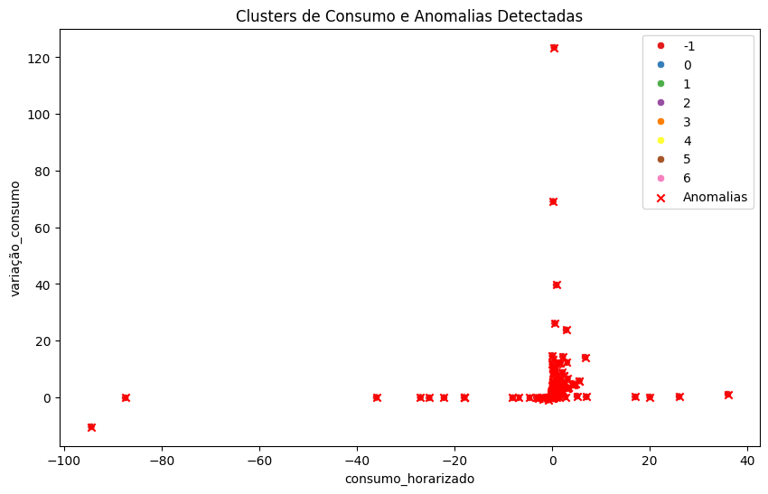

   <sup>Fonte: Material produzido pelos autores (2024)</sup>
   
</div>
  
**Ajuste fino dos hiperparâmetros:**

&nbsp;&nbsp;&nbsp;&nbsp;Após a primeira tentativa, foi realizado o ajuste fino dos hiperparâmetros, a fim de conseguir uma melhor clusterização de dados. <br>
Para o modelo OPTICS, os principais hiperparâmetros a serem ajustados são:
- min_samples: O número mínimo de pontos em uma região para que essa região seja considerada um cluster;
- xi: Parâmetro de densidade que controla a sensibilidade do modelo em relação a mudanças de densidade nos dados;
- min_cluster_size: Tamanho mínimo de um cluster em termos da fração total dos pontos

&nbsp;&nbsp;&nbsp;&nbsp;Para esta abordagem, foi utilizado o método de GridSearch para encontrar a melhor combinação de valores de hiperparâmetros. O GridSearch é um algoritmo que testa todas as combinações de hiperparâmetros e retorna aquela que possui melhores resultados. Ainda nesta análise, foi utilizado como métrica de eficiência do modelo e comparação entre hiperparâmetros o Davies-Bouldin Score, que mede a qualidade dos clusters gerados pelo modelo baseando-se na similaridade média entre os clusters e na sua separação.
&nbsp;&nbsp;&nbsp;&nbsp;Ao rodar tal algoritmo de GridSearch, foi retornada uma melhor combinação de hiperparâmetros com um Davies-Bouldin Score de aproximadamente 0,68. Vale ressaltar que, quanto menor for este valor, melhor. 

**Testes com hiperparâmetros ajustados:**

&nbsp;&nbsp;&nbsp;&nbsp;Após ajustar os hiperparâmetros para os melhores valores, foi possível executar o modelo de clusterização novamente e visualizar como ficou a distribuição dos pontos nos clusters. A partir disso, foi possível concluir que:
1. A quantidade de anomalias identificadas caiu muito, passando para apenas 0,12% do dataframe amostral (1% dos dados), o que corresponde a 36 linhas de dados. Isso reflete que o modelo considerou a maior parte dos dados como normais, e apenas uma pequena parcela como anomalia, como é o esperado, uma vez que as anomalias são exceções. Além disso, é importante ressaltar que pontos com valor de consumo horarizado negativo foram manualmente considerados anomalias.
2. A distribuição dos dois clusters (normal e anormal) ficou muito mais claro na segunda visualização. Agora, é possível entender que o modelo considerou como anomalia apenas os dados que possuíam consumo horarizado extremamente baixo ou negativos.

<div align="center">
   
   <sub>Figura 44 - Visualização de clusters gerada pelo modelo OPTICS após ajuste</sub>

   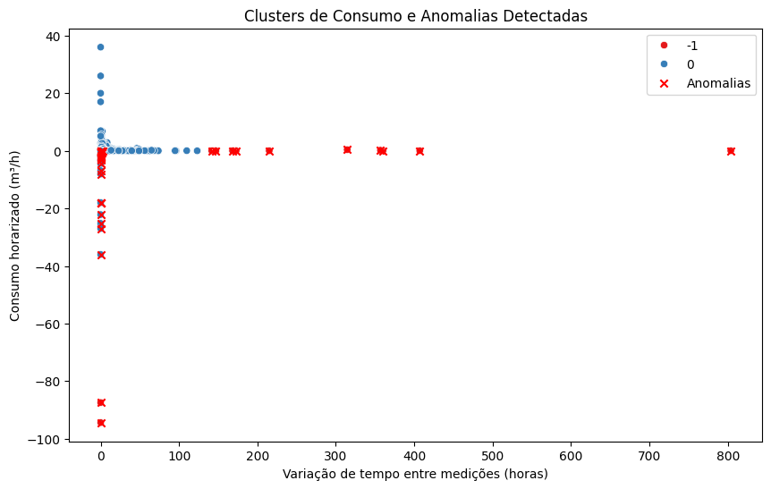 

   <sup>Fonte: Material produzido pelos autores (2024)</sup>
   
</div>
  
**Conclusão dos resultados:**

&nbsp;&nbsp;&nbsp;&nbsp;Em conclusão, é possível perceber através da análise dos dados e clusterização com o modelo OPTICS que dados que possuem consumo horarizado negativos são considerados anômalos, algo que faz sentido no contexto do projeto atual, que analisa dados de consumo de gás. Além disso, o modelo classificou os dados com variação de tempo entre medições muito alta como anomalia, algo que também faz sentido de acordo com informações que foram passadas pela empresa parceira. Dessa forma, a utilização de tal modelo aplicado a todos os dados de consumo que possuímos se faz de extrema utilidade para identificar ao menos estes dois tipos de anomalia que, por mais que não sejam as únicas, são significativas.

  
#### 4.4.5. Modelo Supervisionado Para Previsão de Consumo
&nbsp;&nbsp;&nbsp;&nbsp;Um modelo de aprendizagem supervisionada consegue aprender a partir de dados com resultados pré-definidos, ou seja, já rotulados. Esse tipo de modelo se faz muito útil quando já possuímos dados que estão rotulados ou classificados e queremos classificar novos dados. No contexto do projeto, utilizaremos um modelo supervisionado em conjunto com uma base de dados sintética disponibilizada pela Compass para construir um modelo preditivo que consiga dizer quantos metros cúbicos de gás um cliente irá consumir no próximo mês (Candido, 2023). <br>
&nbsp;&nbsp;&nbsp;&nbsp;Para este modelo, utilizaremos dados sintéticos disponibilizados pela Compass. Estes dados são mais simplificados em relação aos dados reais, possuindo apenas o código do cliente, índice do cliente, data (em intervalos de 1 dia) e o consumo de tal instalação naquele dia.


##### 4.4.5.1. Exploração, limpeza e enriquecimento dos dados
&nbsp;&nbsp;&nbsp;&nbsp; Como os dados sintéticos eram muito mais simples do que os dados reais, todo o processo de pré-processamento foi feito de maneira mais rápida. Assim, foi realizada o tratamento de valores faltantes (NaN) e valores duplicados:
```python
## Calculo da média de consumo diário para cada instalação (clientCode + clientIndex)
df_sintetico['media_consumo_instalacao'] = df_sintetico.groupby(['clientCode', 'clientIndex'])['consumo_dia'].transform('mean')

## Substituição os valores NaN na coluna consumo_dia pela média da instalação correspondente
df_sintetico['consumo_dia'] = df_sintetico['consumo_dia'].fillna(df_sintetico['media_consumo_instalacao'])

print(f"Restam {df_sintetico['consumo_dia'].isnull().sum()} valores NaN após preencher com a média da instalação.")
```

&nbsp;&nbsp;&nbsp;&nbsp;O enriquecimento do dataset é uma medida tomada para acrescentar mais dados que podem ser úteis para um modelo preditivo. Um exemplo de enriquecimento foi feito durante a seção de pré-processamento dos dados para encontro de anomalias, onde foi realizada uma consulta em uma API de temperatura a fim de saber a temperatura média de cada dia em cada medição. Para o dataset sintético, o enriquecimento foi feito apenas por meio de cálculos com os dados já existentes (consumo diário e dia): 
```python
def obter_estacao(data):
    """
    Função para obter a estação do ano com base na data.
    No Brasil, as estações são:
    - Verão: 21 de dezembro a 20 de março
    - Outono: 21 de março a 20 de junho
    - Inverno: 21 de junho a 20 de setembro
    - Primavera: 21 de setembro a 20 de dezembro
    """
    mes = data.month
    dia = data.day
    
    if (mes == 12 and dia >= 21) or (mes == 1) or (mes == 2) or (mes == 3 and dia <= 20):
        return 'Verão'
    elif (mes == 3 and dia >= 21) or (mes == 4) or (mes == 5) or (mes == 6 and dia <= 20):
        return 'Outono'
    elif (mes == 6 and dia >= 21) or (mes == 7) or (mes == 8) or (mes == 9 and dia <= 20):
        return 'Inverno'
    else: # (mes == 9 and dia >= 21) or (mes == 10) or (mes == 11) or (mes == 12 and dia <= 20)
        return 'Primavera'
```
##### 4.4.5.2. Modelo Holt-Winters
&nbsp;&nbsp;&nbsp;&nbsp;O método de Holt-Winters é uma técnica de previsão de séries temporais que incorpora a tendência e a sazonalidade dos dados. É um modelo que se mostra particularmente eficaz quando os dados apresentam padrões sazonais definidos ao longo do tempo (Tebaldi, 2019). Dessa forma, o modelo Holt-Winters se faz ideal para analisar, por exemplo, o consumo de gás de um cliente ao longo dos anos, uma vez que este consumo é sazonal e aumenta ou diminui em determinadas épocas.

**Agrupamento de dados por mês e execução do modelo:** 

&nbsp;&nbsp;&nbsp;&nbsp;Para o projeto atual, decidimos agrupar os dados de consumo por mês, ou seja, ajustar o dataframe para obter o consumo mensal de cada instalação, lembrando que uma instalação é uma combinação única entre clientCode e clientIndex. Como o Holt-Winters apenas usa uma variável no tempo, as únicas *features* que utilizamos foi o consumo mensal e o mês deste consumo. Dessa forma, rodamos um primeiro modelo:
```python
from statsmodels.tsa.holtwinters import ExponentialSmoothing

modelo_mensal = ExponentialSmoothing(
    instalacao_mensal_df['consumo_dia'], 
    trend='add',      
    seasonal='add',   
    seasonal_periods=12  ## Sazonalidade anual (12 meses)
)

## Fit do modelo
ajuste_mensal = modelo_mensal.fit()

previsao_mensal = ajuste_mensal.forecast(1)  ## Prever apenas o próximo mês

print(previsao_mensal)
```

<div align="center">
   
   <sub>Figura 45 - Gráfico de Consumo Mensal Com Ponto de Previsão </sub>

   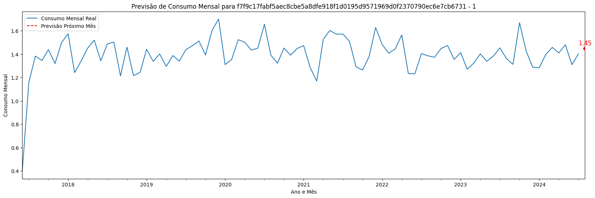 
   
   <sup>Fonte: Material produzido pelos autores (2024)</sup>
   
</div>

&nbsp;&nbsp;&nbsp;&nbsp;Para esta instalação, inicialmente, o modelo previu um consumo de 1,45 metros cúbicos de gás no próximo mês. 

**Critério para identificar previsões corretas:**

&nbsp;&nbsp;&nbsp;&nbsp;Como não é possível, na maior parte dos casos, prever com 100% de certeza o valor que o cliente consumirá no próximo mês, decidimos considerar como "correta" toda previsão que estivesse num intervalo de 10% para baixo ou para cima do valor real. Dessa forma, foi necessário separar os dados em treinamento (80%) e teste (20%). Assim, treinamos o modelo, geramos as previsões, e comparamos as previsões com os valores reais. Se o valor da previsão estiver neste intervalo de 10%, consideramos correta a previsão. 

<div align="center">
   
   <sub>Figura 46 - Gráfico de Previsão de Consumo em Comparação com Dados Reais </sub>

   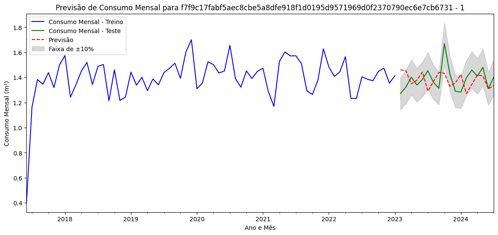 

   <sup>Fonte: Material produzido pelos autores (2024)</sup>
   
</div>
  
&nbsp;&nbsp;&nbsp;&nbsp;Nesta tentativa, o modelo previu corretamente cerca de 77% dos valores corretamente, no intervalo de confiança de 10%.

**Cálculo das métricas de erro:**

&nbsp;&nbsp;&nbsp;&nbsp;Como principais três métricas para avaliar o modelo, escolhemos o Erro Médio Absoluto, o Erro Médio Quadrático e o Erro Médio Percentual. Cada uma dessas métricas tem como objetivo avaliar o quanto o modelo erra as previsões. <br>
&nbsp;&nbsp;&nbsp;&nbsp;O erro absoluto médio calcula a média das diferenças absolutas entre os valores reais e os valores que foram previstos pelo modelo. Um erro médio absoluto de 1, por exemplo, quer dizer que, quando o modelo erra, ele erra por cerca de 1 unidade (metro cúbico, no nosso caso). Já o erro médio quadrático calcula a mesma média que a métrica anterior, porém elevando os erros ao quadrado, o que resulta em uma penalização maior para erros maiores. Ademais, o erro médio percentual mede a média dos erros absolutos divididos pelos valores reais, multiplicados por 100%. Por exemplo, um erro percentual de 0.05 quer dizer que o modelo tem um erro de 5% em relação aos valores reais. <br>
&nbsp;&nbsp;&nbsp;&nbsp;Por fim, o cálculo dessas métricas é de extrema importância para avaliar o modelo. Uma vez que o ideal é que todas essas métricas sejam as menores possíveis, podemos ajustar o modelo e verificar se ele melhorou ou piorou com base nos valores dessas métricas. 

**Ajuste de hiperparâmetros do modelo:**

&nbsp;&nbsp;&nbsp;&nbsp;Os hiperparâmetros de um modelo são os valores ou configurações que passamos para um modelo de maneira manual. Tais hiperparâmetros causam um impacto significante no desempenho do modelo, e são responsáveis por controlar o processo de treinamento e definir a estrutura do modelo. Por conta disso, é muito importante encontrar uma combinação ideal de hiperparâmetros para que o modelo performe da melhor maneira possível.

Para o modelo Holt-Winters, foram identificados 4 hiperparâmetros a serem ajustados:

* trend: Define o tipo de componente de tendência que será utilizado nos cálculos do modelo. Sendo do tipo 'add', o modelo utilizará uma tendência aditiva, onde a tendência é somada à série temporal. Sendo do tipo 'mul', o modelo utilizará uma tendência multiplicativa, sendo mais adequado quando a taxa de crescimento é proporcional ao nível da série temporal. Tendo este parâmetro como 'None', temos que o modelo não inclui componente de tendência.
* seasonal: Define o tipo de componente sazonal que o modelo utilizará em seus cálculos, capturando padrões repetitivos intervalos de tempo, como, por exemplo, um consumo de gás que aumenta em meses de férias escolares. Os valores para esse parâmetro são os mesmos do parâmetro 'trend'.
* seasonal_periods: Define o número de períodos que um ciclo sazonal completo deve ter. Para um ciclo de um ano, por exemplo, o valor deveria ser de 12.
* damped_trend: Define se a tendência deve ser amortecida ao longo do tempo. Se verdadeiro, aplica o amortecimento, fazendo com que a tendência seja menos pronunciada com o passar do tempo. Se falso, não aplica amortecimento e a tendência pode continuar indefinidamente.

```python
## Parâmetros a serem testados
trend_options = ['add', 'mul', None]
seasonal_options = ['add', 'mul', None]
seasonal_periods = [i for i in range(2, 31)]  
damped_trend_options = [True, False]
```

**Grid Search Manual para encontrar melhores parâmetros:**

&nbsp;&nbsp;&nbsp;&nbsp;O algoritmo de Grid Search é utilizado na análise de dados para encontrar a melhor combinação possível de hiperparâmetros para um modelo. Acima, definimos a nossa "grade" de parâmetros, e, abaixo, iremos testar todas essas combinações e calcular as métricas de erro para cada uma. Vale ressaltar que o algoritmo de Grid Search possui um custo computacional alto, e só é viável utilizá-lo aqui porque a quantidade de parâmetros é pequena (Constantin, 2024). Dessa forma, rodamos o seguinte algoritmo, que nos retornou a melhor combinação de hiperparâmetros para o modelo, ou seja, aquela que minimizou os erros:

```python
for trend in trend_options:
    for seasonal in seasonal_options:
        for period in seasonal_periods:
            for damped in damped_trend_options:
                try:
                    ## Apenas testar damped_trend se houver uma tendência
                    if trend is None and damped:
                        continue
                    
                    ## Definir e ajustar o modelo Holt-Winters com os dados de treino
                    modelo_treino = ExponentialSmoothing(
                        train['consumo_dia'], 
                        trend=trend, 
                        seasonal=seasonal,
                        seasonal_periods=period,
                        damped_trend=damped
                    )

                    ajuste_treino = modelo_treino.fit()

                    ## Fazer a previsão para o número de meses no conjunto de teste
                    previsao_teste = ajuste_treino.forecast(len(test))

                    ## Calcular as métricas
                    mae = mean_absolute_error(test['consumo_dia'], previsao_teste)
                    mse = mean_squared_error(test['consumo_dia'], previsao_teste)
                    mape = mean_absolute_percentage_error(test['consumo_dia'], previsao_teste)

                    ## Comparar o erro e armazenar o melhor modelo (baseado no MAE)
                    if mae < best_mae:
                        best_mae = mae
                        best_mse = mse
                        best_mape = mape
                        best_params = {
                            'trend': trend,
                            'seasonal': seasonal,
                            'seasonal_periods': period,
                            'damped_trend': damped
                        }

                except Exception as e:
                    print(f"Erro com a configuração {trend}, {seasonal}, {period}, damped={damped}: {e}")
```

**Modelagem com hiperparâmetros ajustados:** 

&nbsp;&nbsp;&nbsp;&nbsp;A partir dos hiperparâmetros ajustados, o modelo foi executado novamente:

```python
modelo_treino = ExponentialSmoothing(
    train['consumo_dia'], 
    trend=best_params['trend'],      
    seasonal=best_params['seasonal'],   
    seasonal_periods=best_params['seasonal_periods'],
    damped_trend=best_params['damped_trend']  
)

ajuste_treino = modelo_treino.fit()

# Fazer a previsão para o número de meses no conjunto de teste
previsao_teste = ajuste_treino.forecast(len(test))

# Verificar as previsões
print(previsao_teste)
```

&nbsp;&nbsp;&nbsp;&nbsp;Este novo modelo contou com métricas de erro consideravelmente reduzidas e com precisão, no nível de 10% de confiança, de cerca de 89%. 

<div align="center">
   
   <sub>Figura 47 - Gráfico de Previsão de Consumo em Comparação com Dados Reais Após Ajustes </sub>

   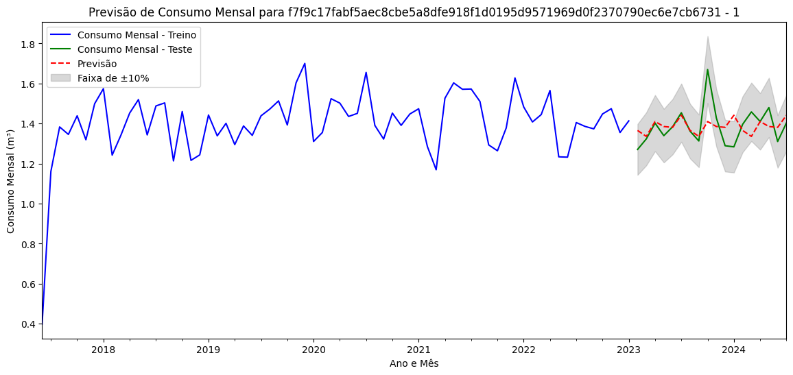 

   <sup>Fonte: Material produzido pelos autores (2024)</sup>
   
</div>

**Finalização do modelo para previsão de consumo:**

&nbsp;&nbsp;&nbsp;&nbsp;Dessa forma, esta seção implementou completamente um modelo preditivo à parte de todo o escopo inicial (de encontrar anomalias em dados reais). Foi feito o pré-processamento dos dados sintéticos entregues pela empresa parceira, ajuste em dados de treino e teste, treinamento de modelo, ajuste de hiperparâmetros e validação de resultados a partir de métricas que calculam a taxa de erro do modelo. De acordo com a própria empresa parceira, uma previsão de consumo de gás para um cliente agrega muito valor às operações da Compass, uma vez que esta previsão pode estar presente, por exemplo, na conta de gás de determinado cliente, que já poderá estar ciente de quanto ele terá que pagar, em média, pelo gás no mês que vem.

#### 4.4.6. Comparação final entre os modelos

&nbsp;&nbsp;&nbsp;&nbsp;Esta seção tem como finalidade comparar todos os resultados dos modelos não-supervisionados desenvolvidos durante a seção 4.4. Tal comparação tem como objetivo mostrar quais modelos performaram melhor a atividade de encontrar anomalias, para que, no futuro, a equipe possa escolher apenas um modelo final para performar o trabalho de encontrar as anomalias nos dados de consumo de gás da Compass.

&nbsp;&nbsp;&nbsp;&nbsp;Durante toda a sprint 4 do projeto, foram testados 4 modelos não-supervisionados diferentes, todos com o mesmo objetivo de identificar anomalias no consumo de gás. Para realizar a comparação entre todos esses modelos, foram escolhidas 3 principais métricas, que, no geral, são responsáveis por metrificar o quão bem o modelo definiu os clusters:

* ```Davies-Bouldin Index```: mede a relação intra-cluster e a distância inter-cluster. Quanto menor, melhor;
* ```Calinski-Harabasz Index```: mede a separação dos clusters com base na dispersão intra e inter-cluster. Quanto maior, melhor;
* ```Coeficiente de Silhueta```: mede o quão bem um ponto de dado se encaixa em seu próprio cluster em comparação com outros clusters. Quanto maior, melhor;

**Métricas do DBScan:**

&nbsp;&nbsp;&nbsp;&nbsp;O modelo DBScan conseguiu as seguintes métricas:

- ```Melhor Silhouette Score```: 0.7482794489545446
- ```Melhor Davies-Bouldin Index (DBI)```: 1.7877124152854893
- ```Melhor Calinski-Harabasz Index (CH Index)```: 1383.0505542992075

&nbsp;&nbsp;&nbsp;&nbsp;Além disso, a visualização dos clusters gerados pelo modelo foi a seguinte:

<div align="center">
   
   <sub>Figura 48 - Visualização da clusterização produzida pelo DBScan </sub>

   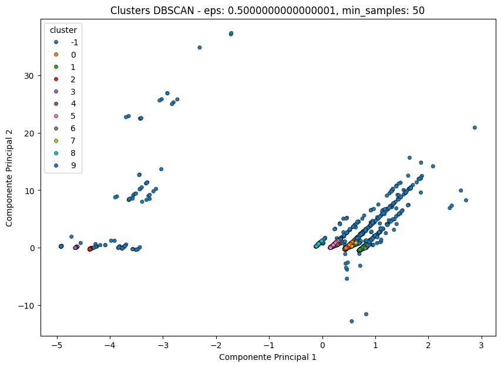 

   <sup>Fonte: Material produzido pelos autores (2024)</sup>
   
</div>

**Métricas do Isolation Forest:**

&nbsp;&nbsp;&nbsp;&nbsp;O modelo Isolation Forest conseguiu as seguintes métricas:

* ```Melhor Silhouette Score (Com pseudoclusterização)```: 0.8526
* ```Melhor Davies-Bouldin Index (DBI)```: 2.5454
* ```Melhor Calinski-Harabasz Index (CH Index)```: 10685.4068
    
&nbsp;&nbsp;&nbsp;&nbsp;Além disso, a visualização dos resultados gerados pelo modelo foi a seguinte:

<div align="center">
   
   <sub>Figura 49 - Visualização dos resultados do modelo Isolation Forest</sub>

   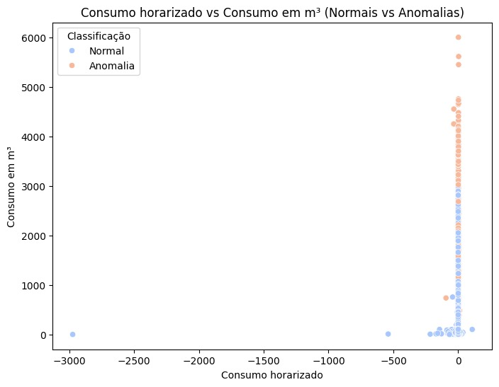 

   <sup>Fonte: Material produzido pelos autores (2024)</sup>
   
</div>

**Métricas do One Class SVM:**

&nbsp;&nbsp;&nbsp;&nbsp;O modelo One Class SVM conseguiu as seguintes métricas:

* ```Melhor Silhouette Score```: 0.8923534243010977
* ```Melhor Davies-Bouldin Index (DBI)```: 2.7424308335681506
* ```Melhor Calinski-Harabasz Index (CH Index)```: 1890.2268179584257

&nbsp;&nbsp;&nbsp;&nbsp;Além disso, a visualização dos resultados gerados pelo modelo foi a seguinte:

<div align="center">
   
   <sub>Figura 50 - Visualização dos resultados do modelo One-Class SVM</sub>

   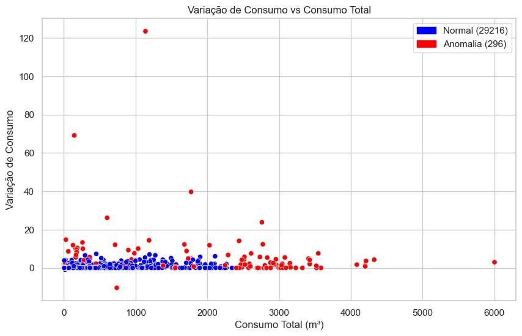 

   <sup>Fonte: Material produzido pelos autores (2024)</sup>
   
</div>

**Métricas do OPTICS:**

&nbsp;&nbsp;&nbsp;&nbsp;O modelo OPTICS conseguiu as seguintes métricas:

* ```Melhor Silhouette Score```: 0.9736186895434548
* ```Melhor Davies-Bouldin Index (DBI)```: 0.6797220500482788
* ```Melhor Calinski-Harabasz Index (CH Index)```: 12534.881388176493

&nbsp;&nbsp;&nbsp;&nbsp;Além disso, a visualização dos clusters gerados pelo modelo foi a seguinte:

<div align="center">
   
   <sub>Figura 51 - Visualização dos resultados do modelo One-Class SVM</sub>

    

   <sup>Fonte: Material produzido pelos autores (2024)</sup>
   
</div>

**Tabela de métricas:**

<div align="center">

<sub>Tabela 4 - Métricas dos modelos </sub>

</div>

<div align="center">


| Modelo              | Silhouette Score | Davies-Bouldin Index (DBI) | Calinski-Harabasz Index (CH Index) |
|---------------------|------------------|----------------------------|------------------------------------|
| DBScan              | 0.7483           | 1.7877                     | 1383.0506                          |
| Isolation Forest 1  | 0.8526           | 2.5454                     | 10685.4068                         |
| SVM One-Class       | 0.8924           | 2.7424                     | 1890.2268                          |
| OPTICS              | 0.9736           | 0.6797                     | 12534.8814                         |

</div>

<div align="center">

<sup>Fonte: Material produzido pelos autores (2024)</sup>
</div>


**Discussão dos resultados:**

&nbsp;&nbsp;&nbsp;&nbsp;A partir dos índices calculados e das visualizações dos resultados de cada modelo, foi possível chegar a algumas conclusões:

* O modelo OPTICS foi o que apresentou as melhores métricas, possuindo o maior coeficiente de silhueta, menor índice Davies-Bouldin e maior índice Calinski-Harabasz. Além disso, ficou claro durante a interpretação gráfica dos resultados que o modelo considerou anômalos aqueles dados que possuíam uma variação de consumo negativa ou que tinham uma variação de tempo entre medições muito elevada.
* O modelo Isolation Forest, em questões de métricas, teve o segundo melhor desempenho, possuindo um alto valor de coeficiente de silhueta e de índice Calinski-Harabasz, o modelo de Isolation Forest também foi capaz de realizar uma distinção entre dados normais e anômalos semelhante ao modelo OPTICS, identificando como anomalias dados com grande variação de consumo e com grande variação de tempo entre medições.
* O modelo SVM One-Class também contou com métricas relativamente boas, contando com um coeficiente de silhueta de cerca de 89%. Além disso, em relação a visualização dos resultados, o modelo foi capaz de classificar os dados que possuem um consumo total em metros cúbicos muito elevado porém com baixa variação de consumo como anormais. Além disso, ele também classificou como anomalia os dados com variação de consumo extremamente alta.
* O modelo DBScan contou com a segunda melhor métrica para o índice Davies-Bouldin e valores decentes para o coeficiente de de silhueta e índice Calinski-Harabasz. Além disso, olhando para a visualização gráfica dos resultados, tem se que o modelo gerou uma separação dos dados em 11 clusters diferentes, sendo um deles anormal.

&nbsp;&nbsp;&nbsp;&nbsp;Dessa forma, a partir dos resultados obtidos, foi decidido que os modelos com maior potencial para identificar as anomalias nos dados de consumo de gás da Compass são o OPTICS e o Isolation Forest, sendo que o segundo é mais específico e mais utilizado no mundo de análise de dados para identificar anomalias e outliers. Dessa forma, a sequência do trabalho no projeto deve estar focalizada no desenvolvimento de um desses dois modelos.

### 4.5. Avaliação

&nbsp;&nbsp;&nbsp;&nbsp;Após os procedimentos realizados desde o início do projeto - o entendimento do negócio na Sprint 1, o pré-processamento de dados na Sprint 2, a modelagem de dados na Sprint 3 e a comparação de modelos na Sprint 4 -, o modelo Isolation Forest foi escolhido como o modelo final para entrega do projeto às empresas *Compass* e *Iolit*.

#### 4.5.1 Descrição da solução final

&nbsp;&nbsp;&nbsp;&nbsp;A solução final desenvolvida pelo grupo Galvão & Associados é o Método Galvão, uma ferramenta de análise e visualização de dados com inteligência artificial que conta com 2 features: um modelo preditivo para detecção de anomalias nos dados de consumo de gás natural; e um modelo preditivo para prever o consumo futuro de gás natural. Ambos os modelos já podem ser utilizados para verificar quais clientes possuem dados anômalos ou para verificar quanto um cliente vai consumir nos próximos meses, funcionalidades acessadas de forma facilitada e visualmente simplificada por meio de uma dashboard interativa e ajustada automaticamente ao conjunto de dados.

#### 4.5.2 Justificativa da escolha do modelo final

&nbsp;&nbsp;&nbsp;&nbsp;Ao início do projeto, foram levantadas as maiores dores e problemas que as empresas parceiras enfrentam, sendo eles:

- A dificuldade de encontrar anomalias nos dados de forma generalizada, rápida e automática;
- A interpretação dos dados coletados;

&nbsp;&nbsp;&nbsp;&nbsp;Para isso, foram desenvolvidas 2 personas que identificam os dois principais públicos que podem melhor se beneficiar com o uso do modelo proposto: Thiago, um cientista de dados; e Thalyta, uma *product manager*. Para que o modelo trouxesse valor para ambos os públicos, ele precisaria facilitar a rotina de tratamento e geração de predições para pessoas que trabalham em equipes de tecnologia e dados da *Compass* ao mesmo tempo em que gera insights de forma clara e de fácil entendimento àqueles que trabalham em áreas de negócios e não necessariamente possuem o conhecimento técnico e tecnológico para utilizarem diretamente o modelo preditivo.

&nbsp;&nbsp;&nbsp;&nbsp;Dessa forma, o modelo final Isolation Forest - após passar pelas etapas de pré-processamento dos dados, desenvolvimento do modelo, ajuste fino de hiperparâmetros e avaliação de desempenho - evidenciou a boa e melhor performance de todas na detecção de anomalias no consumo de gás nos dados compartilhados pelas empresas parceiras. Além disso, o modelo, após ser exportado, pôde ser reutilizado facilmente com apenas 2 linhas de código para a importação, o que mostrou o benefício de facilitar a rotina de equipes de tecnologia sem que muito tempo seja perdido no desenvolvimento e testes de diversos modelos. Também, após o desenvolvimento da dashboard interativa, foi possível utilizar o modelo para gerar predições e gráficos de forma rápida e didática, sem que fosse necessário utilizar códigos e programação - uma maneira melhor de enxergar os dados para as pessoas que não possuem conhecimento técnico aprofundado.

&nbsp;&nbsp;&nbsp;&nbsp;Dessa forma, o modelo final desenvolvido pela equipe tem o potencial para agregar valor e comodidade à experiência de equipes de negócios e tecnologia, sendo uma ferramenta que permite a utilização livre e das maneiras que mais sejam necessitadas pelo usuário, uma flexibilidade necessária no contexto das empresas *Compass* e *Iolit*.

#### 4.5.3 Plano de contingência

&nbsp;&nbsp;&nbsp;&nbsp;Um plano de contingência é uma ação e ferramenta da gestão de riscos que auxilia organizações e equipes a terem ações práticas e concretas em face de possíveis riscos ou falhas que possam ocorrer e impactar o andamento normal de suas atividades. No caso desse projeto, o plano de contingência abordará possíveis falhas ou cenários indesejáveis do modelo preditivo e ações que podem ser feitas para reverter ou tratar os problemas.

&nbsp;&nbsp;&nbsp;&nbsp;Para a delimitação do plano de contingência, é necessário elencar os possíveis riscos. Desse modo, foram escolhidos 3 riscos que podem impedir a utilização do modelo preditivo:

1. Erros de importação de bibliotecas;
2. Conjuntos de dados sem pré-processamento;
3. Dashboard sem funcionamento;
4. Falta de detecção de anomalias;
5. Dados de consumo negativo classificados como consumo normal.

&nbsp;&nbsp;&nbsp;&nbsp;Após elencar os riscos ou erros, faz-se necessário desenvolver planos de ação para contornar os mesmos e permitir a continuação do uso da solução.

**Plano de ação 1: Importação de bibliotecas**

&nbsp;&nbsp;&nbsp;&nbsp;O erro por importação de bibliotecas ocorre quando todas as bibliotecas necessárias para que o modelo preditivo seja executado não estão presentes no notebook. A partir disso, é possível traçar duas ações, tendo como base a utilização do modelo em arquivo e do modelo em código:

- Quando o modelo está em um arquivo do tipo .joblib ou .pkl, é necessário importar a biblioteca utilizada na identificação da extensão do arquivo - ou seja, *joblib ou pickle*.
- Quando o modelo está sendo executado em células de código, é necessário certificar que todas as bibliotecas utilizadas para o desenvolvimento do modelo já foram importadas. No notebook do projeto, todas as bibliotecas foram importadas na primeira célula, então é necessário executar ela antes de executar todo o código em seguida.

**Plano de ação 2: Pré-processamento dos dados**

&nbsp;&nbsp;&nbsp;&nbsp;O modelo preditivo atual possui 11 variáveis que utiliza para o treino e o teste com o conjunto de dados. Logo, conjuntos de dados que possuem variáveis diferentes ou nomeadas de forma diferente não poderão ser utilizadas para gerar predições. Para isso:

- Conjuntos de dados que não possuem as mesmas variáveis que são utilizadas pelo modelo preditivo precisarão passar pelo pré-processamento de dados de acordo com o processo realizado no notebook deste projeto;
- Conjuntos de dados que possuem as mesmas variáveis, mas com nomes diferentes, precisarão ter suas variáveis renomeadas para estar em conformidade com o esperado pelo modelo.

**Plano de ação 3: Deploy do dashboard**

&nbsp;&nbsp;&nbsp;&nbsp;A utilização do dashboard, atualmente, funciona por meio de uma hospedagem realizada para demonstração. Isso significa que, em tempo indeterminado após o término do projeto, o dashboard poderá não funcionar mais. Para isso:

- É necessário que seja feita uma nova hospedagem do dashboard desenvolvido com *Streamlit* para que a utilização do mesmo continue viável e disponível para todos.

**Plano de ação 4: Detecção de anomalias**

&nbsp;&nbsp;&nbsp;&nbsp;Tempos após o fim do treinamento e teste do modelo, apesar de boa performance, o mesmo pode começar a apresentar um desempenho mediano ou ruim. Esse comportamento pode acontecer pela diferença de densidade entre classes que pode ocorrer com diferentes conjuntos de dados ou mudanças específicas de cada dataframe. Para isso:

- É possível realizar o retreino do modelo periodicamente, em busca de manter um bom score nas métricas de avaliação de desempenho.

**Plano de ação 5: Detecção de consumo negativo como anomalia**

&nbsp;&nbsp;&nbsp;&nbsp;Os dados de consumo de gás com valores negativos são erros no registro efetuado pelo medidor e devem ser considerados como anomalias. Entretanto, o modelo pode detectar consumos negativos como dados normais, gerando previsões erradas. Para isso:

- É possível classificar manualmente os dados de consumo negativo como anomalias depois da previsão para que haja a uniformidade dos dados.

&nbsp;&nbsp;&nbsp;&nbsp;Dessa forma, após estruturar um plano de contingência que cobre possíveis erros e que contém planos de ação para cada um dos riscos, é esperado que a gestão de riscos a partir do uso do modelo preditivo seja facilitada e que as atividades, caso um dos riscos ocorra, voltem à normalidade com uma velocidade ainda maior.

#### 4.5.4 Verificação de aceitação ou refutação de hipóteses

&nbsp;&nbsp;&nbsp;&nbsp;Ao longo das 10 semanas do projeto, foram feitas diversas hipóteses, mas 3 foram escolhidas para serem exploradas - as quais podem ser encontradas na seção 4.2.3:

- Variação de consumo de acordo com mês do ano;
- Diferença entre números de instalações residenciais familiares e outras;
- Diferença de consumo para perfis de consumo que possuam caldeiras.

&nbsp;&nbsp;&nbsp;&nbsp;A seção 4.2.3, desenvolvida durante a Sprint 2, além do desenvolvimento das hipóteses, também foi realizada a verificação de aceitação ou refutação das mesmas. Em suma, os resultados obtidos foram:

- A primeira hipótese, relacionada à variação de consumo de acordo com mês do ano, não é verdadeira e não pode ser aceita.
- A segunda hipótese, relacionada à diferença entre números de instalações residenciais familiares e outras, é verdadeira e pode ser aceita.
- A terceira hipótese, relacionada à diferença de consumo para perfis de consumo que possuam caldeiras, é verdadeira e pode ser aceita.

&nbsp;&nbsp;&nbsp;&nbsp;Portanto, é possível perceber que, com a continuação do desenvolvimento dos modelos preditivos ao longo de mais 6 semanas após a formulação ads hipóteses iniciais, os resultados se mantiveram os mesmos, expressando a consistência dos dados após os tratamentos e mudanças.


## <a name="c5"></a>5. Conclusões e Recomendações

&nbsp;&nbsp;&nbsp;&nbsp;Em conclusão a todo o projeto, foi possível obter como resultado um modelo Isolation Forest treinado especificamente para os dados fornecidos pela Compass. Este modelo é capaz de, em tempo hábil, encontrar instalações de gás que possuem consumo considerado anormal, levando em consideração principalmente o tempo que se passou entre uma medição e outra e o quanto o cliente consumiu nesse tempo. A partir disso, o modelo identifica exatamente aquelas instalações com consumo anormal e também já as lista com ordem de prioridade a serem resolvidas. Além disso, também foi desenvolvido um modelo para prever o consumo de gás de um determinado cliente em meses futuros e uma dashboard interativa  para visualização simplificada de tudo isso. 

&nbsp;&nbsp;&nbsp;&nbsp;Em relação ao modelo de previsão de consumo, utilizamos o modelo estatístico Holt-Winters, que consegue fazer previsões com base em dados de séries temporais, levando em consideração tendências e sazonalidade. Identificamos dois casos principais onde este modelo pode ser utilizado pela Compass: prever o consumo de um cliente e adicionar esta informação, por exemplo, em uma conta de gás, ou conseguir prever o quanto de gás que toda a base de clientes residenciais, por exemplo, irá consumir, e utilizar esse valor como base para comprar o gás natural da Petrobrás. Assim, utilizamos os dados sintéticos fornecidos para a empresa para treinar o modelo com as variações individuais de cada cliente e conseguimos entregar, através da dashboard, a possibilidade de simplesmente escolher um cliente e quantos meses se quer prever no futuro. De acordo com métricas de erro como MSE, MAE e MSPE, o modelo atingiu resultados significativamente interessantes.

&nbsp;&nbsp;&nbsp;&nbsp;Sobre a dashboard, esta foi desenvolvida utilizando o auxílio da biblioteca Streamlit, em Python, que permite a criação de *data apps* de maneira simplificada. Na dashboard, é possível, em apenas 3 cliques, subir os arquivos de dados em formato csv e, então, obter as instalações que possuem consumo anormal. Além disso, a dashboard conta com dados embutidos para realizar a previsão de consumo dos clientes. Entretanto, mesmo com os dados embutidos, é possível subir dados novos. Ainda em relação à dashboard, é necessário explicitar que o pré-processamento dos dados não é feito lá. Dessa forma, os dados colocados lá já precisam estar limpos e tratados.  

&nbsp;&nbsp;&nbsp;&nbsp;Como recomendações do grupo para a Compass, sugerimos que o modelo seja testado e utilizado com a base completa de clientes, comparando os resultados com os modelos que a empresa já utiliza. Além disso, recomendamos que a previsão de consumo seja testada com dados reais e em grande volume, uma vez que não conseguimos fazer isso por conta da quantidade de dados. Por fim, a principal recomendação relacionada à utilização do modelo para encontrar anomalias é de que, ao obter, na dashboard, uma tabela com as instalações com anomalias, a prioridade em verificar as instalações deve estar nas instalações que aparecem primeiro. Com todo este trabalho, esperamos que os principais afetados pelo produto sejam tanto as pessoas dos times de dados e negócios que trabalham na Compass, mas também os clientes da empresa. Os primeiros serão impactados por meio da detecção de anomalias e visualização dos gráficos, que podem trazer ideias valiosas para a equipe. Já os clientes podem ser impactados por meio da previsão de consumo, uma vez que a Compass pode oferecer serviços personalizados para clientes com previsão de consumo diferentes. 

&nbsp;&nbsp;&nbsp;&nbsp;Por fim, deixamos aqui um anexo final que fala um pouco mais sobre a dashboard desenvolvida no projeto:
[dashboard](extras/dashboard)

## <a name="c6"></a>6. Referências

COMPASS. Central de resultados. Disponível em: https://www.compassbr.com/divulgacao-e-resultados/central-de-resultados/. Acesso em: 12 ago. 2024.

COMPASS. Estratégia de sustentabilidade. Disponível em: https://www.compassbr.com/sustentabilidade/premios-e-reconhecimentos/. Acesso em: 12 ago. 2024.

COMPASS. Quem somos. Disponível em: https://www.compassbr.com/sobre-a-compass/quem-somos/. Acesso em: 12 ago. 2024.

DE OLIVEIRA, F. R. et al. Clusterização de clientes: um modelo utilizando variáveis categóricas e numéricas. 2020. Acesso em: 25 ago. 2024.

Dicionário Escolar da Língua Portuguesa. 1 ed. Barueri, SP: Ciranda Cultural, 2015. Acesso em: 26 ago. 2024.

Enciclopédia. Significado de Hipótese. Disponível em: https://www.significados.com.br/hipotese/. Acesso em: 26 ago. 2024.

GABRIEL. Panorama sobre a Utilização das Técnicas e Ferramentas de Gerenciamento de Riscos em Projetos. Boletim do Gerenciamento, v. 21, n. 21, p. 23–31, 30 dez. 2020. Acesso em: 13 ago. 2024.

GUSHIKEN, A. Value Proposition Canvas: o que é e como funciona essa metodologia. G4 Educação, 2023. Disponível em: https://g4educacao.com/portal/value-proposition-canvas. Acesso em: 13 ago. 2024.

LAUBHEIMER, P. 3 Persona Types: Lightweight, Qualitative, and Statistical. Disponível em: https://www.nngroup.com/articles/persona-types/. Acesso em: 13 ago. 2024.

MIAN, S. H. et al. Adapting Universities for Sustainability Education in Industry 4.0: Channel of Challenges and Opportunities. Sustainability, v. 12, n. 15, p. 6100, 2020. Acesso em: 13 ago. 2024.

PINHEIRO, N. Pré-processamento de dados com Python. Disponível em: https://medium.com/data-hackers/pr%C3%A9-processamento-de-dados-com-python-53b95bcf5ff4. Acesso em: 22 ago. 2024.

PORTER, M. Estratégia competitiva: técnicas e análise de indústria e da concorrência. Rio de Janeiro: [s.n.], 1986. Acesso em: 13 ago. 2024.

REHKOPF, M. User stories with examples and a template. Atlassian. Disponível em: https://www.atlassian.com/agile/project-management/user-stories. Acesso em: 13 ago. 2024.

REIS, H. L. S. et al. Gás natural. Recursos minerais de Minas Gerais. Companhia de Desenvolvimento de Minas Gerais (CODEMGE), Belo Horizonte, p. 1-39, 2018. Acesso em: 13 ago. 2024.

TEAM, M. J. V. Jornada do usuário: o que é, para que serve e como criar. MJV Technology & Innovation, 4 ago. 2022. Disponível em: https://www.mjvinnovation.com/pt-br/blog/jornada-do-usuario-o-que-e/. Acesso em: 26 ago. 2024.

ROBERTO, C. Crisp-DM: as 6 etapas da metodologia do futuro. Disponível em: <https://blog.mbauspesalq.com/2022/04/12/crisp-dm-as-6-etapas-da-metodologia-do-futuro/>. Acesso em: 02. set. 2024

‌PORTO FILHO, Carlos Humberto. Técnicas de aprendizado não supervisionado baseadas no algoritmo da caminhada do turista. 2017. Tese de Doutorado. Universidade de São Paulo. Disponível em: https://www.teses.usp.br/teses/disponiveis/82/82131/tde-20082018-122603/publico/Dissert_CarlosPortoFilho_corrigida.pdf. Acesso em: 06 set. 2024.

PARRA, T. Método Silhouette para validação do algoritmo de K-Means. Disponível em <https://www.linkedin.com/pulse/silhouette-score-para-avaliar-qualidade-dos-clusters-algoritmo-parra/>. Acesso em: 10 set. 2024.

Géron, Aurélien. "Hands-On Machine Learning with Scikit-Learn, Keras, and TensorFlow." O'Reilly Media, 2019. Disponível em: https://books.google.com.br/books?id=HHetDwAAQBAJ&printsec=frontcover#v=onepage&q&f=false. Acesso em: 11. set. 2024

SCALDELAI, Dirceu; DOS SANTOS, Solange R.; MATIOLI, Luiz C. Índice de Densidade da Clusterização: Uma Nova Métrica para Validação Interna de Agrupamentos. Proceeding Series of the Brazilian Society of Computational and Applied Mathematics, v. 9, n. 1, 2022.

AHMED, Mohiuddin; SERAJ, Raihan; ISLAM, Syed Mohammed Shamsul. The k-means algorithm: A comprehensive survey and performance evaluation. Electronics, v. 9, n. 8, p. 1295, 2020.

BUENO, Luıs Felipe et al. Uma combinaç ao dos algoritmos Isolation Forest e K-Means aplicadaas Eleiçoes Brasileiras. 2021.

B214a Bando, Isabela Hara. Algoritmos one-class para fluxos contínuos de dados e a detecção de ataques em internet das coisas / Isabela Hara Bando. - Londrina, 2024. 60 f. : il. https://sites.uel.br/dc/wp-content/uploads/2024/06/TCC_ISABELA_BANDO.pdf

CORTES, Omar Andres Carmona; MELO, Wesley Eduardo de Oliveira. Utilizando análise de sentimentos e SVM na classificação de tweets depressivos. Cadernos de Observação Tecnológica em Sistemas de Informação, v. 12, p. 102-110, 29 abr. 2021. DOI: 10.14210/cotb.v12.p102-110.

CANDIDO, G. Aprendizado supervisionado x não supervisionado - Data Hackers - Medium. Disponível em: <https://medium.com/data-hackers/aprendizado-supervisionado-x-n%C3%A3o-supervisionado-ca79b522659d>.

TEBALDI, P. C. Holt-Winters | O que é e como funciona esse algoritmo? Disponível em: <https://www.opservices.com.br/holt-winters/>.

CONSTANTIN, G. A otimização de hiperparâmetros. Disponível em: <https://www.linkedin.com/pulse/otimiza%C3%A7%C3%A3o-com-grid-search-gabriel-constantin/>. Acesso em: 23 set. 2024.

LIU, Fei Tony; TING, Kai Ming; ZHOU, Zhi-Hua. Isolation forest. In: 2008 eighth ieee international conference on data mining. IEEE, 2008. p. 413-422.

STRAUSS, Edilberto; JÚNIOR, Manoel Villas Bôas; FERREIRA, Wagner Luiz Lobo. A IMPORT NCIA DE UTILIZAR MÉTRICAS ADEQUADAS DE AVALIAÇÃO DE PERFORMANCE EM MODELOS PREDITIVOS DE MACHINE LEARNING. Projectus, v. 7, n. 2, p. 52-62, 2022.

ANKERST, M. et al. OPTICS. ACM SIGMOD Record, v. 28, n. 2, p. 49–60, 1 jun. 1999


## <a name="attachments"></a>Anexos
[Dashboard](extras/dashboard)

[Flyer de apresentação do modelo](extras/FLYER%20GALVAO%20E%20ASSOCIADOS.pdf)
